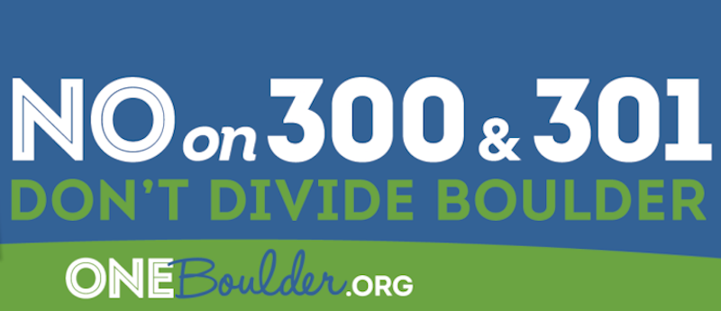
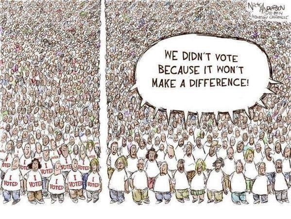

DOJO4 is above all a community, and we love where we live so - we vote!  We want you to vote, too, and in the hopes of making it easier and thus more likely that you will, I'm sharing a voter guide that I wrote up for friends and family.  These recommendations represent only my own views, but I'm also including some opposing views from my friend & colleague [Mark Gelband](https://twitter.com/markgelband).  While we have the same endgame: getting Boulder off fossil fuels ASAP, Mark and I stand on opposite sides of the municipalization debate (he's anti, I'm pro) and that one issue determines much of where our views diverge on the candidates and ballot measures below.

**One place we agree wholeheartedly is NO on 300/301.** 

 

300 is the "neighborhood rights initiative" (aka "gated community act"). It would give 10% of the people in a hood - and there are 66 tiny proposed enclaves - the right to put any land use or zoning changes affecting that neighborhood up for a vote. As [one opponent](http://oneboulder.org/david-abelson-neighborhood-ballot-issue-unconstitutional/) put it, "The ironic part is that Livable Boulder states on its website that the initiatives were 'born out of a concern for democracy.' Yet, the 'neighborhood right to vote' initiative limits the thing it purports to support — community engagement. Only a small fraction of the city electorate would effectively be granted a veto power over a valid council action. That approach does not foster greater democracy; instead, it disenfranchises the rest of the voters."  A great article in City Lab sums it up as "[Mega-NIMBYism at work](http://www.citylab.com/housing/2015/10/they-are-coming-for-our-neighborhoods/408994/)."  

I am personally not a fan of many decisions the planning department has made on new developments, or the say I had in some of the bigger eye-sores going in.  I also agree with Mark that our current land use and zoning rules are in desperate need of an overhaul.  But if you think getting a permit for your granny unit above the garage is expensive and difficult now, just wait until a handful of your neighbors can force a vote on it!

So, 300 is kinda see through if you actually read it, but 301 seems to be getting a little more traction because it continues the long standing Boulder meme of the "evil developer." I mean, *of course* development should pay it's own way. Aside from the fact that Boulder already has some of the most costly fees for development in the nation - [David Biek covers those here](http://oneboulder.org/david-biek-no-on-300-and-301/) - and we just added a $9/sq ft. linkage fee to subsidize affordable housing, Livable Boulder has gravely misrepresented the inevitable outcomes of 301's passage.

To summarize, development would stop in it's tracks (yeah, actually our City Manager has said that flat out - no more permits until the litigious dust settles).  Let me rephrase: **no more housing units would be added to our city**.  That means that current homeowners' property values *and property taxes* will skyrocket (yes, beyond their current altitude); kids who grew up here will have to leave to be able to afford homes; teachers and service workers will have to move further out and commute in; retirees on fixed incomes wouldn't be able to afford their property taxes on a fixed income; etc. etc. etc.

[PAUSE, DEEP BREATH.] 

By now you're thinking, "*It seems like everyone I talk to is against those measures ([even The Daily Camera](http://oneboulder.org/daily-camera-editorial-no-on-300-301/), which is no friend of the planning department); I'm sure they're too extreme to pass; I don't really need to go to all the trouble of filling out the ballot that someone hand delivered to my very doorstep and will pick up after I've marked a few dots and signed it.*"

Well not so fast, buster!  **The folks who put these measures on the ballot represent the faction of Boulder that actually votes.** Doesn't matter if they're the minority if they're the only ones who bother to vote. To reference the *fucking* awesome citizen, [Becky Boone](https://twitter.com/boonrs?lang=en) — that woman who got in hot water with some of Boulder’s more conservative faction earlier this year for [saying “fuck" a lot](https://youtu.be/Mme2iqk1IYU) while trying to get more people in Boulder to vote — in our last local election (2013) only 1/3 of Boulder voted.  : (  Sad face : (  And the majority who do vote are over 40 and own their own homes (while the majority of Boulder’s residents are under forty and rent).  

 

So, here’s how I’m voting — hope it’s useful to you!

**CITY COUNCIL**

There are 5 open spots and 19 candidates.  These five are the ones that I think have the best chance at both getting elected and effectively opposing 300/301 and promoting affordable housing, climate action, open space and the other issues I care most about locally. 

1. **Morzel** - has been an amazing advocate for the mobile home owners I’ve been organizing to help this year, plus she’s a geologist, mother of three boys and a zero waste hero in her own home. Although I don't agree with everything she's done in her long tenure, I think she should stay on council because she will continue to be a strong voice for open space, climate, and social justice issues. 

2. **Rigler** - is younger than most candidates. He is a strong environmental advocate (he used to work for Al Gore on climate change), has gotten involved in Boulder by serving on the Transportation Advisory Board, and works as spokesperson for Naropa. He would bring a very visceral sense of what it is like to try to get by in Boulder as a renter. Half of our residents rent, while I believe that every other council member is a homeowner. 

3. **Brockett** - Aaron is a younger family guy who lives in North Boulder's Holiday neighborhood. Aaron is one of the "we should have more density where it makes sense, such as along transportation corridors and hubs" voices. Although I'm not necessarily a true believer of the "density equals affordability" mantra, I do think Aaron is a really smart, rational, and independent thinker and very much has his heart in the right place. He'll be a really really great addition to council.

4. **Plass** - Tim is running for his second term on council and has really proven himself as a bridge-builder and approaches decisions on council not as an ideologue, but as a reasonable person who wants the best for Boulder. The bike community has recently embraced Tim and he also is a strong advocate for Boulder's municipalization efforts, local food investment, and smart growth.

5. **Jones** - Zan is a terrific public servant and is a strong champion for progressive values, especially including the environment and climate. Zan is also the Executive Director for Ecocycle. She's an all-around great person and is always a calm, reasonable, and intelligent voice on important issues.

Note: Some of this text was lifted from my most favorite candidate of all, [Steve Fenberg](http://).  

Mark will probably vote for Riggler, Yates, Burton, Cote and maybe Spinrad. 

**ALPHABET SOUP**

2B — Yes
2C — Yes
2D — Yes
2N — Yes
2O — Yes
2P -— Yes 
2Q — Yes
2R — Yes
300 — NO
301 — NO
3A — Yes
5B — Yes
BB — Yes

For those who want to read more about the ballot measures:

**Yes on 2B, C & D** — Tax extensions + one sales tax increase to fund open space and transportation and the general fund.  Here’s a brief summary from Better Boulder on [why to vote YES on 2B, 2C and 2D](http://betterboulder.com/vote-yes-on-2b-2c-and-2d/).

**YES on 2N** — This is a fraught attempt at regulating AirB&B and VRBO style rentals, which supplement the income of thousands of Boulder residents and enable them to actually afford to live here.  The short story is: if this doesn’t pass, all short-term rentals will become illegal.  If it does pass, the fight goes on and the dumber parts of this measure will surely be challenged in court, so think of it as an interim step.

**YES on 2P!!!**  I am so disappointed to see the ambivalent coverage this is getting in the Camera.  In short, ALL of the efforts that Boulder makes across dozens of programs in dozens of departments — including EVERYTHING my partner works on to [transition Boulder to carbon-free power sources](https://bouldercolorado.gov/climate) — will be severely curtailed if this doesn’t pass.  

**Yes on 2O** — Like 2P, this merely extends existing taxes on electricity use – one that replaced the old franchise fee and funds the general fund (2O), and the other funds city climate action programs (2P). *This is not a vote on municipalization – however you feel about that, these two deserve a yes.*  (**Mark would disagree, and say No on 2O** because "it would send a strong message to council on the $15M + already wasted on lawyers and consultants and not 1kWh of local or renewable energy.")

**Yes on 2Q** — From what I understand, this just modernizes the library commission and is basically an administrative clarification and there really isn't any reason to oppose it. 

**Yes on 2R** — This is an interesting one. (From the Daily Camera: This measure asks: Should City Council members get a $10,000 annual salary, which will increase with inflation, in addition to the per-meeting pay they get now, and health benefits equivalent to those received by city employees? Council members currently earn $206.97 per meeting for up to 52 meetings per year, with the maximum pay being $10,762.44. Adding the base salary would put City Council members above $20,000 a year.

*What supporters say*: Offering a higher salary and health insurance will make it possible for people from more diverse economic backgrounds to serve on City Council. Adding a base salary also reflects the large amount of work council members do outside of meetings.

*What opponents say*: Serving on council should be essentially a volunteer position, and raising the pay moves it closer to being a job. Others believe the pay increase isn't large enough to make a difference in the types of candidates who can afford to serve.

*What I say*: it’s not enough of a pay raise, and obviously they should have access to the same health benefits city employees get.  The idea that serving on City Council should be a volunteer position is flagrantly classist and merely ensures that only people who can afford not to work for a living could even consider running, and that thus our representation will continue to be drawn only from the wealthiest among us.  

**YES on BB** — This is a statewide ballot measure that is on the ballot because of the ridiculousness of TABOR.  If it passes, the state keeps tax $$ it has *already collected* from the marijuana industry and spends $40million on schools and $12million on marijuana education.  If it doesn’t pass, most of the money goes back to growers and sellers, and regular CO taxpayers get about an $8 refund - woohoo.  

**Yes on 5B** — There will be more and more wildfires to come as the climate heats up. Adding $0.004 per dollar to property tax values to pay for the fire department to protect their homes seems more than reasonable, it seems prudent!

**BOULDER VALLEY SCHOOL DISTRICT**

Only two are running opposed.  Between Barge, Femmer and Gebhardt, I’d pick:  **Barge, without a doubt**.  His wife is a teacher (currently), and his answers to the [Daily Camera questionnaire](http://www.dailycamera.com/local-election-news/ci_28946902/voter-guide-2015-boulder-and-broomfield-counties) were the best among his competitors. Several of my friends know him personally, and like him a lot.

And between McCloskey and Benford, I’d pick: **McCloskey!!**.  When asked about the biggest problem our district faces he answered equity while Benford discussed student achievement.  McCloskey has been a teacher, and Benford seems to be a bit of a firebrand who holds less than mainstream views. I've heard that she's seen as someone who attacks the superintendant and the teacher's union repeatedly. 

**IT'S NOT TOO LATE TO REGISTER TO VOTE!**

As a reminder, everyone's ballots arrive by mail (many have already arrived) and you can either mail them in or [drop them off](http://www.bouldercounty.org/elections/polling/pages/default.aspx).  And, [it’s not even too late to register to vote, change your address or get a replacement ballot](https://www.registerincolorado.org/)!  Just go online by the 26th of this month if you’d like your ballot mailed to you.

**NOW GO VOTE!**

  