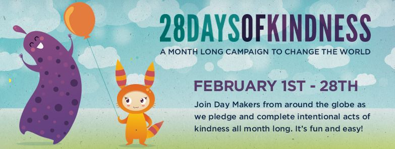
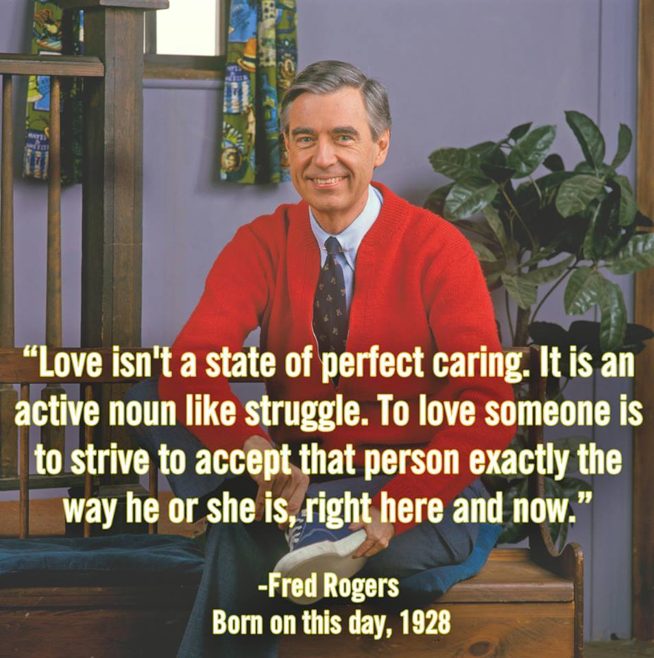
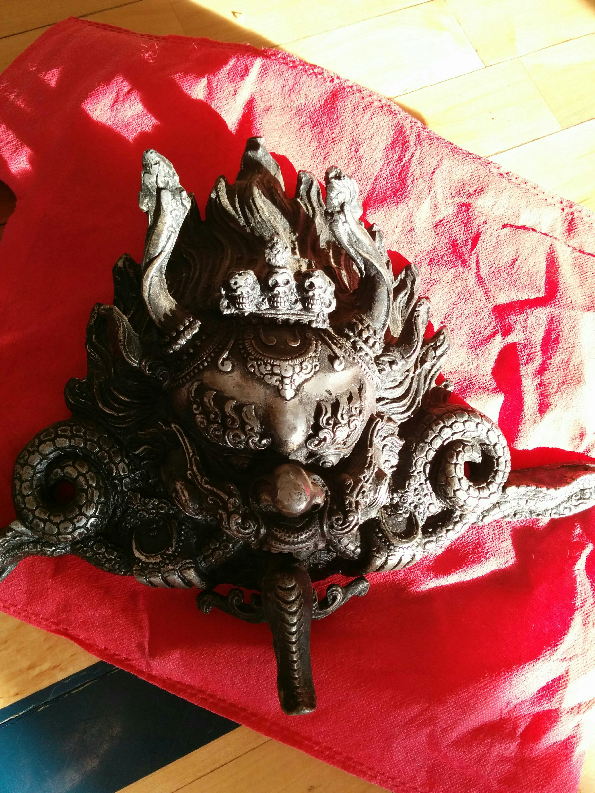
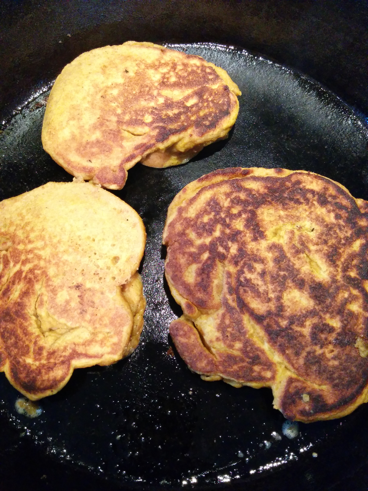
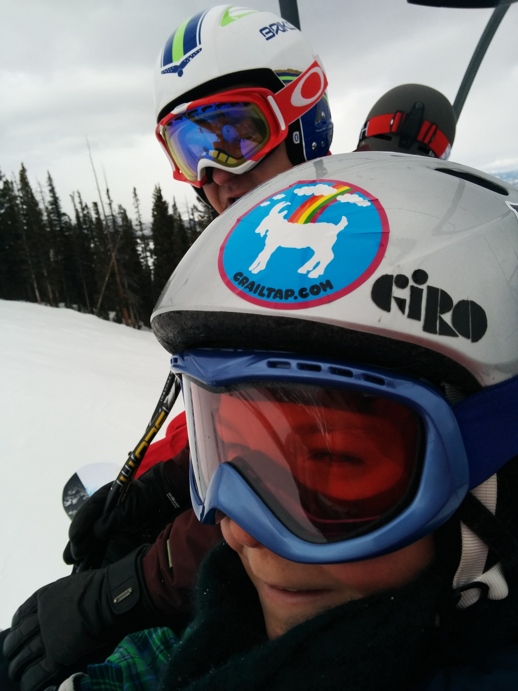
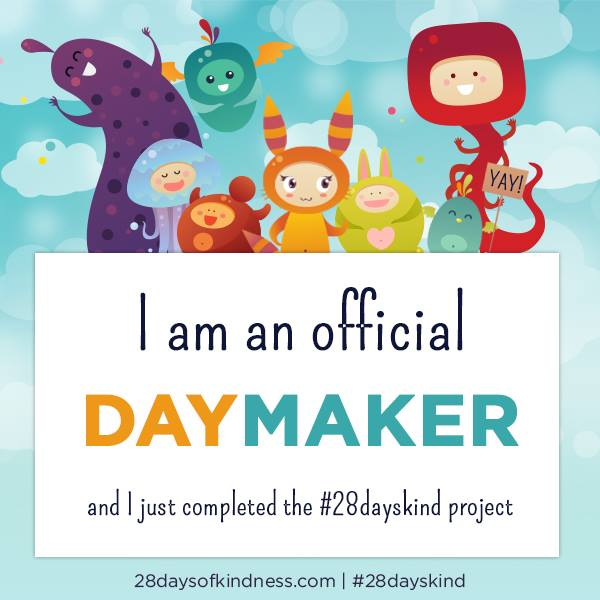

[Jessica Watson](/team/jessica-watson) has put together a super fun project for the month of February who's aim is simple:  to encourage people and companies to pledge an intentional act of kindness daily for the entire month.

You can read more about the event [here](https://www.facebook.com/events/430758197076608).

DOJO4 is committed to the campaign and we will be chronicling our daily acts here.

Stay tuned, and get on board!

<a href='#2015-02-01' name='2015-02-01'>2015-02-01</a>
-------------------------
- Ara spent the morning advising a young tech team from http://bdw.colorado.edu/.
- Ara worked with the http://www.uscyclingmonument.com/ to develop a new donation website.
- Jesse did some voluteer website evaluation and update planning for non-profit http://nedcompost.org.
- Emily spent the morning cooking her hubby's favorite foods for the week.

<a href='#2015-02-02' name='2015-02-02'>2015-02-02</a>
-------------------------
- dojo4 bought coffee & croissants for some friends at our local fav, [Boxcar](http://www.boxcarcoffeeroasters.com/).
- Sam did everyone's dishes so we'd arrive to a clean dojo kitchen this morning.

<a href='#2015-02-03' name='2015-02-03'>2015-02-03</a>
-------------------------
- Emily made quiche and coffee at 7am for the babysitter, who is not a morning person.
- Ara meet with a financial planner that was interested in our [pivot](/blog/the-big-pivot) and he could use some of the inspiration to make a similar pivot for his own business.

<a href='#2015-02-04' name='2015-02-04'>2015-02-04</a>
-------------------------
- Ara took the afternoon off (first time ever) to take his son Axel skiing.
- Luke got up early to shovel the DOJO4 porch.
- Jesse took a friend's recycling to the Nederland transfer station while he was on vacation.

<a href='#2015-02-05' name='2015-02-05'>2015-02-05</a>
-------------------------
- 

<a href='#2015-02-06' name='2015-02-06'>2015-02-06</a>
-------------------------
- Emily is coordinating a meal train for a friend who just had a baby.
- DOJO4 helped fund a poetry book built by a local high school student: http://www.awesomefoundation.org/en/chapters/boulder.
- Ara's family had 'father son' and 'mother daughter' date night.
- Jesse gave his lovely wife a foot massage.

<a href='#2015-02-07' name='2015-02-07'>2015-02-07</a>
-------------------------
- 
- Jesse gave his housemate a ride to evening meditation at the [Shoshoni Retreat Center](http://shoshoni.org/) outside of Nederland
- Emily made hosted dinner for some friends who are going through a rough patch.

<a href='#2015-02-08' name='2015-02-08'>2015-02-08</a>
-------------------------
- Luke and Nicole brought this amazing [Mahākāla](http://en.wikipedia.org/wiki/Mah%C4%81k%C4%81la) all the way from India for DOJO4  
- Jesse spent 4 hours volunteering for [NedCompost](http://nedcompost.org) building bike trailers for the bicycle powered compost collection service.

<a href='#2015-02-09' name='2015-02-09'>2015-02-09</a>
-------------------------
- Emily donated to her friend's [Veterans Expeditions GoFundMe campaign](http://www.gofundme.com/l08llw) for combat veterans, which empowers veterans to overcome challenges associated with military service through outdoor training and leadership.
- Corey spent the weekend doing wifey-mommy-friendy things, which knowing her were both kind and funny.

<a href='#2015-02-10' name='2015-02-10'>2015-02-10</a>
-------------------------
- Emily let someone with 1 item go ahead of her cart *full* of diapers, kale, kleenex and the like at the grocery store. Late night. 
- dojo4 joined [Ecocycle](http://www.ecocycle.org/) in their proposal to Boulder City Council that would make recycling mandatory for Boulder businesses.  Keep it out of the landfill, people!
- Jessica, friends, and neighborhood bar hosted gift cards for the homeless, a local event where people could make greeting cards, and donate gift cards, to be given to the homeless through Our Daily Bread (a Catholic Charity).

<a href='#2015-02-11' name='2015-02-11'>2015-02-11</a>
-------------------------
- Ara found this on the internet: 

<iframe width="480" height="360" src="https://www.youtube.com/embed/zd7c5tQCs1I" frameborder="0" allowfullscreen></iframe>

- Jesse helped his wife tan a sheep's hide & consoled a friend about the death of a chicken.
- Jen spent 3 hours helping her daughter Nova make hand-made Valentine's cards for her 3rd grade class.
- Jessica got to know her Lyft driver, who picked her up on a cold evening. Turns out he just became a granddad and couldn't be happier.

<a href='#2015-02-12' name='2015-02-12'>2015-02-12</a>
-------------------------
- Ara got up early and made famous Alaskan pumpkin pancakes for his kids on Valentine's day. 
- Jessica payed the toll for the car behind her while driving back from the gym.

<a href='#2015-02-13' name='2015-02-13'>2015-02-13</a>
-------------------------
- Ara booted Luke out of the DOJO4 door early on a sunny day for a friday afternoon bike ride.

<a href='#2015-02-14' name='2015-02-14'>2015-02-14</a>
-------------------------
- DOJO4 finished building the new [U.S. Cycling Monument](https://www.uscyclingmonument.com/) website
- Jessica brought flowers for a friend, and let her neighbor borrow her outlet adapter for his international trip.

<a href='#2015-02-15' name='2015-02-15'>2015-02-15</a>
-------------------------
- Angela cooked a lovely chicken soup and cookies for the household.

<a href='#2015-02-16' name='2015-02-16'>2015-02-16</a>
-------------------------
- Grandpa Alan flew out from Oregon to ski with his grandkids 
- Luke shoveled everyone on his block's sidewalk during the storm.  And built a snow fort for Felix.

<a href='#2015-02-17' name='2015-02-17'>2015-02-17</a>
-------------------------
- Ara called an old friend he hadn't spoken too in 20 years and reconnected.
- "Nana" babysat so that Emily & her hubby could have a date night.

<a href='#2015-02-18' name='2015-02-18'>2015-02-18</a>
-------------------------
- Ara got up early to make sourdough waffles for his kids.
- Luke bought Nicole a BRAND NEW BIKE!
- Jessica happily held the door open for someone carrying a grocery cart and a baby.

<a href='#2015-02-19' name='2015-02-19'>2015-02-19</a>
-------------------------
- Emily got up at 5am to comfort a sick kiddo and figured why not make a big breakfast for everyone, too.
- Jessica left good reviews for a couple of her favorite local businesses.

- Corey had a bunch of people over to her parent's Losar celebration for good food, good cheer, and merriment.

<a href='#2015-02-20' name='2015-02-20'>2015-02-20</a>
-------------------------
- Jessica rescued Ara, having himself fallen off the nice wagon for a day, with some of her choice acts to keep DOJO4's nicey-nice mojo rockin.

<a href='#2015-02-21' name='2015-02-21'>2015-02-21</a>
-------------------------
- Jesse found someone's NJ drivers license in the street by the bus station then stalked them online and found its owner. The owner sent a self addressed envelope with $20 and a kind note inside. He gave the $20 to his roommate who was just lamenting her financial state as he opened the letter. Double kindness.
- Brett did a million chores, cooked dinner *and* brought home flowers for Emily.  Rockstar.

<a href='#2015-02-22' name='2015-02-22'>2015-02-22</a>
-------------------------
- See yesterday's double-kindness.

<a href='#2015-02-23' name='2015-02-23'>2015-02-23</a>
-------------------------
- Jeremy mailed some personal items to an Aussie traveler who left them behind here in B-town.
- Emily made time to show up for a friend in need ~ the more love we give, the more we have.

<a href='#2015-02-24' name='2015-02-24'>2015-02-24</a>
-------------------------
- DOJO4 bought chair massages for its hard-working developers and friends.
- In a birthday kindness reverse-move Michael woke up and made breakfast for his lovely wife and daughter.

<a href='#2015-02-25' name='2015-02-25'>2015-02-25</a>
-------------------------
- Emily did some volunteer work for her art teachers.
- Jen made handmade soap for Axel and Nova's teachers.

<a href='#2015-02-26' name='2015-02-26'>2015-02-26</a>
-------------------------
- Spike was über neighborly and shoveled our walk and his out from this deluge of snow Boulder is experiencing. 
- Ara shovel the nieghbor's driveway too ;-)

<a href='#2015-02-27' name='2015-02-27'>2015-02-27</a>
-------------------------
- Emily started volunteering this month on a low-income/affordable housing campaign.
- After a sleepless night with a sick kid, Emily & Brett were still kind to each other this morning.  We're pretty sure that kindness after no sleep counts extra.
- Ara reached out to an extended family member struggling with mental illness.

<a href='#2015-02-28' name='2015-02-28'>2015-02-28</a>
-------------------------
- Jeremy took time out of his Saturday morning to show Emily around Github - he is a super kind and helpful teacher!

*Thanks so much to Jessica Watson and her inspiring  [28 Days of Kindness Movement](https://www.facebook.com/events/430758197076608).  This world needs her and her army of Day Makers!*

We'll leave you with a little Pema, for good measure.

