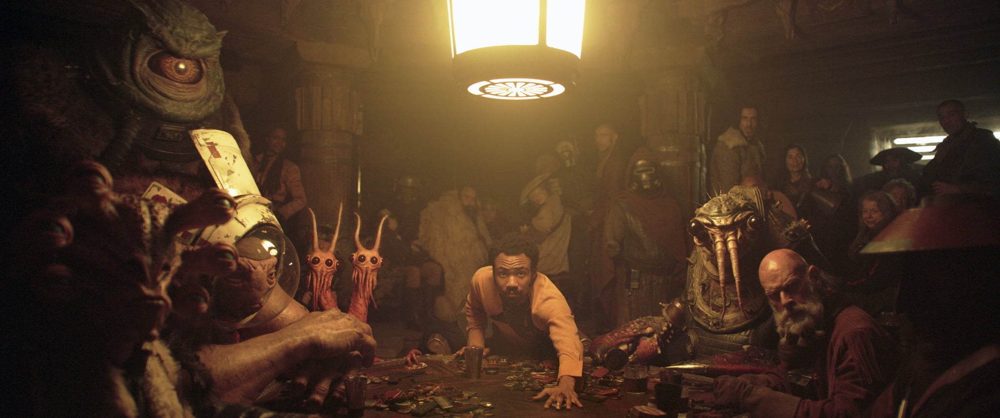
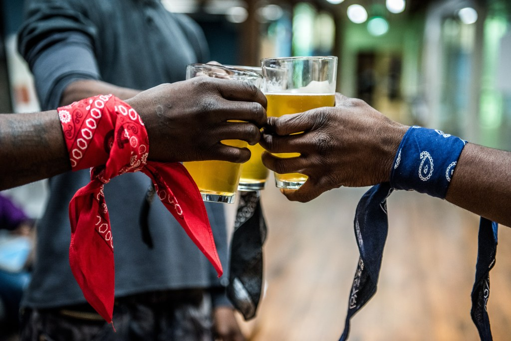

Despite that purely mercenary consumerist capitalism still rules the roost of business, the ideas of using [business as a force for good](https://bcorporation.net/about-b-corps) and [conscious capitalism](https://www.consciouscapitalism.org/credo) seem now to have fully entered the popular mind stream. 

National and international organizations (and their associated events) like [B Lab](https://bcorporation.net/), [Conscious Company Media](https://consciouscompanymedia.com/), [Social Capital Markets](https://socialcapitalmarkets.net/), [Social Venture Network](http://) and the [Zebra](https://www.zebrasunite.com/) movement have for years, if not decades, been working to bolster this movement. They have also been integral to bringing the conversation about conscious business into the mainstream.  (Also see [this list](https://consciouscompanymedia.com/sustainable-business/10-conscious-business-industry-groups-consider-joining/) of industry groups with similar missions.) 

A few themes are pushing to the forefront of this conversation that are both encouraging and demanding. These are threads that ran throughout the discussions and presentations many of the gatherings that I was at over the last few years: [DazzleCon](https://www.zebrasunite.com/attend-dazzlecon-17) in 2017, the annual [B Corp Champions Retreat](https://bcorporation.net/2019-champions-retreat), and the recent the [Conscious Leaders Forum](https://consciouscompanyleadersforum.com/) and [BCEO Women's gathering](https://bthechange.com/we-the-change-women-together-envision-a-better-earth-through-better-business-8c9524777a14) of female B Corp founders and CEOs. Likely, these topics are now also points of focus at every other gathering of this type.  They are clusters of attention that are gaining strength and it's become ever more clear that we can't have the conversation about doing well by doing good in business without talking about them:

**1. Equity, inclusion and diversity.**

**2. Self-care and mindfulness.**

**3. Love.**

**4. The how, not the what.**

Let's break 'em down a little, with some resources to learn more, if you are so inclined...

**Equity, Inclusion and Diversity**
 If we are going to improve the state of the world, it's becoming ever more clear that generative change cannot happen with a narrow group of people nor a narrow frame of mind. Limited and disproportional inclusion can only lead to limited and disproportional benefit. Broadening our understanding of identity and access has become fundamental to the movement to use business to drive that change. Emphasis on [deepening our awareness](https://consciouscompanymedia.com/workplace-culture/3-lessons-on-advancing-equity-and-inclusion-in-the-workplace/) of entrenched and toxic exclusivity, inequity and homogeneity is fueling a greater consciousness of what is possible when more and varied perspectives are included. Gatherings like [Spectrum](https://consciouscompanymedia.com/spectrum/) are heralding the powerful wave of change that emerges from diverse experiences, identities, geographies, abilities and perspectives. Providing resources for effective [inclusiveness has become a top priority](https://bcorporation.net/for-b-corps/inclusive-economy-challenge) for B Lab. The Zebra movement is focused on [re-appropriating the system](https://medium.com/@sexandstartups/zebras-lets-get-in-formation-fdcbc72fec4a) to be something more and to be something different kinds of entrepreneurs actually want to participate in. 

**Self-Care and Mindfulness**
 We're learning that for real change to happen it has to be internalized.  Anxiety, franticness, self-aggression, depression and guilt are not sustainable fuel for positive change. As the demands of a speedy, relentless world take their toll on our bodies and psyches, and our societies and environment need all the help they can get, the stakes have become higher. It is ever more recognized that any inclination to use business to offer that help to the world must be supported by sane minds and healthy bodies. Caring for ourselves is integral to being effective entrepreneurs and changemakers. 

[Impact Founder](https://www.impactfounder.com/), the [School of Upliftment](https://soultour.com/sou), [Search Inside Yourself](https://siyli.org/) and [Awake at Work](http://awakeatwork.net/) are just a few of countless organizations that are addressing this need and this opportunity.

The jury is in: self-care and awareness, in its various forms such as meditation, yoga, time in nature, saying no, etc. are integral priorities for the most potent work to be done.  

**Love**
 Love has entered the language of mainstream business management. Elderly, white and sometimes even politically conservative male CEOs are getting up in front large audiences to talk about love being the mainstay of the success of their multinational companies. [Ray Anderson](https://www.youtube.com/watch?v=iP9QF_lBOyA), the famed founder of [Interface Inc.](https://www.interface.com/US/en-US/homepage) carpet, may have been one of the first to break the modern seal on imbuing the power of business with sentimentality (along with [James Autry's earlier books](https://www.amazon.com/James-A.-Autry/e/B001IYZFQG) on biz leadership as service). And [Bob Chapman](https://ileadwithlove.org/bob-chapman-2018), CEO of the equipment and engineering conglomerate [Barry Wehmiller](https://www.barrywehmiller.com/), is now coming on strong. His approach may be based in a Reagan-era paternalism, but the message that comes through in [his writing](https://www.amazon.com/Everybody-Matters-Extraordinary-Caring-People/dp/1591847796) is unequivocal in its emphasis on the need for love and caring to be the foundation of any successful business. Similarly, the first new rule of business in [Raj Sisodia](http://rajsisodia.com/)'s [*Firms of Endearment*](https://www.firmsofendearment.com/) is: 

> Build a high-performance business on love. 

And Mary Powell, CEO of Green Mountain Energy, who has massively grown the company's revenues, attributes a large part of her company's success to ["leading with love."](https://greenmountainpower.com/news/gmps-mary-powell-list-world-changing-women/)

The understanding is that the impact of a company is directly predicated on the love and care that its employees are afforded in their work. If employees feel valued and truly cared for, they will not only develop the talents and gifts that contributed to a well-resourced, successful company, but will be happier, more fulfilled human beings with more to offer their relationships and the world. This approach to conscious business reasons that we can [change the world one job at a time](https://www.trulyhumanleadership.com/?page_id=36), with love. 

**The How, Not The What**
 The questions of what companies should do to create change in the world and what they can do to do good are changing. The questions are now *how* do we create change in the world and *how* do we do good? We are seeing increasingly compelling instances of the purpose behind mission-driven companies being expressed in how they do business. A beautiful example of this is [TRU Colors brewery](https://trucolors.co/). TRU Colors is North Carolina brewery staffed by local, often rival, gang members. The mission of the company is to eliminate gang-related gun violence in area. This mission is accomplished by offering gang members rewarding employment alongside people who have been their adversaries in the community. Training and group facilitation is provided as part of the professional training for employees. Thus far the gang-related violence has been significantly reduced in the community since the brewery started hiring gang members. TRU Colors' economic product is beer, but how and by who that beer is produced is where their impact lies. 

Similarly, a company like [Warby Parker](https://www.warbyparker.com/) is creating impact not by selling eyeglasses, but by [producing them](https://www.warbyparker.com/how-our-glasses-are-made) in a sustainable, non-toxic way and by having integrated a [Buy a Pair, Give a Pair program](https://www.warbyparker.com/buy-a-pair-give-a-pair) into their business model. My business [dojo4](https://dojo4.com/) creates our most powerful impact not only through the code we write for clients but by providing our members with an engaged livelihood that supports not only their families but their passions, and by creating and serving our community. 

There are more and more examples that any company can be used to do good in the world. An [outdoor apparel company](https://www.cotopaxi.com/pages/gear-for-good) can be based on "improving the human condition" and impactful in making "[meaningful strides toward reducing global poverty](https://www.cotopaxi.com/pages/impact-report)." And this is potent it means that *any* company can create impact. We have [clients](https://dojo4.com/work) like [Brass Taxes](https://brasstaxes.com/) and [InKind](https://inkind.com/) who are creating significant positive impact and humanizing the way business is done through providing everything from [tax services](https://brasstaxes.com/) to [restaurant financing](https://www.inkind.com/). 

As we work to co-opt business as a way to create benefit, we're learning how to do it better. Inclusion, self-care, love and how we do it will be the supports that are going to make it happen.
