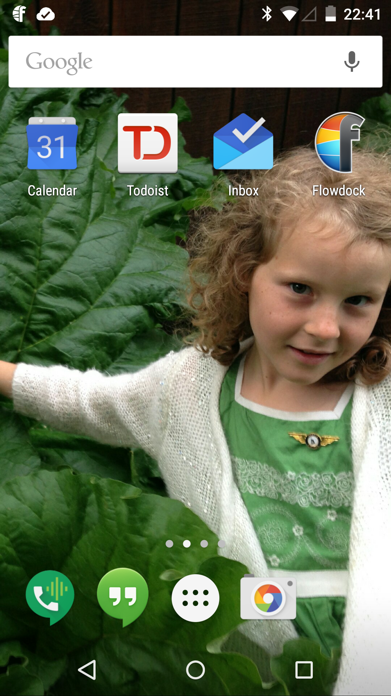
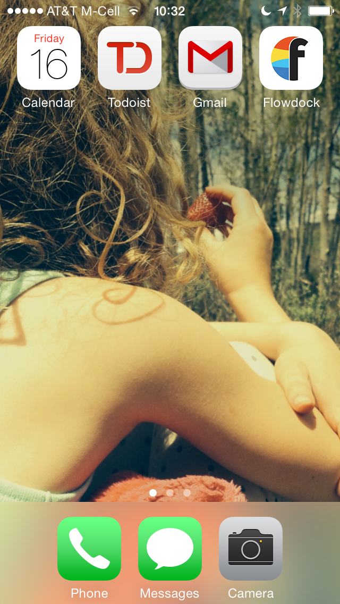
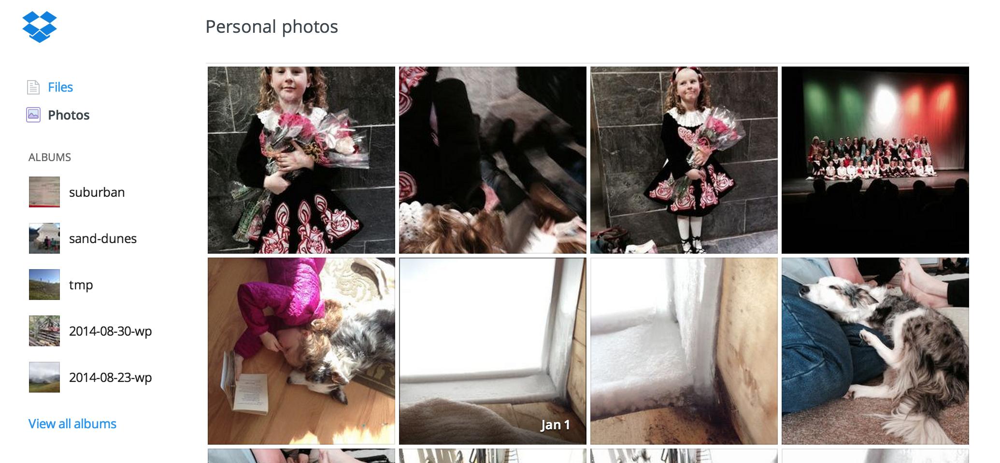

People love gadgets and gimmicks, especially those that promise to help them get more shit done.  Maybe no single thing ever invented has more potential than the smartphone to liberate people from having fill their brains up with the massive amounts of minutiae [trying to move the needle](/blog/the-big-pivot) requires.  The magic of having a CPU, camera, beautiful screen, GPS unit, crazy good navigation, the internet, [all of wikipedia](http://techcrunch.com/2015/01/15/wikipedia-rolls-out-a-redesigned-mobile-app/), and even an actual phone in your pocket is truly something straight out of [The Jetsons](http://en.wikipedia.org/wiki/The_Jetsons).

Of course, like all tools, it is the user that decides what to do with it's potential and the reality is, for 99% of people the phone has become an agent of distraction, entertainment, [relationship destruction](http://i.huffpost.com/gen/1758465/thumbs/o-MOM-TEXTING-facebook.jpg) and generally "Not Getting Shit Done" (TM).

Following is my own personal list of techniques for using my phone as a tool instead of a toy:

1) Clean that thing up!
=======================  

Move all the Apps you don't use out of the way, and put 'first things first' on your home screen.  Here is a shot of my Android phone's desktop:

And here's my iPhone:

No 'Angry Birds', no iTunes, just the stuff I Need.

2) First Things First
=====================

The apps I do choose to keep handy are organized with a very deliberate goal: to GSD (Get Shit Done).

I have all the essential, but minimal, ingredients of my work life striped across the top, organized from ['most urgent, and important'](http://olivergearing.com/wp-content/uploads/2013/03/Importance-Vs-Urgency.gif) to ['important, but not urgent'](http://olivergearing.com/wp-content/uploads/2013/03/Importance-Vs-Urgency.gif).

A Brief explanation of the 4 apps up top:

- Calendar.  This is stuff that must happen *today*, I never put anything on my calendar that isn't a real, live, hard date so there is rarely anything waiting for me here.

- Todoist.  This is my todo list, it's full of stuff that I've planned and should be working on *now*.

- Email. A lot of people would put this first, but I don't like training my mind, or other people's, to consider email as some sort of realtime todo list.  I check it when I get around to it, and process it into actionable items at that time.

- Flowdock: this is our rally point at work, one part instant messaging and one part status board, I drop in here when I need to but, as with email, try not to let it drive my work for the day.

And the 3 down low:

- Phone.  I try to use this more than forms of messaging.  People waste a lot of time typing on tiny keyboards when a call would do just fine.  A corollary to making this useful is keeping your contacts up to date and synced.

- Messages.  I hate having this on my home screen but a few parts of my life require it.  Most tend to be personal in nature and I've capitulated to those people that prefer SMS because of their importance to me.

- Camera. The polaroid quality of having a camera connected to the internet cannot be overstated and it's the thing I miss the most if I'm not carrying a phone.  I snap shots of white boards, things that are broken before heading to the hardware store, dogs, and kids.  A Picture is worth a 1000 words and I try to use mine a *lot*.

3) Shut up everyone!
====================

My loathing of bleeping beeping notifications is [well documented](http://dojo4.com/blog/your-application-s-notifcations-bleeping-beep), but the phone is my least favorite notifier.  I absolutely do not need a beep-y digital device interrupting my concentration like some kind of remote control anyone in the world with a a host of stupid apps can activate.

I have notifications for all apps turned 100% off.  My phone makes no noises, no beeps, it has zero badges showing piles of unread stuff.  None of that.

You may be wondering how people get ahold of me who really need to.  That's actually pretty easy: I've installed a silent ring tone as the default for my phone.  This truly wonderful as my phone never rings ;-)  However, I have an audible ring tone assigned to three people:

- My wife
- My business partner
- My mom

This let's me never need to mute my phone and, with all sincerity, interrupt any meeting when my phone rings with a polite "I'm sorry, but I really need to get this" before stepping out and taking what I already know to be an important call.

4) Backup nothing
=================

Although I used to be an avid film photographer I never got into any form of digital photography; the idea that I could fill up a drive with 10,000 photos without caring about the quality or cost was bad enough, but needing to plug the damn thing in was an absolute buzz-kill.  Don't we have technology for that sort of thing?

Some people are religious about backing up their phones but that is something that needs actually doing, and I'm all about less doing of things.  My approach is simple:

- Only use apps that sync to the cloud, or otherwise manage their own data.

- Install DropBox on your phone for a single reason: use the 'Upload Camera' feature to ensure that all your photos quietly and automatically migrate off of your phone, and into the safety of your DropBox storage.  This ensures that all those precious photos are out of some stupid gallery application and in safe and simple place where you never have to worry about them.

- Use [Rdio](http://www.rdio.com/) to listen to music.  As my good friend [Ben](https://twitter.com/bbrinck) once said: "owning music is an old fashioned idea."  I used to own terabytes, yes terabytes, of mp3s.  I used to mess around buying stuff, syncing stuff, and plugging in my phone to realize the magic pile of crap called iTunes.  And then I saw the light: pay Rdio 12 bucks a month, listen to whatever I want, whenever I want.  Store nothing.  Do nothing.  I do sync some stuff to my phone for offline listening, but this is data that I don't care, or need, to ever backup, should my phone drop into a lake, or the snow, or the [great sand dunes](http://www.nps.gov/common/uploads/photogallery/imr/park/grsa/FB1BFF10-155D-451F-67C2FAC1CA54425A/FB1BFF10-155D-451F-67C2FAC1CA54425A.jpg) (all things which have happened).

5) Write, but do not read
=========================

I'm sure some of you are doubting my sincerity here since I do, in fact, post quite a bit of stuff to [Twitter](https://twitter.com/drawohara) and [Facebook](https://www.facebook.com/ara.t.howard) but here is my secret: I use email to post everything.  I do this via our [family tumblr](http://mostlovelyart.com/) and Tumblr's excellent ability to accept posts, including photo posts, via email and relay them to both Twitter and Facebook, and a variety of other methods that let me snap a photo, open up mail, type something quick, hit send, and forget about it.  This has the added advantage that email *always* works, even when I'm offline.

So, there you have it.  5 ways to make owning a smartphone less stupid or, at least, more conductive to moving your life forward.

