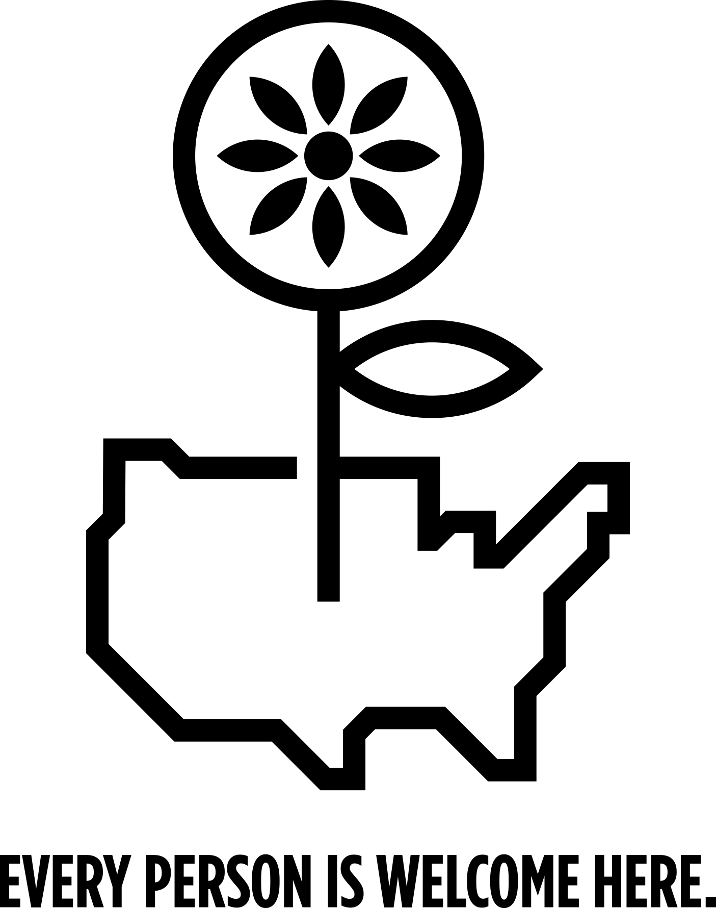

The election happened. We looked around and suddenly understood that other people might see us as possible haters; that as far as they could see we could be secretly (or not so secretly) harboring ill will toward them, wondering if we'd prefer they weren't here, and disrespect them as fellow human beings. 

Xenophobia, racism, misogyny, homophobia, and prejudice of all kinds have always existed in this country, but we are, perhaps, more in danger now than ever of having those types of violence normalized. We resist and rail against this! And we want people to know that we are [working to liberate ourselves](http://www.whiteaccomplices.org/) from these fundamental misunderstandings of the truth of interdependence. 

*All spaces big or small, whether they be a public space, a business, an institution or a country, shall be welcoming and safe for all humans. We may not share beliefs, appearance, privilege, experience nor means, but hold in common the infinite capacity for human kindness. Regardless of gender, religion, origin, race, ethnicity, ability, or economic access, every person has indelible value. We recognize this and proclaim it.*

 

So, we created an [image](http://dojo4.com/all-in) (thanks, [Anthony Dimitre](http://anthonydimitre.com/)) to let others know and remind ourselves that we welcome all people, whether it be in our homes, our streets, our businesses, our institutions, or our country. If that speaks to you, too, [download here](http://dojo4.com/all-in) and share far and wide... 