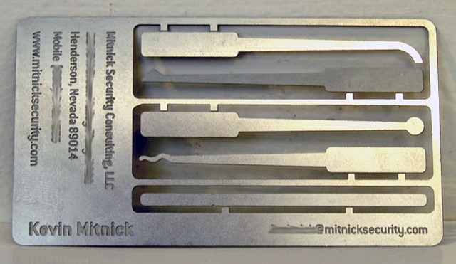

Like many other shops, we deal with many smallish problems. Problems like where to get our coffee from ([Boxcar](http://boxcarcoffeeroasters.com/)), where to go for lunch, what editor to use (Vim).

We also struggled with how to manage who has access to our development, staging and production servers. We went through a few iterations attempting to solve this problem. We then hit two realizations:

* Everyone that develop and deploy code are in a single team on GitHub
* GitHub provides access to the [public SSH key for their user via their API](http://developer.github.com/v3/users/keys/)

It turns out that SSH *public* keys are indeed **public**. The impending arrival of [Miles Matthias](http://dojo4.com/blog/miles-smiles) provided the motivation to act on this insight. [lockpick](https://github.com/fredjean/lockpick) came out of that realization. 

We now have the ```lockpick``` script on a cron job. Any member of the dojo4 and trusted sub team now has access to our servers.

[lockpick](https://github.com/fredjean/lockpick) is open source software and is licensed under the MIT license.

--

Image from [Ran Yaniv Hartstein](http://www.flickr.com/photos/ranh/), found on [Flickr](http://flickr.com) at http://www.flickr.com/photos/71052670@N00/106709219/in/photolist-aqUW8-2NYNRp-3afgoE-56hKYh-6tsdur-6twmtW-7bBkEv-acmuGx