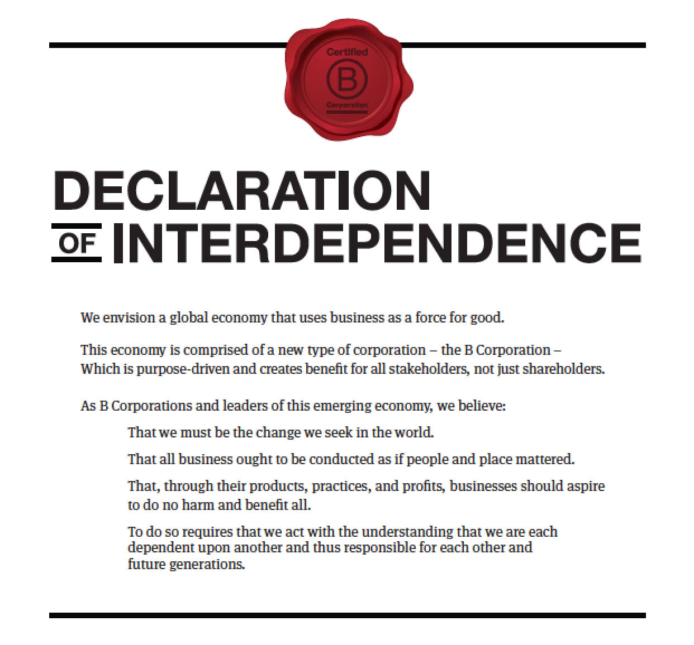

 

It was recently [time to re-certify](https://www.bcorporation.net/become-a-b-corp/how-to-become-a-b-corp/performance-requirements) as a [B Corp](https://www.bcorporation.net/what-are-b-corps) - we were happy to do it and pleased to [pass with flying colors](https://www.bcorporation.net/community/dojo4). Just like [the original assessment](http://www.bimpactassessment.net/), the recertification took some serious time and energy, but we've been really pleased to be a [B Corp](https://www.bcorporation.net/what-are-b-corps) these last two years and so it felt well worth it.

[As we've mentioned before](https://unreasonable.is/5-benefits-to-becoming-a-b-corp/), there are lots (or at least 5!) of good reasons to be a B Corp:
1. It’s stellar marketing.
2. It puts you in good company and a strong network.
3. It raises your standards and makes them easier to maintain.
4. It supports and includes you in a thriving movement.
5. It lets you and your stakeholders, rather than your shareholders, decide what’s best.

That being said, the B Corp certification is a means not an end. Being a B Corp means meeting [the highest standards of verified, overall social and environmental performance, public transparency, and legal accountability](https://www.bcorporation.net/what-are-b-corps/about-b-lab). Being a force for good is achieved by organizations without necessarily being B Corp certified. But the certification does provide a framework and support structure for some of the world's most impactful businesses in the world, big and small, to do their best work. 

The B Impact Assessment is updated every two years to keep the standards up to date. Having gone through it twice now, we have some specific suggestions to improve those standards, especially to make it more accessible for startups looking to certify (and re-certify). There are a number of ways that what certain companies do (or don't do) could be more adequately and compellingly reflected in the assessment:

* Currently only contributions to 501c3s are accounted for. This does not reflect financial and in-kind contributions to entities and campaigns that may not be designated as non-profits. For instance, the current assessment has no way to recognize our contributions to GoFundMe campaigns for individuals, support for [Standing Rock activists and actions](https://medium.com/@ShaunKing/please-support-these-5-standing-rock-legal-defense-funds-to-stop-the-dakota-access-pipeline-754be4674ec2), or [Awesome Boulder](http://www.awesomeboulder.org/).  Not all impactful philanthropic financial and in-kind contributions are tax deductible.

* The assessment puts a lot of weight on environmental practices and emphasizes the reduction of waste. However, it does not account at all for the carbon cost of internet/data usage. As a tech company, we have no physical inventory but store a vast amount of information on servers that use [an immense amount of energy](http://thebulletin.org/dirty-parts-computing-world9312) and [water to operate](http://). If we were asked to track this usage, it would work against our B Impact score- and rightly so. The [B Corp community](https://bthechange.com/will-the-digital-future-be-green-6cd2bbd34f4a) is [looking at this as a major factor](https://bthechange.com/sustainability-in-business-a-greener-internet-99aa96734024) to be taken into consideration, but it is currently omitted from the actual assessment. The assessment could be used to get [companies to up their game and use the internet in greener, most sustainable ways](http://www.greenpeace.org/usa/global-warming/click-clean/). 

* At dojo4, collectively, we have [made](https://github.com/spikex) [thousands](https://github.com/ahoward) of [open-source](https://opensource.org/) [contributions](https://github.com/copiousfreetime). This is one of our most valuable contributions to the technical and business communities. There is currently no way to reflect this contribution, qualitatively nor quantitatively, in the assessment. This is a major oversight of the unique offerings and impacts that technical organizations make to business, education, innovation and society, in general. 

* dojo4 consists almost exclusively of contractors (and now, members, since we've become a co-operative). We offer both perks and substantive benefits to contractors. However, right now it does not matter how much awesome stuff we do for contractors (none of which is legally mandated)- the B Impact system has no way to count it. Most startups rely heavily on contractors, and measuring the good that we do by them would help motivate companies to treat contractors better than they otherwise might. The assessment would be improved by creating ways to measure benefits that companies offer to 1099 contractors.  

* To reflect the current workforce, the assessment should account for the efforts made in home / virtual offices. People make huge investments in make their home offices to make them environmentally friendly. The B Impact assessment would be greatly enhanced if it took into account the efforts made to reduce and track the use of water, energy, as well as the procurement practices in alternate workplaces.  But, right now if you have a home or virtual office, the assessment does not count a single positive thing that you do for the environment.  This favors those companies that pay rent or own an office building and does not reward those who reduce unnecessary and wasteful commutes by working where they live. 
 
* The assessment offers points for creating local benefit. This is surely a worthy criterion but does not provide an alternate opportunity for organizations that serve their end-users digitally, and thus often without regard to geo-location. Currently, the benefit is only measured for the end user, not the client, so our choice to work with local companies is not reflect since only the location of the client's customers is measured. This does not adequately account for the supply chain choices that can be made by software developers to support their local economies. For instance, we cannot usefully define the location of the individuals that use the software we build, but we can choose to work with clients that operate in a specific location, such as our local community. If the client is local, the benefit should be local, even if that client serves an international group of users.

As [B Lab](https://en.wikipedia.org/wiki/B_Lab) and [the B Corp community ](https://www.voanews.com/a/b-corporation-real-value-social-values/3798503.html)continues to evolve, the assessment will continue to evolve and adapt to the standards that are necessary to do the most impactful work that businesses can be doing in the world. We're proud to be part of that movement and excited to adapt and improve as part of it! 

*We would not have made it through the original assessment, the recent recertification nor much of the content in this blog post without hard work and intellectual acumen of [Emily KenCairn](http://dojo4.com/team/emily-utz).* *And you could now have the same good fortune to work with her in this capacity - amongst other things, she now works with companies of all sizes to help them get B Corp certified through her own consultancy, [Apiary Impact Advisors](http://www.apiaryimpactadvisors.com/).* *Hire Apiary today and you'll be a B Corp before you know it!*

