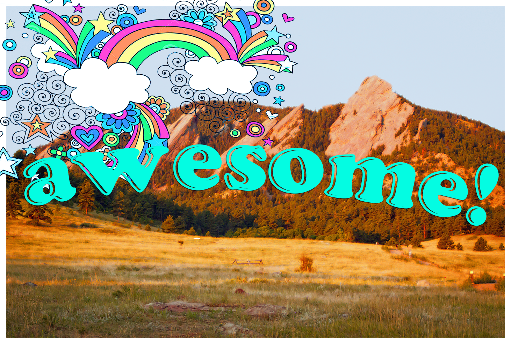
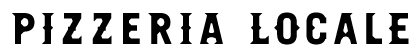
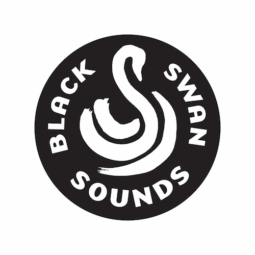

 

One of the best things about being on the Board of [Awesome Boulder Foundation](http://www.awesomeboulder.org/) is the annual celebration at which we:

- hang out
- eat good food
- drink some beers
- visit with some of [the past year’s grantees](http://www.awesomefoundation.org/en/chapters/boulder)
- drink some beers 

This year's bash was especially delicious, thanks to our favorite pizza joint, [Pizzeria Locale](http://localeboulder.com/), which managed to donate 30 pies to our event in the midst of their Friday evening rush. Thank you pizza gods!  

 

A huge shout out also goes to Joel of [Black Swan Sounds](http://www.blackswansounds.com/) who brought out the booty-shakin' soul in all of us.

 

If you're someone doing cool shit in Boulder, it's super easy to [apply](http://www.awesomefoundation.org//submissions/new) for an Awesome Boulder grant. $1,000. Submission deadline's once/month. Make Boulder even more awesome, and then you can come to next year's party! : )

