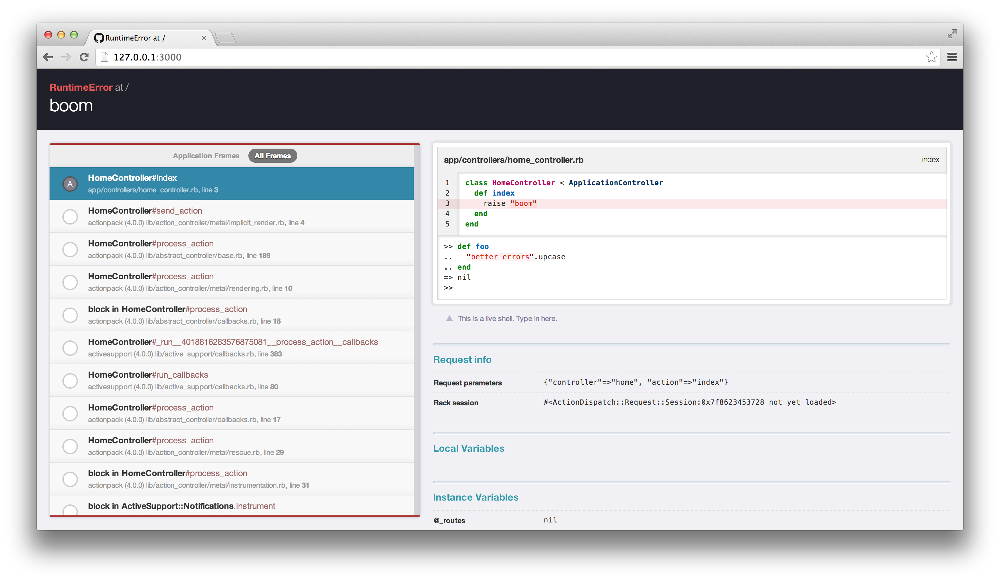

One of the rails gems that we've been using in our newer apps is [Better Errors](https://github.com/charliesome/better_errors), which allows you to be dropped into a pry-like REPL and nicer error page when rails raises an exception during the browser's request process.

 
_([Image source](https://github.com/charliesome/better_errors))_

This is helpful for our developers because instead of getting a static error page, going to search in the code where to put a `binding.pry`, and re-running the error prone code, Better Errors loads a page where we can interact with the code right there and then, enabling us to find the problem faster, write a fix faster, and iterate faster.

One of the recent features we just discovered is the ability to see the last rpc error. We have a pattern of ajax calling an rpc method in our rails app when we just need to get some information or post a simple object like favoriting a user or something. The code that runs on our rails server that handles that ajax request won't blow up the whole server and automatically invoke Better Errors, so the work around is to go to a special url that better errors exposes to show the last error thrown in our rails code: http://localhost:3000/__better_errors. 

Has anyone else out there used this tool? What are some things you like/dislike about it? Always love to hear feedback via twitter (click below).