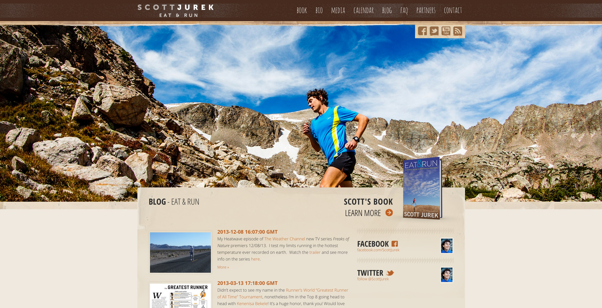
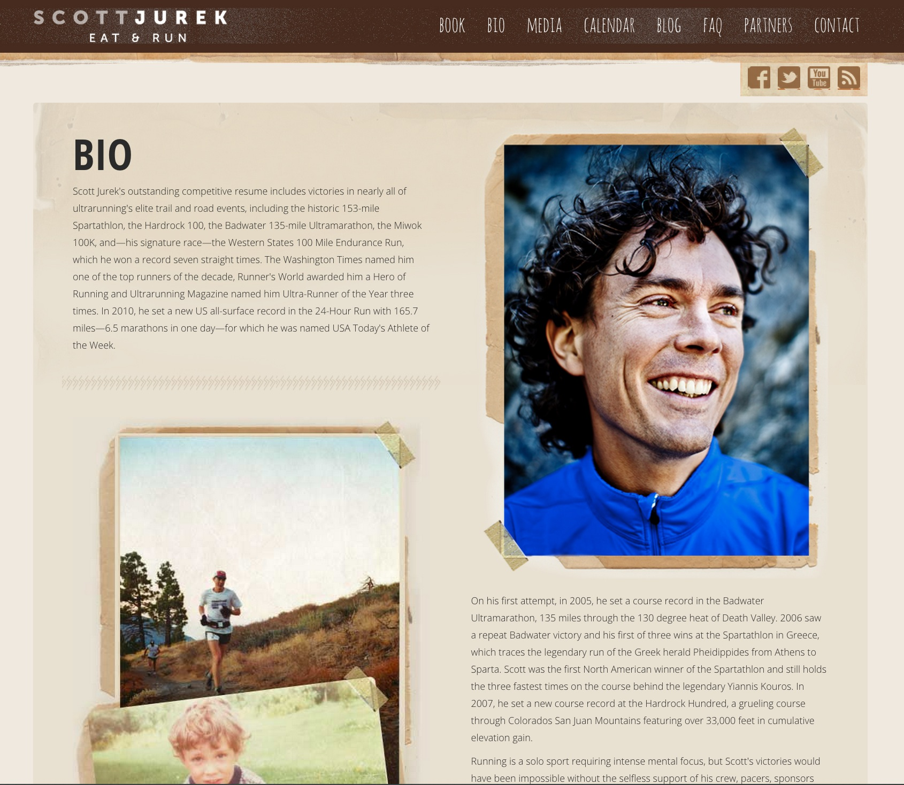

*"Setting a record on the [Appalachian] Trail means huffing through an ultra marathon once a day, every day, for about six weeks. The total elevation gain and loss is nearly 515,000 feet, and much of it is hardscrabble rock barely identifiable as a trail."*

We at the dojo are cheering for our old friend & client, [Scott Jurek](http://scottjurek.com/) as he [attempts to break the speed record for the AT](http://www.outsideonline.com/1997316/will-scott-jurek-break-appalachian-trail-record-maybe).   

In 2012 we had the enjoyable experience of building a fast-loading [static website](http://dojo4.com/blog/static-is-the-new-black) for Scott, to coincide with the launch of his memoir, [*Eat & Run*](http://scottjurek.com/eatandrun/). We worked together to create a visually cohesive brand as well as to incorporate a blog and a calendar plugin that he could edit.

 

We love the site and we love the man.  This quote from *Eat & Run* could easily have come from our CTO, Ara Howard:

"There’s a joy to discomfort and pain. Any time you push through a barrier of discomfort there’s an ease and a lightness on the other side."  May that philosophy carry him swiftly into yet another mind-boggling ultra-running record!

### UPDATE

[HE DID IT!](http://www.runnersworld.com/trail-racing/scott-jurek-celebrates-a-new-appalachian-trail-thru-hike-speed-record)

