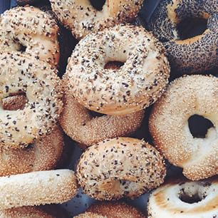

*"Don't call it a comeback, I been here for years."* 
    
    - LL Cool J

DOJO4 is more than just an awesome boutique software company.  We're also a community space.  Before there was [The Hub](http://dojo4.com/blog/hubbishness), there was the dojo.

We still like to gather people for various [Meetups](http://www.meetup.com/Denver-Boulder-Freelance-Web-Developers/) and [happy hours](https://www.facebook.com/dojo4codeanddesign/events?ref=page_internal) on a regular basis; and starting a week from today we'll be bringing [Code && Coffee](https://twitter.com/codencoffee) back home.  This is a weekly, informal, gluten-friendly gathering of developers - many of the Ruby persuasion, but all are welcome.  

**WHO:** You, your laptop.
**WHAT:** [Code && Coffee](https://twitter.com/codencoffee) (&& Bagels && Tea)
**WHEN:** Wednesdays, 9AM - 12PM
**WHERE:** 2030 17th St. Boulder, CO 80302

It'll be exactly like this:

 

With a little of this thrown in for good measure:

 

