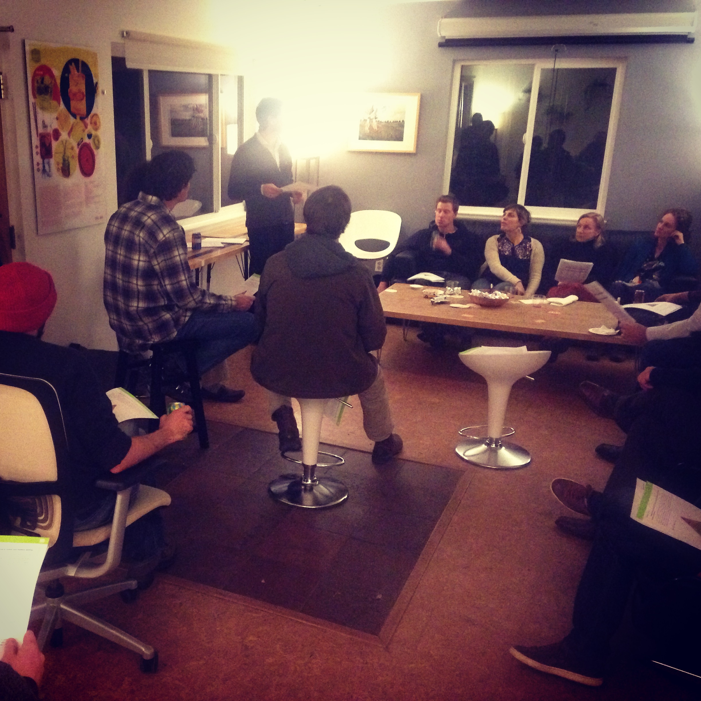

Last night we hosted the first dojo4 Community Happy Hour, a monthly series featuring a short talk by a presenter from our community, bookended by beer, wine and delectable treats. 

**5-6:30pm every third Thursday, come to 2030 17th Street.**  Bring a friend, bring a bottle to share and warm up the winter evenings by engaging interesting topics, enjoying each other's company, and enriching your world.  

A big shout out to [Downtown Boulder, Inc.](http://www.boulderdowntown.com/) for sponsoring these gatherings!  Keep an eye on [dojo4's Facebook events page](https://www.facebook.com/pages/dojo4/109134865775715?sk=events) for upcoming topics.  Hope to see you there!

 
*Sol Halpern of [Highlander Wealth: A Mindful Finance Company](http://www.highlanderwealth.com/), enlightening us last night on the basics of being awake with regard to our financial lives.*

