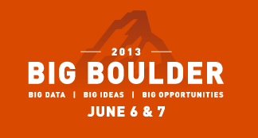

Starting today, lil ol' Boulder hosts [Big Boulder 2013](http://bigboulderconf.com), [Gnip](http://gnip.com/)'s second annual, star-studded conference dedicated to social data. We enjoy working with Gnip throughout the year as a client, but supporting this project is always especially fun. 

In terms of design, we updated the iconic Flatirons logo for this year's conference, and redesigned the brochure and lanyards for press. We were also pleased to do the logo and layout design for the [Big Boulder Initiative](http://bigboulderconf.com/initiative), launched today.

 

In order to let the killer, responsive aesthetic of the conference (yes, we think it looks gorgeous, in the the flesh and on the phone) shine seemlessly, we made sure all the technical components were properly in place:

- we moved hosting to S3

- we implemented new [Middleman gems for S3 syncing](https://github.com/fredjean/middleman-s3_sync), gzipping, and other types of site optimization

- devised strategy for [old conference](http://2012.bigboulderconf.com/) / new conference archiving

- swapped out [Zurb CSS framework](http://dojo4.com/blog/zurbs-foundation-3-embracing-the-new-old-box-model) with Twitter Bootstrap for consistency between Gnip's web properties

- branded and built [The Big Boulder Initiative microsite](http://bigboulderconf.com/initiative)

- helped automate creation of name badges, feeding CSV file into InDesign (a simple tutorial on this to follow this post soon...)

 

dojo4 is psyched to be able to support the Gnip team and contribute to this important gathering!

*this blog post made possible by [Steve](http://dojo4.com/team/steve-bailey) and [Anthony](http://dojo4.com/team/anthony-dimitre)*

