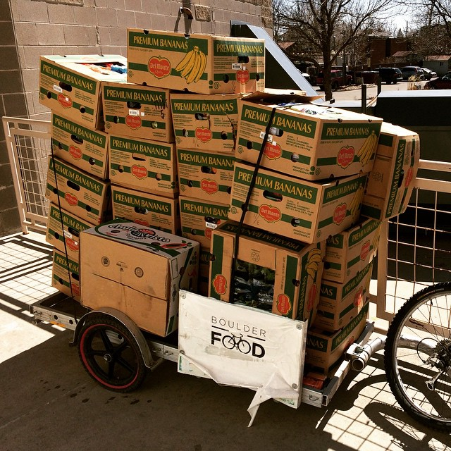
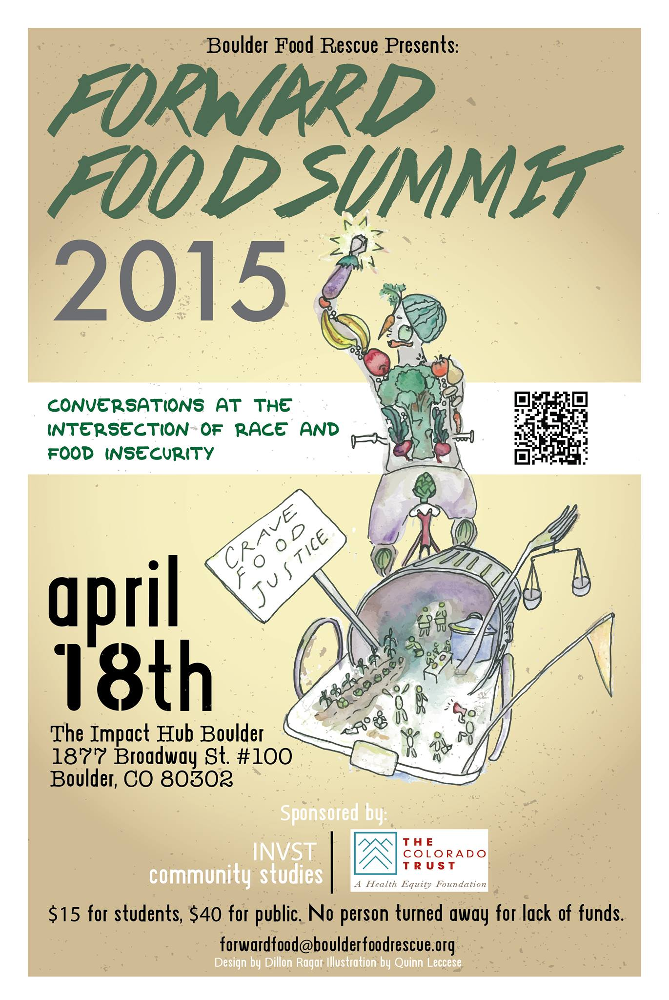

On his way to work Monday, dojo4 developer Rylan Bowers picked up about 500 lbs of would-be-thrown-away-food from Walmart and powered it over to [Harvest of Hope](http://www.hopepantry.org/index.html) *on a bike*.  

 

Rylan has volunteered almost every Monday for [Boulder Food Rescue](http://www.boulderfoodrescue.org/) over the past two years. When asked why, he shared that, "Volunteering my time/energy and giving back to the world/community is very important to me and was ingrained in me from an early age by my mother. Growing up we volunteered with Children's Home Society in San Diego to help those at a disadvantage in society. When I moved to Boulder I wanted to continue giving back in some way and found Boulder Food Rescue. Food waste and misallocation of resources are major issues worldwide and are important for me to address and be involved in in any way that I can. This was a way I can be involved in volunteering, saving food from going into the garbage can and moving it to people in need while keeping a low carbon footprint. Wins all around!"

In the good 'ol US of A food waste is arguably a much bigger problem than food shortage.  A comprehensive report from [endhunger.org](http://endhunger.org/food-waste/) notes that in 2010, "31% of the 430 billion pounds of the available food supply at the retail and consumer levels went uneaten." Translation: over half of the daily recommended caloric intake for grown men, much less children, was thrown in the trash.  Meanwhile, *1 in 6* Americans experiences food insecurity--aka: hunger.

Given this reality, we hope *every* town and city in America will found it's own Food Rescue. BFR is [making that possible](http://www.boulderfoodrescue.org/index.php/start-your-own-food-rescue/) through advocacy, mentorship and leveraging technology for good. Check out their open sourced [Food Rescue Robot](https://github.com/somerandomsequence/food-rescue-robot), already being used in at least 22 cities.  The Robot reports that Rylan has clocked about 90 pickups, 9,000lbs of rescued food and counting. 

If this peaks your curiousity about food justice work locally--and we hope it does--go to the [Forward Food Summit](http://www.boulderfoodrescue.org/index.php/forward-food-summit/) next month over at [Impact Hub Boulder](http://www.impacthubboulder.com/).

 
