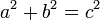

i think many developers consider the work of development to be about developing software.

for sure it is about that!

however, it's also about developing the developer.  

*getting stronger.*

here is a simple algorithm one can use to become a stronger developer:

- understand the problem completely

- design an abstraction

- implement the abstraction

- release the abstraction

- solicit feedback

- use feedback to build understanding

that's pretty abstract for some people to understand, so let me give a concrete example contrasting this developer

from this one

in development of an application that needs to create isosceles and right triangles.

developer one uses the following process:

- pull the 'isosceles' card off the board.  don't bother reading the 'right triangle' one.

- get samples of isosceles triangles.  write code that can reliably produce just those kinds of isosceles triangles the code expects.  since doing more is YAGNI, check it in, make sure CI is green.  and head home.

developer two does instead:

- review the board.  read recent commits.  undestandings the 10,000 ft. roadmap the developer merges the 'isosceles' and 'right' triangle cards into a single new card called 'build a triangle domain model' (understand the problem)

- developer works on paper, finally arriving at (the abstraction)

- developer implements code that models generic triangles using the theorem and specialisations for each of the specific types 'isosceles' and 'right' (implement the abstraction)

- developer isolates the domain code from non-domain code and pushes a library to github.  (publishing the abstraction and soliciting feedback)

- developer merges pull request for 'divide-by-zero' bug several days later (using feedback to further understanding)

in the end developer one checks of a box and strenghtens his team's process.  developer two strenghtens the code, the team and, most of all, himself.

by repeating the process over and over developer one can transform himself in developer two by repeated working to strengthen technical and domain muscles.  conversely, developer two can stop training and become soft like developer one.

developer ability is just like muscle: you've got to use it or loose it.

