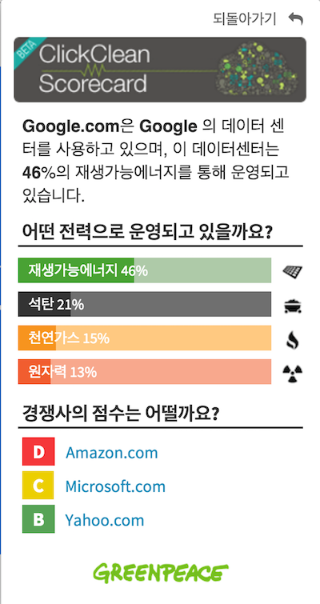

Greenpeace has been at the forefront of a growing problem many of us haven't really even thought about: the carbon footprint of our collective Internet use.  People, "the cloud" is actually on the ground, and it takes [A LOT of power to run it](http://www.greenpeace.org/usa/global-warming/click-clean/#report).  That power can either come from clean or dirty sources, and Greenpeace has been out there for years actually measuring the flow of energy that fuels our streaming video, texted photos and websites.

Greenpeace's [Click Clean Scorecard](https://chrome.google.com/webstore/detail/click-clean-scorecard/kabglhocepgbnobnbhjalijemcipaoha) Chrome extension is the latest plugin, so to speak, in their [Click Clean Campaign](http://www.greenpeace.org/usa/global-warming/click-clean/#report), which leverages consumer demand to compel corporations to switch to green energy sources. Now thanks to some serious nerd head-banging here at DOJO4, it now functions for Korean users in their native tongue. 

  

When you use the Click Clean Scorecard extension, a little cloud lights up red, yellow or green on your dashboard, indicating how the website you're on scores in terms of their data power sourcing.  Click on the cloud, and you'll see the details, but more importantly you'll have a Tweet all written out for you that either congratulates or shames the responsible corporation for their stand on clean energy usage. 

                 

For all you armchair activists out there, let me tell you: those Tweets make a difference! Waaaaay back in 2011, Greenpeace estimated that global energy use for data/computing was equivalent to that of the 6th largest country in the world. The subsequent explosion of mobile device usage, streaming video and remote data storage has increased that usage exponentially. So, by today's numbers, if we got the digital industry to go 100% renewable, it would be kind of like getting a nation the size of the United States to get off fossil fuels entirely. Pretty cool, huh?

