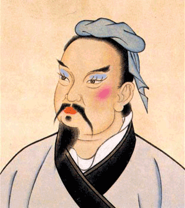

*A poor leader: the people fear.
A good leader: the people love.
A great leader: the people say, "we did it ourselves."
-Sun Tzu*

 

We [ask each other a question every Friday at dojo4](http://dojo4.com/blog/friday-question). It helps us understand ourselves each other better. Recently the question was: what makes an exemplary leader? This question starts to get at the heart of what leadership is. What does it mean to be a leader? How do we lead well in our own lives, not just for others but for ourselves. I thought the answers harvested for our motley crew worth sharing:

An exemplary leader... 

* has impeccable ethics.
* projects calm at the center of the storm.
* is someone who is not motivated by the desire to be liked, nor the fear of being disliked.
* understands that there is one mountain, but many passes.
* has integrity and the ability to hold a path in the face of adversity.
* can communicate effectively the reasons why a decision was made.
* will do the dirtiest work.
