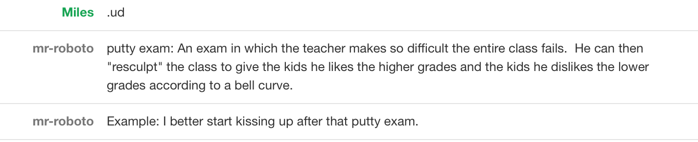

We take our work seriously. We're professional with our clients. We don't mess around.

In addition, anyone who's worked with us knows that we wear suits every day to work, we refer to each person we come into contact with by their last name only, and we express our feelings through the most professional of gestures - the head nod.

However, [UrbanDictionary.com](http://urbandictionary.com) is funny.

So I wrote [a ruby client](http://github.com/milesmatthias/urban_dict) to interact with the UrbanDictionary API and integrated it into our robot, [fbomb](https://github.com/ahoward/fbomb), which lives in our group chat in Flowdock.

Thus:

 

[Add it](http://github.com/milesmatthias/urban_dict) to your robots to continue your professionalism.