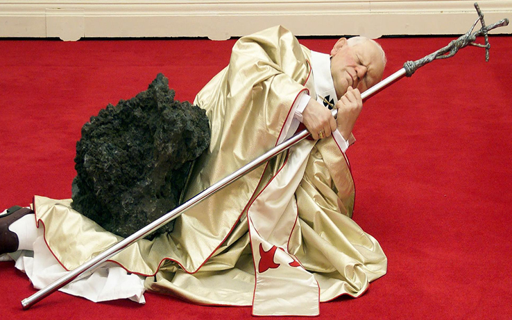

Over the course of several days last month dojo4 created a simple, beautiful [microsite]( http://www.mauriziocattelanmovie.com/) for director/producer [Maura Axelrod](http://mauraaxelrod.com/) on her forthcoming documentary, *[Maurizio Cattelan: The Movie](http://vimeo.com/110854034)*.  

If you're not familiar with Cattelan's work, I suggest going straight to a Google image search for a [punch-in-the-stomach-style introduction](https://www.google.com/search?q=maurizio+cattelan&es_sm=91&source=lnms&tbm=isch&sa=X&ei=vbSIVLLgCYqYyQTuvoLYDg&ved=0CAgQ_AUoAQ&biw=1440&bih=697) to this contemporary Italian artist's oeuvre. The *New York Times'* Artsbeat blog [featured Maura's doc](http://artsbeat.blogs.nytimes.com/2014/11/04/a-documentary-follows-the-curious-career-of-maurizio-cattelan/?_r=1) last month, aptly describing Cattelan as a mix of, "Surrealist whimsy with a darkly comic view of life in the 21st century."

 

Watch the [trailer](http://vimeo.com/110854034) and brace yourself for *Maurizio Cattelan: The Movie* in 2015!