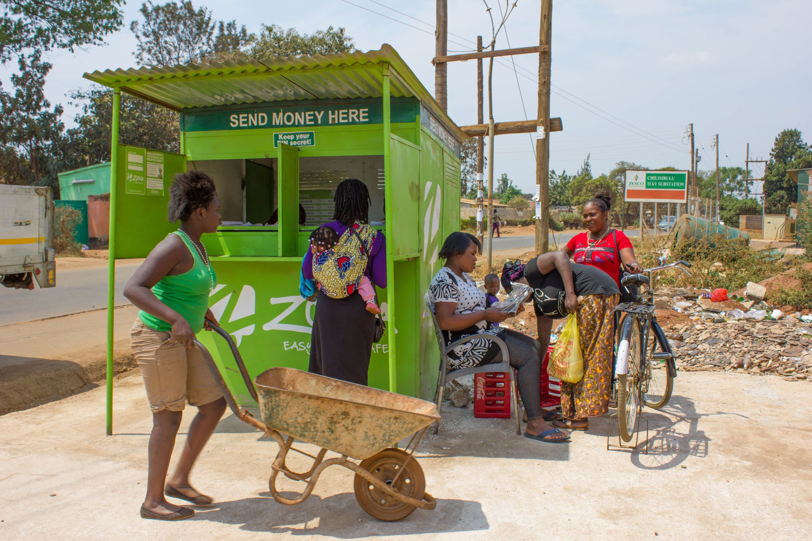

I had a super fun conversation last week with [Keith Davies](https://twitter.com/kdavies24), Head of Finance, Risk, and Analytics at [Zoona Africa](http://www.ilovezoona.com/), which is a mobile payments platform committed unlocking the full potential of the African continent.

I was extremely fortunate to get to know the CEO of Zoona, [Mike Quinn](https://twitter.com/zoonamike), and their Head of Talent, [Lelemba Phiri](https://twitter.com/lelemba), at the [the world’s first accelerator dedicated adolescent girls](http://girleffectaccelerator.com/), and I can say that their company represents a best-in-class effort to use technology and solid business principles to make a positive impact on a population that has real demand for it.

Keith and I talked about all manner of things related to building teams, and hiring good people, which is what led me to write this post: they are looking for a top-notch individual to lead a unique opportunity to do data science on an exploding market in an exciting place, and I think DOJO4's network might reach this person.

So, as promised, here is Keith's summary, verbatim, about an opportunity to do meaningful work with great people in Cape Town, South Africa.

*Please share with great people!*

---

Zoona (www.ilovezoona.com) is a growing African payments business with a passion for helping businesses grow by delivering solutions to Micro & Small Enterprises (MSEs). In countries like Zambia, businesses of all sizes struggle to grow because of challenges transacting in cash, low access to affordable finance and poor and unreliable data. By combining a set of affordable and accessible working capital finance products with a real-time, electronic payments platform, customers are able to transact in an easy, quick and safe way.

Zoona has a sustainable business model and is backed by quality, international investors. We have grown to process millions of dollars in payment value each month in pursuit of our vision of Cashless Growing Businesses...everywhere!

Here are some videos to help make this more tangible

- http://vimeo.com/114721782
- https://www.youtube.com/watch?v=IrpO-uGz_XE

From a data perspective, Zoona is in the enviable position of gathering data on sectors of society where there is very little formal data.  We can therefore use this data to improve our products and services and thereby build financial inclusion (which is considered to be one of the most impactful poverty relief interventions) in these communities.  We have built a data team and proved the value that data can bring to both our business and our customers.  We are now looking to add a strong data scientist to our team that will lead in taking data insights and predictive capabilities to the forefront of our business.  The right person will have deep technical skills and have a burning desire to leverage their skills in a new, socially impactful way.

The position will be based in Cape Town at the tip of South Africa.  Cape Town is a beautiful, cosmopolitan city, with myriad activities to choose from, from great night life to hiking, surfing, sailing, kite-boarding, mountain biking trail running, golf etc and a climate to match.  That is not to even mention the world class (and cheap) food and wine in and around the city.  Cape Town is also emerging as a tech hub with a vibrant startup community. By way of example, Amazon AWS has emerged from and is based out of Cape Town.

This is an incredibly exciting opportunity for anybody who is looking to utilise their cutting edge skills in an industry that is making great strides at sustainablly alleviating poverty.

If this sounds interesting to you, please get in touch with me at keith@zoona.co.za
