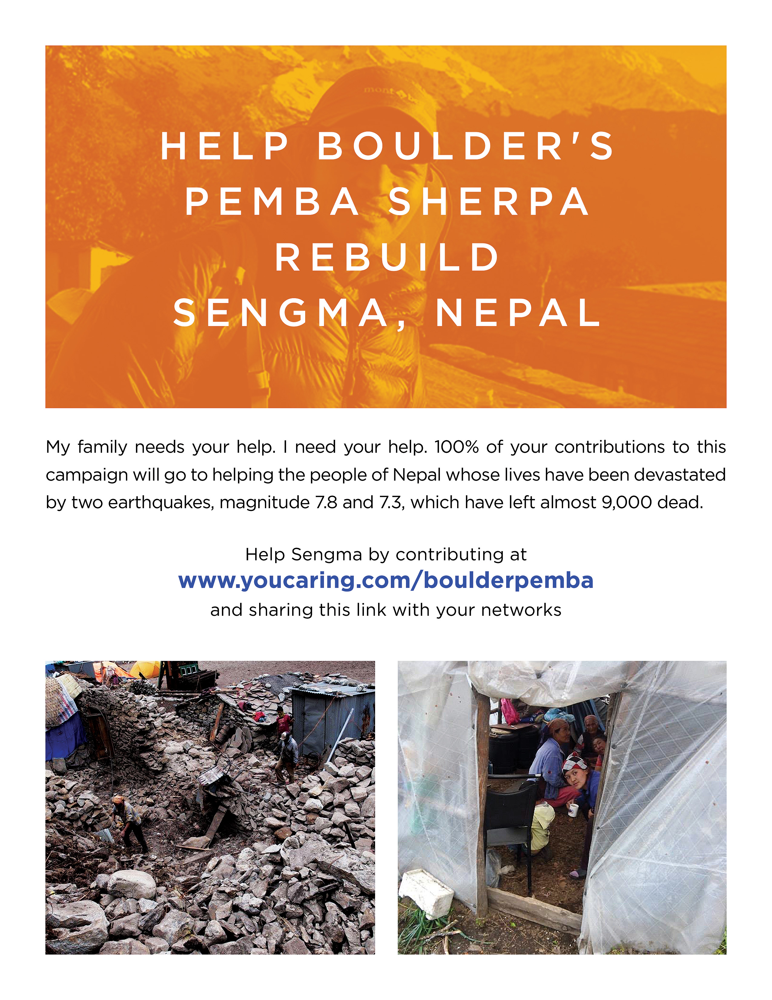

The [devastation of caused by the recent earthquake in Nepal](https://data.hdx.rwlabs.org/group/nepal-earthquake) has been in the forefront of the minds of many of us these last few weeks. Although there have been [outpourings of support](http://emailadore.com/emails/5568c83d42937dec6b000003), [only a fraction of the the UN appeal for funds has been met and those monies are now only trickling in as monsoon season approaches](http://www.humanosphere.org/world-politics/2015/05/post-quake-funds-for-nepal-drying-up/) and the reality of landslides and flooding threatens with further infrastructure damage, disease and loss of life. In many cases, the funds that have been donated are having a hard time reaching the communities that need the most help. 

This is one way you can help get aid to one of the many places it is needed most: Boulder's own [Pemba Sherpa](http://www.sherpasrestaurant.com/owner.html) is traveling to his native [village of Sengma](https://www.google.com/maps/place/Sengma,+Chaurikharka,+Nepal/@27.7064698,86.7071271,9z/data=!4m2!3m1!1s0x39e90fd165466e95:0xd142ee6288855e03) near Mt. Everest, to bring aid. 

To send him with as much support as possible, **please donate at: [http://www.youcaring.com/boulderpemba](http://www.youcaring.com/boulderpemba)**

[Greg Greenstreet](https://twitter.com/ggreenstreet), Director of Data Products Engineering at Twitter here in Boulder, will be traveling with Pemba to help distribute aid. Greg wrote this appeal: 

*friends,*

*if you could put this flyer up at your shops to help raise money for Pemba Sherpa & his village, Sengma Nepal, i would appreciate it.*

*i am personally headed over with Pemba on June 13th to help distribute the aid.*

*every **$1000 builds a house for a family**.*

*the monsoons are coming June-July, closely followed by winter in the Himalayas & more than 1M people are without housing.*

*the earthquakes are over (hopefully), but the challenged of rebuilding their lives lay ahead for the Nepalese people.*

*please pass it along to your network to help raise awareness.*

*Cheers,*

*~greg*

*Greg Greenstreet
Director, Twitter Data Products Engineering
ggreenstreet@twitter.com
@ggreenstreet*

 

And here's a list of other recommended organizations:

* [Tewa - Nepal Women's Fund](http://www.tewa.org.np/site/index.php)
* [Himalayan Medical Foundation](http://www.himalayanmedicalfoundation.org/)
* [Shedrub Ling](http://www.shedrub.org/news.php?nid=116)
* [Shechen](http://shechen.org/donate/)
* [Karuna Shenchen](http://karuna-shechen.org/how-to-help/)
* [10 other vetted, international charities](http://www.pri.org/stories/2015-04-25/how-help-nepal-7-vetted-charities-doing-relief-work-following-earthquake)

