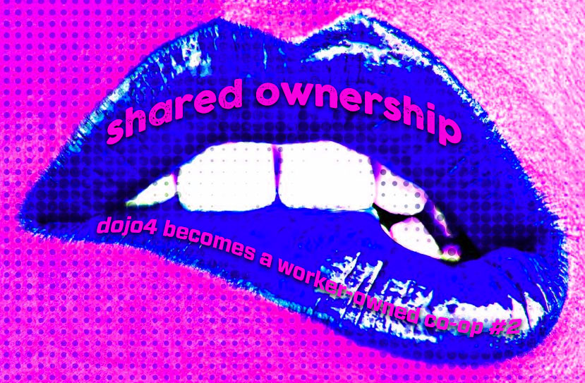

 
>>see [here](http://dojo4.com/blog/on-the-lip-of-shared-ownership-dojo4-becomes-a-co-op-series-number-1) for #1 in this blog series<<

Wow, this is taking us a really long time to do. Granted, I had [a baby](https://www.instagram.com/p/BKB_CmpBbtB/) and [we bought our building](https://twitter.com/coreykohn/status/781555418417946624) since we first started the process to transition to a cooperative [6 months ago](http://dojo4.com/blog/on-the-lip-of-shared-ownership-dojo4-becomes-a-co-op-series-number-1). But this process takes serious attention, commitment and buy-in, all of which can be in short supply when you are also trying to run a business, even a small business like dojo4.

That being said, we're on our way. We have a term sheet drafted (to be published in the next installment of this blog series) and are pretty much set to go. In the meantime, we put together a comparison list (also as a pdf table [here](assets/c.html)) of what things are like now verses what they will be like after we transition to being a cooperative. This helped us think through where we have more work to do to make things explicit, and is meant to help people who currently work with dojo4 decide whether or not they want to buy in as members. I thought it may also be helpful to anyone outside our organization who is also thinking of co-oping....

*Note: For those of you who don't know us or dojo4 personally, it is currently owned 50/50 by [Ara](http://dojo4.com/team/ara-t-howard) and [me](http://dojo4.com/team/corey-kohn). And everyone that currently works with dojo4 does so as a contractor.*

**PROFIT / LOSS**

***now***

* Ara and Corey split profit and risk 50/50
* profits at year-end are given as 'bonuses' based on # of hours billed / worked

***co-op***

* member patronage dividends paid out at year-end according to profits minus retained holdings
* the patronage amount based on actual patronage (e.g. 1 patronage unit for every 10-hours of dojo4 billable work)
* risk is shared by all members and can be covered with a capital call to members, but more likely would be covered by retained holdings - if a personal guarantee is required, there may be extra compensation to cover that risk (or, at least an internal agreement for members to contribute toward the indemnification of the individual making the personal guarantee)

**MONEY**

***now***

* Ara and Corey are paid a salary; contractors are paid by the hour plus any bonus

***co-op***

* the co-op will have some salaried employees 
* all members, including managers will receive a patronage dividend at the end of the year

**ORGANIZATIONAL STRUCTURE**

***now***

* Owners (Ara & Corey) manage and oversee all contractors, may at times delegate some responsibilities to contractors but are essentially responsible for all elements of managing the business
* Ara and Corey technically have authority to hire, terminate contractors.

***co-op***

* Managers: responsible for most elements of running the co-op
* Council: TBD and outlined in a discrete, enumerable list- e.g. specific project-related, QC responsibilities, moving locations, bringing on new members, etc. 
* Board: hiring & firing managers, possible fundraising, support and advisory group for managers

**DECISION-MAKING**

***now***

* Ara and Corey make all decisions based on area of expertise or by consensus

***co-op***

* A Council of co-op members helps Managers make decisions about:
    * Which clients to take
    * Which contractors to hire (non-owner track and owner-track (trial period)
    * Which projects to take
    * Who will work on which projects
* A Board of Directors decides whether to retain or fire the Managers (currently Ara & Corey)
* The Managers (currently Ara & Corey) make all operational decisions and all / any other decisions that are not made by the Council or the Board

**MEMBERSHIP**

***now***

* Club house rules!

***co-op***

* Member buy-in is $X or $X/12 /month paid over a year
* Membership can be terminated by super majority vote of other members or by member’s own choice
* Exact buy-in amount is returned member upon termination (no interest or appreciation), to be returned within 3 months of termination, and at discretion of Board, based upon net cash flow and balance sheet.
* Member’s LLC become a member (entitled to one and only one vote), but the rights and responsibilities of membership will be exercised by the LLC’s principal
* Membership will be a democracy of people, not businesses, but the legal documentation can show the member’s LLC if they have one. This protects independent contractor designation and limited liability protection.

**NOTES**

* The current owners, Ara and Corey, are not taking any $ out of the business at the time of conversion to being a co-op. All new member buy-in amounts are going toward giving the business a buffer in the bank account. Ara and Corey are simply diluting their shares in the company, with the faith that by diversifying ownership, the business will thrive and that will be good for everyone.
* For patronage dividends to qualify for the significant tax benefit (single level taxation), they must be allocated on the basis of patronage, that is the value of goods/services contributed or consumed through the cooperative. In dojo4’s case, this will require measuring the individual contribution of members.  Since members contributions will fluctuate and vary over time, we will continue to tracking time and convert that time into units of patronage.  "Patronage" includes both billable and non-billable hours/service/contribution by a member to or through the cooperative. dojo4 patronage includes both client billable time as well as value-add operational/management time. 
* Cooperatives, like other legal business entities, can buy, own and dispose of property.  This can include real estate, capital assets (web site, equipment, products).  Without opinion on the tax treatment to either the coop or to members arising from the distribution of the proceeds of the sale of property, the cooperative can and many do buy and own property as a way of increasing the profitability of the cooperative, by and for its members (think the dairy marketing and processing coop that buys Grade A dairy equipment).  We will have to check whether the proceeds of the sale of such equipment (hopefully at an increased tax basis from purchase price) is treated as capital gain (better, for now) or as ordinary income (usually higher rates). 

>>see [here](http://dojo4.com/blog/on-the-lip-of-shared-ownership-dojo4-becomes-a-co-op-series-number-3) for #3 in this blog series<<

 

