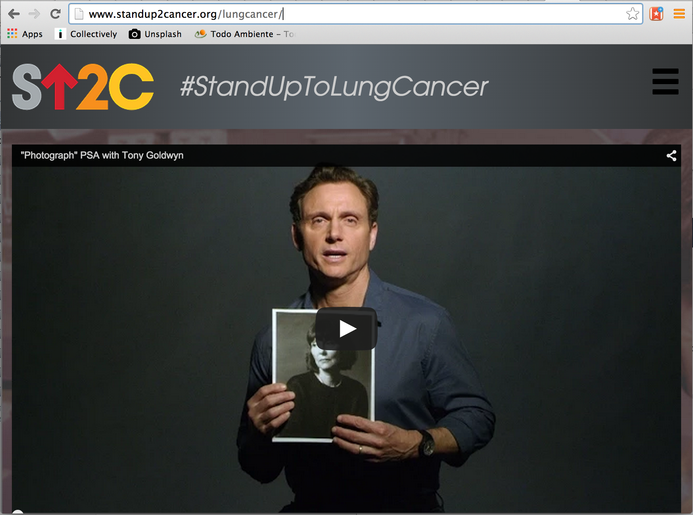
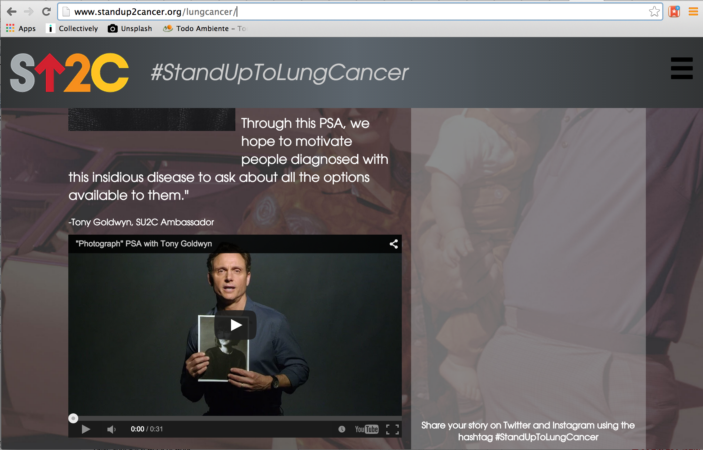

 

 

[Working with Stand Up To Cancer](http://dojo4.com/work/su2c) has been rewarding for us, not only because the [innovations this organization support](http://www.standup2cancer.org/why_were_different) are truly groundbreaking and often lifesaving, but also because they are great to work with. Most recently we implemented a responsive design for their [lung cancer campaign](http://www.standup2cancer.org/lungcancer/). We were able to implement design and Tony Goldwyn's embedded PSA video responsively to be effective, look great and get this important message across within any screen size. 

[Lung cancer is leading cause of cancer deaths accounting for approximately 27 percent of all cancer deaths in the United States](http://www.lung.org/lung-disease/lung-cancer/resources/facts-figures/lung-cancer-fact-sheet.html). And Stand Up to Cancer is helping fund [research](http://www.standup2cancer.org/dream_teams/view/su2c_acs_lung_cancer_dream_team) that is giving lung cancer patients options that have never been available to them before. 