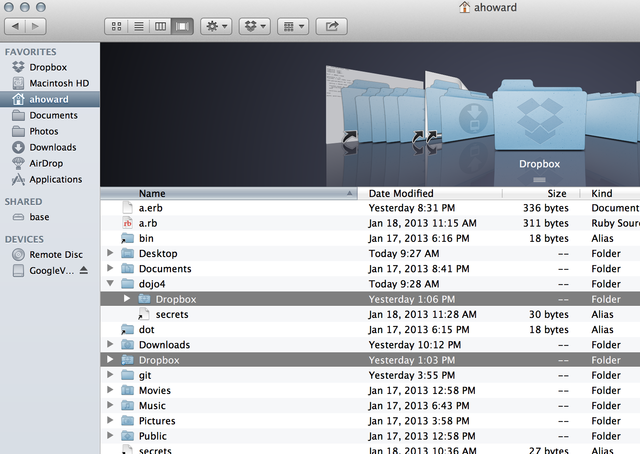
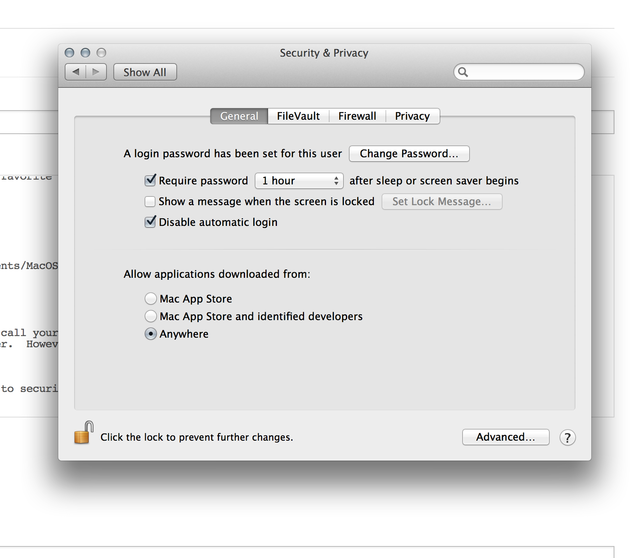
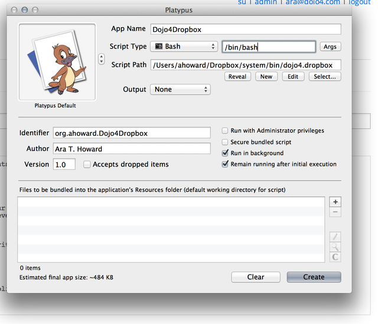
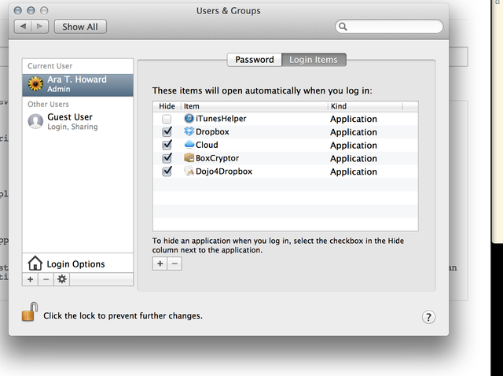
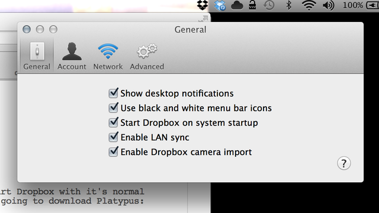

I setup a new machine this week and really needed to run two Dropbox instances: one for my personal stuff and one for my http://dojo4.com account.

There are quite a few ways to accomplish this but the following way is, by far, the simplest and most robust.  


It also supports > 2 instances running on the same machine.

Step one is to create a shell script using your favorite text editor (vim) and put it anywhere.  It should read like this:


````bash

#!/usr/bin/env bash

# this file is saved at : /Users/$USER/bin/dojo4.dropbox

HOME=/Users/$USER/dojo4 /Applications/Dropbox.app/Contents/MacOS/Dropbox


````


Replace 'dojo4' above with whatever you want to call your alternate instance.  Running this directly will start Dropbox with it's normal 'Dropbox' directory nested under a 'dojo4' folder.  



However, you aren't going to run this directly.  You are going to download Platypus ( http://sveinbjorn.org/platypus ).


You almost done.  Download and install it.  Due to security settings you may have to allow non-AppStore installs on your machine:





Next, fire up Platypus and create a new shell script application




in my case I named this 'Dojo4Dropbox' and this new wrapped Dropbox application is saved as '/Applications/Dojo4Dropbox.app'.


That's really it.   You can run this new application just like '/Applications/Dropbox.app' and it's storage directory will be nested.  And you can manage it as a startup item just like any other application:



For the final touch adjust your second instance to use a black-and-white icon so you can tell them apart:





Rinse and repeat to run more than 2 Dropbox applications.  ;-)
