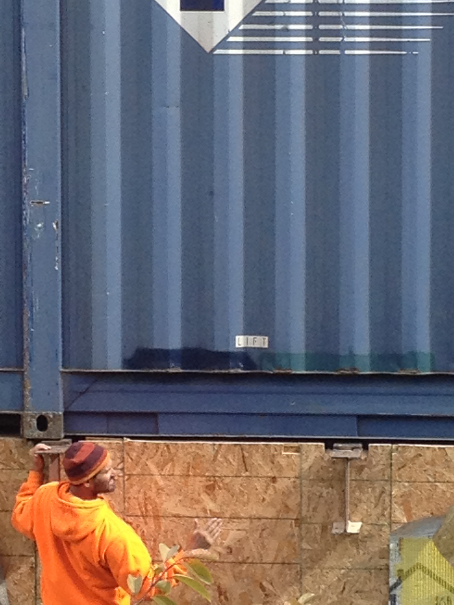
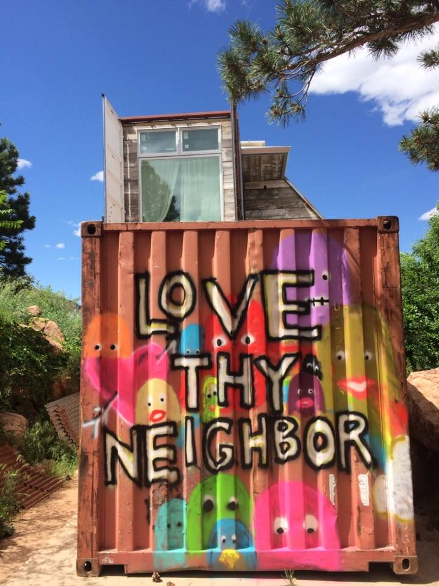

<small>“Sincerity - if you can fake that, you've got it made.” ― George Burns</small>

 
When Shakespeare wrote “Merchant of Venice” more than five centuries ago, he knew well that what’s on the outside is rarely the whole story - and yes, he wrote “glisters” not “glitters”:

All that glisters is not gold;

Often have you heard that told:

Many a man his life hath sold

But my outside to behold:

Gilded tombs do worms enfold.

But for some reason we still seem obsessed with the external illusions in life - car, clothes, hairdos, zip code... And even as we challenge long standing social norms about race, sexual orientation, gender identification, discrimination, etc. we still spend a significant amount of time judging the proverbial book by its cover. And when I say “we,” I see myself in the picture.

“Appearances matter.” “Never a second chance to make a first impression.”

A couple of Fridays ago I got a chance to share personally with [Stuart Rudick](https://www.google.com/url?q=http://mindfullinvestors.com/who-we-are/&sa=D&usg=AFQjCNEH0EorUJ084k0Hh6q3VyO_8zEHoA) of [Mindfull Investors](https://www.google.com/url?q=http://mindfullinvestors.com/&sa=D&usg=AFQjCNG6OIAhlbWlT7QRae7EoSpkTyBRCQ). He had taken a mountain bike ride with @drawohara and was in town to visit his daughter, a student at CU, where he too had graduated way back when bands still rocked Tulagis and alcohol flowed on the Hill.

Not exactly sure where or how Ara and Stu first met, but Stu attended the [Michael Fitzpatrick](https://www.google.com/url?q=http://en.wikipedia.org/wiki/Michael_Fitzpatrick_(musician)&sa=D&usg=AFQjCNHFNiYNY_fGXfe9SqJDmD1H3WeB1A) house concert, a burgeoning cultural aspect of @dojo4’s unique practice of business through meaningful work, doing cool shit that matters and honoring people in the process.

I didn’t know who Stu was when I first met him, but he had two essential qualities I appreciate - he looked straight and clearly into my eyes when he spoke; he paid attention when he listened.

Stu walked into dojo4 right before lunch on Friday; he had his dog with him, a cocker spaniel he “claimed” was his daughter’s. Friday lunch @dojo4 is the perfect time to be introduced to another evolving human. Before lunch, daily stand-up includes a community circle with a more personal question.

This is a weekly acknowledgement - something that gives each of us a chance to pause and think about ourselves, our loved ones, each other, our work, our community. A clap and a bow. One minute of silent contemplation. For those who have never meditated (or like to talk like I do), one minute of silence gives a much fuller sense of the breadth of 60 seconds.

Close your eyes and your mouth for a minute. Check it out. Notice your breath.

@coreykohn had the question: what is the best/worst, easiest/hardest thing for you about community?

“My selfishness.”

I forget exactly what Stu said though I knew he felt at home, welcomed in our community.

We ate middle eastern. We chatted. We knew some similar people, Miami transplants to SF, one a great friend who had recently moved back to Boulder. Something about who he was, what he projected gave me the sense that I wanted to know more. Ara had said he should check out my home invited him up to see my home and he came.

I showed him around, immensely proud of what I have built, but open with him about how the parts “unfinished” greatly impact my love relationship, exacerbate some challenging feelings with neighbors not loving our shipping container meets recycled barn aesthetic.

 
In all fairness I’ve done no landscaping, scraps of cut out container, weeds and construction detritus litter the yard, and a 20’ Hyundai rusting shipping container graffitied with “Love Thy Neighbor” facing the street sits where a driveway once was. It’s waiting to become part of a garage/workshop.

When I tell people about this, I say the outside still looks like West, West Virginia.

Stu had another quality in the best longstanding relationships I’ve had and the ones I’ve created recently - no bullshit, self-effacing, direct and loving - even when that means honest feedback. He got close to me, looked straight into me and said: “Mark, your house is a metaphor. You don’t see it. You must.”

“This place is so damn amazing on the inside. It’s you - creative and bold and beautiful. It’s what you clearly care the most about - what’s on the inside. But the outside is your shadow self. It’s this buffer you use to keep some from loving you in ways you want. Soften that a little. See what happens.” I don’t know about you, but this IS the communication I want.

I told him it was a filter, a filter I’d used effectively throughout my life. That the people who were willing to get beyond my sometimes gruff exterior were the ones I would more likely want to engage with.

“I get that,” he said. “But others who could really benefit from knowing you, might not be able to.”

Thank you, Stu. I’m thinking about that pretty deeply, and I might even take a shave.

If you’re interested in how fishnet stockings fit in this story, authentic communication, building with shipping containers, or building kindness, empathy and meaning in your organizations, get in touch mark@dojo4.com.