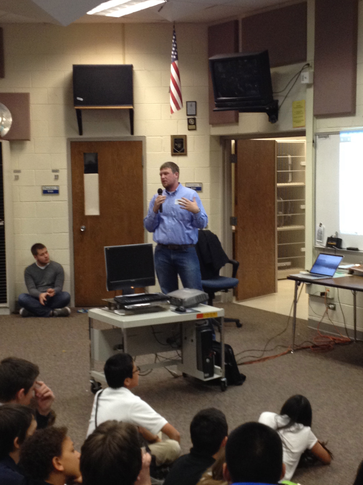
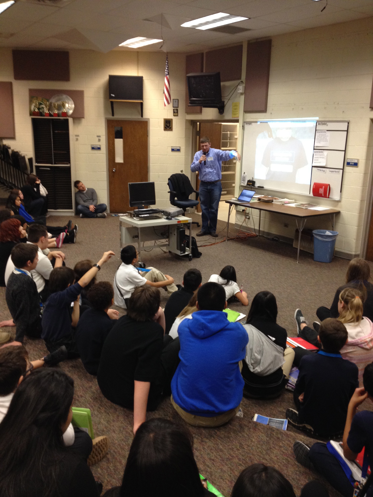
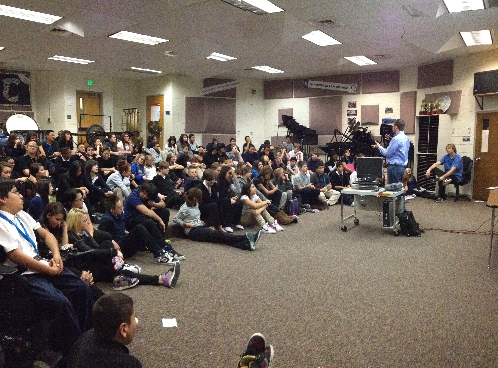

Today I had the pleasure of speaking at Northglenn Middle School to the 8th grade class for [Code.org's](http://code.org/) "Hour of Code". The hour of code is an initiative to introduce computer programming into as many schools as possible with the hope that schools will begin teaching programming in more schools full time, and in the very least, get more kids interested in writing code.

In preparing my talk, I was worried most about speaking about things at their knowledge level. I wasn't worried about them being interested, since I know most of the kids their age already play on and work with computers and mobile devices. My biggest fear was not boring them with too simple of concepts or talking about complicated things above their comprehension, so I tried to keep things simple, yet allow for more in-depth discussion when they asked questions.

After giving my talks, I was blown away by how intersted these kids really were and how much they already knew. It's easy for people to look at them as kids and think all of it is way too complicated for them, but several of them already understood the concept of code, had mastered basic languages like html, and were thirsty for learning more! A couple of kids even came up to me afterwards and showed me some code they wrote on their phones.

I encouraged the kids that were really interested in starting to code more to visit [codeacademy.com](http://codeacademy.com) to learn specific languages, edit a theme on tumblr, or even [github.com](github.com) if they really wanted to start building things. I even invited them to email me with questions at miles [at] dojo4 [dot] com.

Thanks to the technology teacher at Northglenn, Valerie Fink, for inviting me and setting everything up. It was very easy to arrange and I was really welcomed at the school, so I'd recommend to anyone speaking at Northglenn, or any other school, if they get the chance.

Here's a [link to the slides and notes](https://docs.google.com/a/dojo4.com/presentation/d/1uRtLnnUCaJtaXPrNlCOTLNTDi3sMzL-xQf4Kp_X4Jk8/htmlpresent) I used.

Also, their thirst for these classes (one kid even came up to me asking where he could take classes about C++ because he already did Visual Basic!) made me think of having a parent and child meetup where kids and their parents could come learn to code together. 

I think getting young people involved in coding as soon as possible is one of the greatest things we can do, not only so more US workers will fill those jobs, but because it's a great medium for kids to express themselves and be in control of something they build. I'm excited about helping any way I can and was honored to give the talk today.

**Update:** Here are some pictures!

