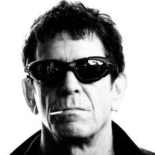

Being a great engineer is an art, not a science.

Hiring great engineers is more like dating than anything else.

Recently, on my daily hikes over Mt. Sanitas to @dojo4 I've been trying to answer seemingly simple questions such as:

- Why is it hard to hire *great* engineers?
- What *is* a great engineer?

Typically, I'll begin to categorize, formalize, and arrange ideal traits in my mind as the trail gets steeper (I do stuff like that while I'm hiking).  Later, when my breathing labors and oxygen deprivation has focused my mind a bit more, I come back to the same set of ideas.

On the one hand, I *know* the answers to both of the above questions but, on the other, I've found that trying to formulate precise answers has become harder and harder to pin down, as I've pondered them more and more on each passing hike.

Ultimately, I've arrived at the conclusion that describing *how* great engineers are, is more meaningful than describing *what* they are.

It's probably important to mention here, that what *I* mean when I say 'great engineer', might be different from what *you* mean.

--

I mean technicians who build useful solutions to real human problems.

Wikipedia sums this up similarly:

  The work of engineers forms the link between scientific discoveries and their subsequent applications to human needs and quality of life. In short, engineers are versatile minds who create links between science, technology, and society.

  ref: http://en.wikipedia.org/wiki/Engineer

By this definition and my own, one isn't an engineer when one's work:

- doesn't address the needs of real humans.
- doesn't create solutions that are adopted by groups of humans.

I don't think most engineers actually evaluate themselves by a similar definition - instead, preferring an assessment based on technical skill alone, and leaving the human litmus tests as the responsibility of business and marketing teams.

This is unfortunate, and a topic for a future post...

In the meantime, here are some of the practices I've witnessed in successful engineers, and ones that I've grown to identify as indicators of the type of engineer who is going to consistently - problem after problem - be able to deliver solutions to large groups of other living, breathing human beings.

Great engineers use hammers
---------------------------

No, I don't mean "rm -rf". I mean hammers, metal ones that bang nails in.

Nothing tests engineering skill (vs. technical skill) like solving a problem outside one's domain:

- bathroom to tile?
- bridge to build?
- satellite dish to calibrate?
- sump pump to repair?

Being a technician, means being limited by tools and skill, but being an engineer, means being limited only by problem solving skills and communication - so pick up that f***ing manual and figure out how to wire the thermostat today; tomorrow, you can figure out how to change the oil.

(An interesting titbit on hammers: does a titanium one produce more force on impact than a lead one?  Does it depend on how fast you swing it? Is it  'easier' or 'harder' to use a light hammer vs. a heavy one.)

Great engineers are athletes
-----------------------------

All systems are engineered for humans.  And all organic systems follow the same cyclical pattern of:

- Stress
- Recovery
- Regeneration

Moving through this cycle, is how athletes gain fitness.  But it's also how populations grow, over extend themselves, experience famine, and begin to grow again.

No biological system experiences growth in a linear fashion.

When engineers are out of touch with the realities of their bodies (and everyone else's), they develop ideologies that model machines instead of organic systems.  For example, the concept of 'velocity' in agile development is seen as something that should be predictable in the future, and consistent given a certain team size. In fact, we know that all organic systems experiencing stress are going to move through small and large periodic cycles of activation and fatigue.  This means that periods of high velocity are always going to be followed by periods of low velocity, and that this is to be expected and actively planned for.  It's been an accepted pillar of producing peak performance in the professional coaching community since the 1950s - http://en.wikipedia.org/wiki/Sports_periodization - but an engineering community that identifies with machines more than people hasn't quite gotten there yet.

Many individual engineers, however, are there now.

You don't need to run marathons, or lift 500 pounds to learn about biological rhythms.  Riding to work, backpacking, doing yoga, or just taking long walks is sufficient to learn about this fact of nature when practiced *consistently* when feeling good, and *also* when feeling bad.

Understanding the periodic nature of human beings lets great engineers have insight into problems, users, teams, project trajectories, and even markets - all organic systems.

Great engineers listen to good music
------------------------------------

Good problem solving is both non-linear, and pattern recognition based, and developing abstractions means being able to see the forest and not the trees.

Appreciating good music - let alone playing it - requires all of these skills in spades.

Throughout my programming career I've noticed that great engineers - the ones helping real humans solve real problems - have a love for great music and are often musicians themselves.

Mediocre ones seem to think Pandora is a 'pretty neat idea' and really haven't considered how having sounds bouncing around in their heads, and making sense of it, is pretty much *just like* reasoning about complex systems. Or why listening to bluegrass or opera - even if you don't like it - is a *lot like* learning Lisp when you've been stuck programming C.  Or why the JVM is the glam metal of engineering tools.

For instance, a Google search for 'image of java' brings this up:

 

and one for 'ruby', this:

 

Kidding aside, my observation has been that reviewing an engineer's music collection for interesting stuff is as reliable a metric as any for assessing how often they'll be able to get someone else's problem solved, and how harmonic their own solutions will be.

Great engineers do hard physical labor
--------------------------------------

There are two issues that crop up repeatedly with engineers that don't sometimes perform hard physical labor:

- They develop solutions that are too expensive.
- They develop solutions that are too resource intensive.

The field of engineering operates in a weird vacuum where six-figure budgets are the norm, and even small projects take months. There really aren't checks and balances in the field that knock concepts back to the real world of energy and effort.

For instance, many people in software consider their work as something magical that transforms mere ether into piles of money with nothing but huge brain power applied.  They forget that the Cloud is made of metal boxes, connected with wires, and burning tons of oil every second to keep those magnetic media spinning on bearings made by children in China.

Lately, it's become fashionable for some engineers to participate in things like - cycling, CrossFit, running, etc. - but these activities, while beneficial, don't measure as highly on the "über engineer" scale when compared to solving problems through the application of physical and mental effort *_combined_*.  Operating your mind and your body independently is a different mode of operation, than operating them both together, which is exponentially more difficult.  Nothing brings you back to reality like moving a ton of rock, digging a ditch, or painting all day.  The clever idea you had at 7am - that seemed like a great one at the time - is a faint memory.  Actually, you may have forgotten why you climbed up that ladder ...  It turns out that solutions that are hard to implement make you tired, and that being tired *makes you stupid*.

Solving problems through pure effort teaches engineers about what *hard* really is. That something doesn't need to be an order of harder magnitude to become a total PITA, and that fatigue puts a mental premium on simplicity and the hand cuffs on complexity.

Great engineers make great lovers
---------------------------------

Everyone knows that engineers are famous for their love-making ability.

;-)

Here's the thing. It's hard to develop solutions for a great many people when you don't understand a great many people.  It's also really hard to develop an understanding for people that are different from us without being in an intimate relationship with them.

Anyone that's married can tell you how profoundly difficult it is to understand his or her, so being in a relationship is a tried and true way to stretch these muscles.

Truthfully, what this last practice is speaking to, isn't whether you have a wife, husband, boyfriend, girlfriend, or all four - but whether or not you are able to identify closely with other people that are *very different* from yourself.

It is a rare engineer that solves problems only for other engineers, and even then, what makes sense and is helpful for someone else, is a remarkably difficult thing to get right.

Great engineering, after all, stems from understanding the problems of others; thus, the most valued skill an engineer can have is the ability to understand deeply, someone with a mind that is completely different than their own.

-------------------------

So there you have it.  5 practices great problem solvers practice.  

Some of you may have noticed that *none* of them are mystical; in fact, they're all quite human.  Other readers may be poised on the comment button with the reaction that none of these have anything to do with engineering and, for them, the path to becoming the most versatile, powerful, engineer possible may indeed *be* mystical.  

:::