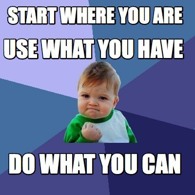

 

What does it mean to have a more meaningful career? At some point have you been encouraged to follow your bliss in order to discover your meaningful, engaged career? Have you felt confused, demoralized or duped by this suggestion?

These questions of how to build careers & businesses based on humane and compassionate values, with missions that enact positive impact, and how to engage in meaningful, engaged and joyful work, are deeply intertwined. 

And I’m going to tell my story to illustrate the entwinement. I always wanted to do something that really helped people and made real change in the world, and I thought in order to do that I had to work for a company (or build my own organization) that “did good”- that feeding the undernourished, educating the disadvantaged, delivering medicine and clean drinking water, solving environmental problems, saving endangered species, etc. 

But it turns out that being a do-gooder is no guarantee of having a meaningful life or career or building a business that actually makes a significantly positive impact. What I learned is that it’s not WHAT a business or a person does but HOW they do it. 

To be clear, I have not arrived: I'm pretty sure that I have not found my dream job, or the ideal career. I have not figured out what it means to run a business that is a perfect model of “[business as a force for good](https://www.bcorporation.net/handbook).” However, I have learned a lot and come a long way in finding what I think of as fulfilling livelihood and I’ve found that people with all sorts of backgrounds and experiences can be instrumental in making positive impact. I’ve found out that making positive impact is hugely a matter of attitude, view and approach.

A little bit about myself... I was born in Boulder, CO to a Buddhist family (of the [Jewbu](http://www.urbandictionary.com/define.php?term=JewBu) variety). Then, we moved around a lot. At some point, it became clear that I was really good at math and science, and so, was encouraged to study those things, but had no real clue about what I might do for work or as career. I studied Biology and Medical Anthropology but ended up in NYC on a [travel magazine](http://www.bluemagazine.com/) photo editor internship and then out of desperation and luck, landed a job as an associate producer on a documentary. Because that was then my only real professional experience (beside bartending and waiting tables), I worked in documentary film production for the next almost 10 years. I ended moving back to Boulder, and again with some desperation and luck, landed a job managing a small software company and am now a partner in that business- it's still what I’m doing now. 

And all along, for years, I'm super sad about not knowing what it was that I wanted to do. I remember having a big fight with an old boyfriend, but only crying when a he asked me “what do you want in your life?” *Follow your bliss and the money will follow* felt like a bunch of BS to me. Actually it felt like an insult, because I couldn’t even identify what my bliss was. Can hanging out with your friends and being a generally nice person make me money and be meaningful? Generally, not.

I knew I wanted to do something good in the world, but had no clue what that was or how to do it. There was a pervasive feeling of inadequacy and  sadness because I had this sense that I had a lot to offer and was decently smart and competent but just clueless about what to do with that. I would hear about and meet people doing really cool things that actually made a positive impact on their communities and the world, and I felt envious.  My particular situation didn’t afford me a lot of financial support and I often (and erroneously) blamed that for my inability to initiate anything substantive.

Fast forward to now. What I’m doing now doesn’t necessarily look like what I imagined my dream job would look like and I don’t necessarily feel everyday that what I do is making a positive impact on the world around me, but strangely enough I love the little company I built and feel lucky to do what I do every day. I was kind of coasting along, thinking I was just doing a job, then just co-running my little business, and then sort of gradually and suddenly at the same time, I realized I was doing exactly what I had always wanted to do, which was to make a positive impact on the world and truly help people. 

This actualization wasn’t because we were building some kind of ground-breaking software that was delivering earth-shattering solutions to the world’s most complex problems. It's because *we are building a business that allows and encourages people to feel good when they walk in our doors.* And when people do business with us they are often surprised by our openness, friendliness and eagerness to find the best solution for them even if it’s counter to our bottom line. *We’re building a business that values people’s humanness.* 
It’s impacted my life, my family’s life, and it's impacted countless people that encounter us (colleagues, employees, clients, the competition, etc.). 

Here’s the tricky part: building an engaged, impactful, change-making business or career has way more to with HOW and WHY we do it than what it is or looks like. More fundamental than WHAT a business does, or what we do in a job, is HOW and WHY the business does what it does or HOW and WHY we do what we do in a job. For example, dojo4 is just a services company- sure we have been fortunate enough to find ways to sign some clients like [Off.Grid](http://offgrid-electric.com/) and [Greenpeace](http://www.greenpeace.org/usa/global-warming/click-clean/), but at the end of the day, we are writing the exact same code that we may write if we had been hired by [Monsanto](http://www.globalresearch.ca/the-complete-history-of-monsanto-the-worlds-most-evil-corporation/5387964) or [Chick-fil-A](http://www.huffingtonpost.com/david-badash/chick-fil-a-5-reasons-it-isnt-what-you-think_b_1725237.html). The WHAT is the same, but the HOW and WHY is different.

Our mission is to support and to provide a wonderful environment for the people we work with and their families. Our mission is to provide a space that is built on the human qualities of humor, curiosity about how to do it better, friendliness, intellectual rigor and joy, to
provide support for lifestyles that integrate our many interests, activities, responsibilities and families.

I've seen this be so effective that I've become deeply inspired by business and the power of business to make positive change in this world. I’ve become an evangelist for “business as a force for good.” 

Of course it’s not all about just making a place where people are happy to work- a big part of what a business does of course make a difference-
I believe that many of the big, big problems facing the world can be solved by business- by providing innovation and services in health, energy, agriculture, communication, education, etc. 

The main thing I’ve learned is that building a meaningful, impactful business and/or career starts with the building blocks:

* the ideals that a business is built on
* the attitude that we take about the work we do
* how we understand ourselves and each other
* how we treat ourselves and each other

With these building blocks in place- the WHAT of the career or the business falls in place- the WHAT is so deeply informed by the HOW and the WHY that it can actually feel secondary.

So what does that mean for you?! It means **start where you are**. You can use your current job and business as a force for good by treating your clients, your audience, your competition, your employees, your colleagues, yourself with respect and compassion.

 

Think about what positively impacts you- is it friendliness? Generosity? Honesty? Transparency? Clarity? Humor? Patience? Take whatever that is and cultivate it in how you relate with yourself and the people you encounter through your business. 

Take the time to understand yourself and the people you encounter through your business better. Thinking about HOW and WHY you want to want to engage a career or business that makes real positive impact, will help determine and support your decisions about WHAT to do with that business or career. 

Although I still don’t know what my bliss is or how to follow it, I’m starting to sense that it doesn’t serve to look to far afield to figure out how to do good with my career and my business. My bliss may be making an impact close to home and in my day-to-day, and letting that inform the bigger decisions and actions.

Imagine if every person and every business started with treating themselves and the people a in their immediate sphere of influence with respect, curiosity and friendliness - that would truly change the world!

*Thanks to [Mandy Godown](https://twitter.com/Miss_Mandaline?ref_src=twsrc%5Egoogle%7Ctwcamp%5Eserp%7Ctwgr%5Eauthor) and [Nicole Casanova](https://twitter.com/nicolecasanova?ref_src=twsrc%5Egoogle%7Ctwcamp%5Eserp%7Ctwgr%5Eauthor) for inviting me to present at [SheSays Boulder](http://www.meetup.com/SheSays-Boulder/), where I originally gave this as a talk.*