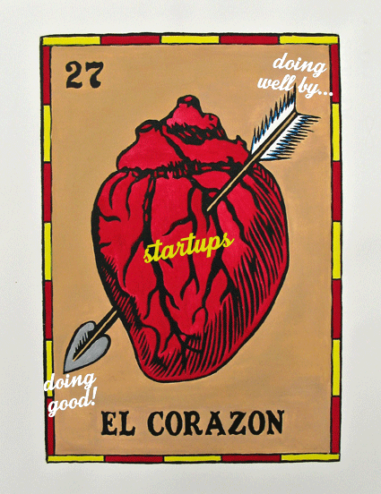
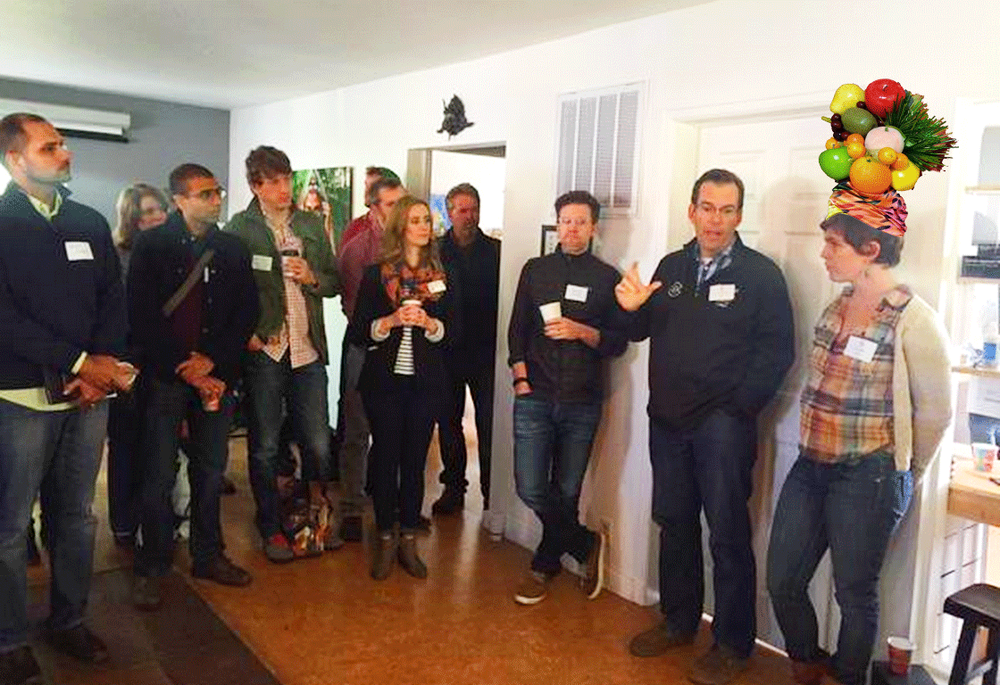

 

There was special something in the air at [Boulder Startup Week](http://boulder.startupweek.co/) this year: a lot of heart. For sure, it's been there every year, but this year it was really on the proverbial sleeve. Some people will say that of course this Startup Week has includes events like "[Intro to Mindfulness for Startups](https://boulderstartupweek2015.sched.org/event/1001fd4cbb532f5eaabf40a572925ba2#.VVI21dpVikp)", "[Finding Balance: health within the startup community](https://boulderstartupweek2015.sched.org/event/e7dd8141f1a1f0097a626e9d54d91116#.VVI3FdpViko)" and yoga sessions- it's Boulder! That cliche might indeed hold water but, regardless, this year's Boulder Startup Week felt not just heart-felt and holistic, but almost radically so. The most energetic conversations are not about how to make it as big as possible, as fast as possible- they were about finding [balance](https://boulderstartupweek2015.sched.org/event/e7dd8141f1a1f0097a626e9d54d91116#.VVJV8NpViko), [radical self-inquiry](https://boulderstartupweek2015.sched.org/event/3798238c32e7e3c311d87f29038299c5#.VVJWMdpViko), and [using business as a force for good](https://boulderstartupweek2015.sched.org/event/286ef4fd0cd3e5c1bc6acfcabced36fc#.VVJWg9pViko). This humanistic approach to the demands and potentials of startup life is the real vanguard of the startup world. And [this most radical of views](https://twitter.com/bldrstartupweek/status/598239129957109761) holds that compassion and generosity can infuse the way we treat ourselves and, in turn, will be magnified through the way we run our businesses and the outcomes our businesses achieve. 

This came up in conversation with [Matt Stinchcomb](http://www.newdream.org/results/making-responsible-business-a-reality-interview-with-matt-stinchcomb), until very recently the [VP of Values & Impact at Etsy](http://magazine.good.is/articles/figures-of-progress-matthew-stinchcomb-vp-of-values-and-impact-etsy). The reason he's out of his VP job is because since the company went public in April (and [became one of the biggest B Corps to make a public offering](http://www.inc.com/jeremy-quittner/etsy-ipo-brings-b-corps-the-forefront.html)), he is transitioning out of [etsy.com](https://www.etsy.com/) and into heading up etsy.org (so new, there isn't even a site up yet). In addition to sharing his story about the importance of garnering employee engagement in the process of certifying as a B Corp, he shared his vision for this fledgling Etsy Foundation of supporting "regenerative entrepreneurship." The foundation will be supporting entrepreneurs and entrepreneurs-to-be in accessing education from the point of view that our entrepreneurial endeavors can actually regenerate ourselves, the environment and the economy. Regenerative entrepreneurship is personally, environmentally and socially net positive rather than being at the expense of each of these. A radical, and truly viable, vision. 

That conversation happened at a full-house event hosted by dojo4 called "B a Better Business: the B Corp Path to Best Kind of Fame, Wealth & Influence." I co-presented with Matt, [Ryan Martens](https://www.rallydev.com/blog/authors/ryan-martens), [Seth Levine](http://www.sethlevine.com/) and [Kim Coupounas](https://www.youtube.com/watch?v=iGHzqmnGH4A) on how B Corps are leading in the marketplace, attracting capital and magnetizing a driven, engaged workforce. We talked about how all sizes of companies can foster regenerative, generous and robust business models. We're learning and showing, at [Boulder Startup Week](https://twitter.com/search?q=%23BSW15&src=tyah) and beyond, that we can create personal, environmental and social wealth with our startups. And we're having a great time and looking spectacular while doing it!

 

 