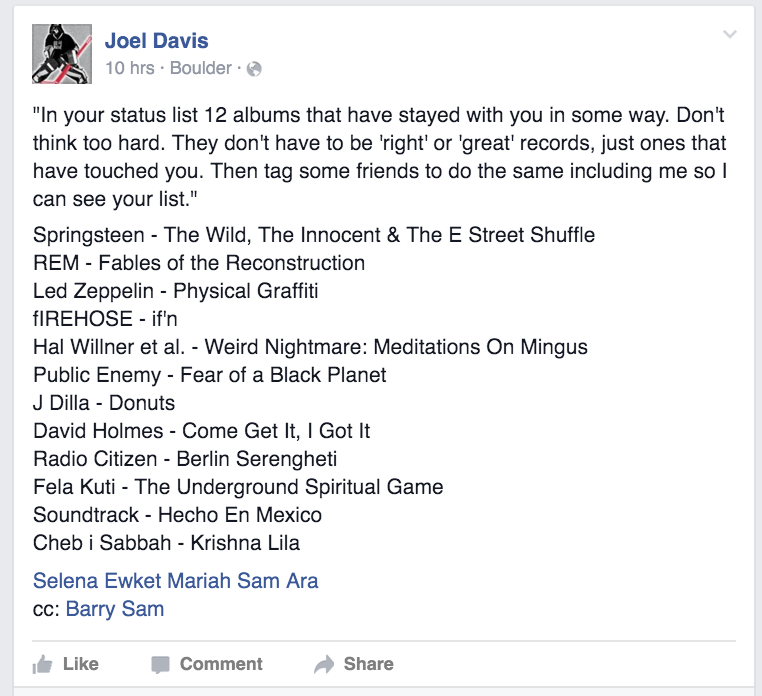

One of the super sweet things we have going at DOJO4 is that we have a house D.J. - [Joel Davis](https://twitter.com/blackswansounds)

It isn't super complicated - basically Joel:

- hangs out in the office running his record company [Black Swan Sounds](http://www.blackswansounds.com/)

- jams a bunch of good tunes into the Sonos queue

As you can imagine this complicated arrangement took years of contract negotiations between our legal teams but, basically, we feel like DOJO4 is winning the situation.

Kidding aside, music is very important to me, as a person, and as a developer.  One of my favorite interview questions is:

<i>"Show me your music collection."</i>

It's well known that many musicians become great programmers and that having a musical mind is a good predictor of having the combination of analytical plus creative talents that weaves great code together.  put another way, if you listen to shitty music you probably write shitty code too.

So, when Joel dropped this on FaceBook

I knew I had to drop what I was doing and comb through my music collection (did I mention that some programmers I, er, know are also often OCD?) ...

Before revealing my list I want preface it by saying two things:

- These are 12 of my favorite *complete albums*, not tracks, not songs.  Albums.

- I listen to a TON of electronic music and couldn't help noticing that none of it fit here.  It isn't that I don't have many favorite sets - I just don't consider them albums, sets are a different kind of collection IMHO.

So, without further adieu here they are, 12 complete albums that I dig:   

### Miles Davis / Kind of Blue / https://en.wikipedia.org/wiki/Kind_of_Blue

One of my favorite work albums of all time.  Nothing beats it for late night concentration.

### Doc Watson / The Watson Family / https://en.wikipedia.org/wiki/The_Watson_Family

My first dog was named 'Shady' after 'Shady Grove' and I've been listening to this album ever since I was a little boy.

### Dinosaur / You're Living All Over Me / https://en.wikipedia.org/wiki/You%27re_Living_All_Over_Me

My wife hates this one but I love the raw energy Jay belts out on the guitar.   I've ridden and skied many many miles to these sounds.

### Jane's Addiction / Nothing's Shocking / https://en.wikipedia.org/wiki/Nothing%27s_Shocking

This was a favorite, along with their first album in high school when friends were listening to 'Def Leppard' and represents a point in my life when I really started wanted to hear new and different sounds.

### Dead Can Dance / Into The Labryinth / https://en.wikipedia.org/wiki/Into_the_Labyrinth_(Dead_Can_Dance_album)

I keep coming back to this genre defying album.  It was a favorite 'homework album' in college and high school.

### Beastie Boys / Paul's Boutique / https://en.wikipedia.org/wiki/Paul%27s_Boutique

The greatest album of all time.  Q.E.D.

### Johnny Cash / At Folsom Prison (Live) / https://en.wikipedia.org/wiki/At_Folsom_Prison

This album represents the west and every great hip-hop album all at once.  Definitely the first time anyone called anything 'Bas Ass'.

### Prince / Purple Rain / https://en.wikipedia.org/wiki/Purple_Rain_(album)

I don't think anyone can love music and not love Prince.  Especially if they are in a hot and heavy make-out-session with a sophomore girlfriend (or boyfriend) (or both). 

### Pixies / Doolittle / https://en.wikipedia.org/wiki/Doolittle_(album)

My wife loves this album.  And I love my wife.  And the Pixies just fucking rock.

### Bob Marley & The Wailers / Rastaman Vibration https://en.wikipedia.org/wiki/Rastaman_Vibration

Bob's greatest if you ask me, and proof of the global impact music can make on politics.

### Rolling Stones / Tattoo You / https://en.wikipedia.org/wiki/Tattoo_You

Best cover.  Best liner.   'Waiting On A Friend' - sooooo smooth.

### The Beatles / Abbey Road / https://en.wikipedia.org/wiki/Abbey_Road

I cruised through the first 11, as Joel had asked, but picking the last one really took some thought.  I went through Kendrick Lamar, Neutral Milk Hotel, Led Zeppelin, Theivery Corporation, Die Antwoord, Emmylou Harris, and the Flaming Lips... But couldn't settle.

Ultimately I picked this one because it was the first album I ever owned - my dad gave me a tape player with one tape, 'Abbey Road', that was purple on one side and white on the other.  I listened to that tape until it was worn out and still think that the b-side of 'Abbey Road' is one of the most inspiring sets in history.

---------------------

So, there you have it.  Thanks for inspiring such a fun mental exercise Joel!

