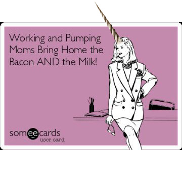

Do any of the behaviors below apply to you?

* At least once during the workday, you spend 15-20 minutes locked in a room. 
* When the only door that locks in your office is the one to the bathroom, you announce to your coworkers that if they need it, they better use it now, because you're going to be in there for a while.
* While locked in said room, a rhythmic, mechanical sound can be heard faintly emanating through the thin door.  
* What you're doing in there may or may not be a mystery, but your coworkers do not make eye contact with you when you finally emerge. 
* However, on a good-humored day, twinkly eye contact is offered from your coworkers, mostly in recognition of the fact that while you were locked away, they were blasting this on the office stereo: https://www.youtube.com/watch?v=ZaI2IlHwmgQ

If you identified with any of the above, you may have an obsessive masturbation schedule that you're having trouble putting on hold during the work day. But more likely you are a breastfeeding mother who must pump milk out of her boobs every day for months, if not years, after the birth of each child. 

 

Ah, the joy.  

As a first-time parent, I heard all sorts of warnings about how hard it was going to be and how sleep deprivation was going to rock my world. I spent lots of time trying to prepare for how I was going to balance parenthood with running a business, how I was going to manage child-care and the desire to be with my baby (or not). But not for one minute did I imagine that the need to pump milk was going to be the #1 most time-consuming & tyrannical element of being a working mother*. (And, yes, if you want to maintain a healthy milk supply to be able to feed your child properly AND not suffer from rock-hard-tit-feels-like-its-going-to-explode syndrome and [mastitis](http://http://en.wikipedia.org/wiki/Mastitis) it is absolutely necessary to pump at work, often even if you're a person who only works part-time.) 

I had not prepared myself for the humility and perseverance it was going to take to stick with it. Lugging the Inquisition-style device of a pump back and forth to work (those things were not designed to fit in a bike basket, although they are now significantly smaller than the suitcase-sized contraptions of days of yore). Pushing aside beer cans and bottles of hot sauce in the office mini-fridge to find room for little bottles of hard-earned milk, that then are forgotten at work- or worse yet are forgotten in a hot car on the way home from work and have to be tossed. Having to be sure to actually schedule time in the middle of a workflow or between meetings to stand in the bathroom, nearly topless, hooked up to a machine. Sorting out whether the feeling of inadequacy has to do with not having slept enough to be effective or with a stress-induced, lame milk supply. It's been just over a year of these frustrations and I'm only just now getting a little used to it. 

I'm not going to go down the wormhole of comparing the challenges of the respective genders here. But suffice to say, this is one way in which women face a unique and truly demanding challenge of integrating the demands of biology, career and family- one that is surmounted drop by drop. Although it has literally brought me to sleep-deprived and frustrated tears at times, the best support has been having a sense of humor about it, kindness and humor from my colleagues, and envisioning myself as a strange and mythical creature that can do crazy wondrous things like turn blood into milk.

 

*I use that term with full acknowledgement that every parent is a working parent.