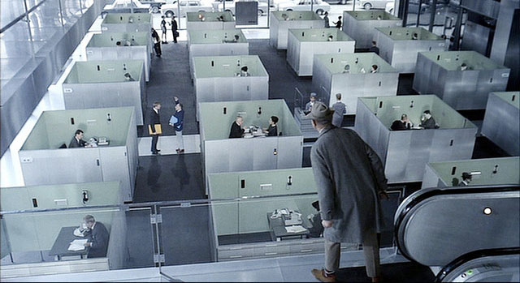
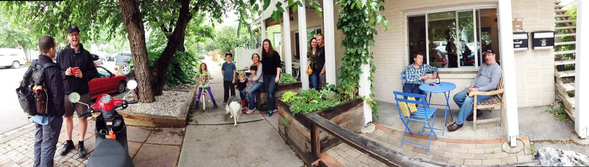

 
In 2001, my uncle, Earl, took me to visit an old buddy of his, [Godfrey Reggio](http://www.imdb.com/name/nm0716585/), in the film editing studio he had set up just below Canal St., not long before 9/11, and not far from my East Village apartment. He was in the process of making [Naqoyqatsi](https://en.wikipedia.org/wiki/Naqoyqatsi), the third film in the [Qatsi trilogy](http://www.koyaanisqatsi.com/). Earl thought I'd be interested because I was working in documentary film and television production at the time- but in the end, what was a huge influence on me wasn't the product of the filmmaking that was happening, but the environment is which the film was being made. 

Godfrey welcomed us warmly as we stepped out of the freight elevator and into the cavernous loft. Right away I could see there was something different happening here than in any other production company I'd ever visited or worked at. It was late-morning and almost completely quiet in the space- there was none of the regular hubbub I was used to and although I couldn't see anyone right away, there was an palpable sense of hushed productivity. The tour Godfrey led us on revealed numbers of sparse but cozy, dimly lit edit bays arranged along wide [cloistral](http://www.faena.com/aleph/articles/the-monk-who-became-a-filmmaker-documents-the-soul-of-the-world/) hallways, each inhabited by one or two people, working on footage glistening on cinema displays. The back of the loft opened up into a communal kitchen area bounded by a long, heavy wooden dining table with a projector screen at the end of the room. 

As Godfrey and Earl kibitzed about friends from their hippie commune days, someone came out of the kitchen and clanged a large, iron fire triangle hanging from the ceiling. Seconds later, a dozen and a half or so people came streaming out into the hall and into the kitchen and started to serve each other from the pots that had been cooking on the stove. We joined them with our bowls of steaming lunch as they sat down at the long table and started to eat. The meal's lively conversation was punctuated by Godfrey's introduction of us as guests, and then a screening of some of that morning's work. 

Probably then everyone just got up, plopped their dishes in the sink and holed up for a few more hours to slog their way through endless hours of difficult video. However, the way that I like to remember it- and the imagery and activity that the environment seemed to be designed to evoke-  is that there was then a post-meal, spontaneous, communal and utopian co-cleaning of the kitchen and some meaningful small talk in the skylight beam of downtown, early afternoon sun as people brewed themselves some tea before settling back into applying their natural talents to an artful documentary imbued with deep purpose. I think I like to remember it like that because the studio and the people I met there opened my eyes to a way of doing, and *being in* work, that I had not yet encountered. 

Maybe I remember it that way because I'm an incorrigible idealist (or maybe because of the giant joint we smoked after lunch with Godfrey in the apartment he shared with his girlfriend in the back of the loft). But, I left with my mind sparked by seeing that the product of work is deeply influence by the environment in which it is created, that the 'what' may actually be wholly secondary to the 'how'. That day influenced me in my belief that *the work is in the doing rather than what comes out of the doing*. And it influenced my thinking about what is important work and why we do it. It encouraged my understanding that work does not have to look like what people might think of as work to be both impactful and valuable. It allowed me to be inspired to build beautiful, unconventional physical and interpersonal spaces for people to do that work. 

I hope that what we are doing at dojo4 is some version of that and that I can do it more and more. We've worked hard to create a space that is a reflection our values of the primacy of community and authentic relationships, radical openness, and the worthiness of work well-done. Maybe some day, some young whippersnapper will come here and be inspired to do meaningful work in a meaningful way. (And maybe, if I'm lucky, I'll smoke a joint with them in the back and they'll write an idealistic blog post about it.)

 

[*Uncle Earl Rosner ::: July 9, 1942 - October 1, 2015*](https://instagram.com/p/8USDweEqgZ/) 
*Om gate gate paragate parasamgate bodhi svaha*

**Naqoyqatsi**
* trailer: [https://www.youtube.com/watch?v=jl1RcfvEsiA](https://www.youtube.com/watch?v=jl1RcfvEsiA)
* full movie: [http://www.disclose.tv/action/viewvideo/174861/Naqoyqatsi_Life_as_WarFull_Length/](http://www.disclose.tv/action/viewvideo/174861/Naqoyqatsi_Life_as_WarFull_Length/)
* soundtrack by Philip Glass: [https://soundcloud.com/peyman-khazaeli/naqoyqatsi-philip-glass](https://soundcloud.com/peyman-khazaeli/naqoyqatsi-philip-glass)
* Qatsi Trilogy: [http://www.koyaanisqatsi.com/films/film.php](http://www.koyaanisqatsi.com/films/film.php)
