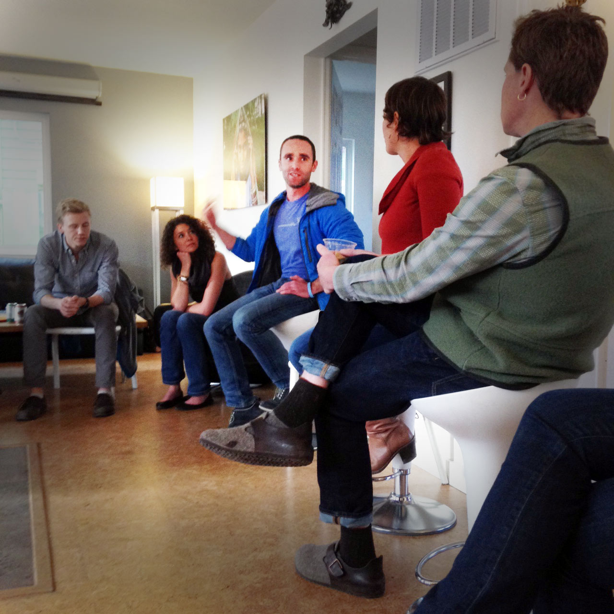
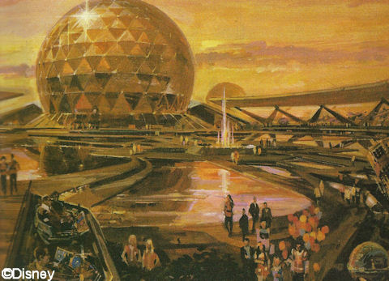

The dojo crew had a great conversation at last week's [Community Happy Hour](http://dojo4.eventbrite.com) with our most [Unreasonable](http://unreasonable.is/) friend, Daniel Epstein. Everything from nanotech to the downsides of polyphasic sleeping were discussed, but the real takeaway for me was this:

*In order to get technologists to use their enormous power for good (in other words, to solve real problems that serve humanity and the earth, rather than just convenience, profit or entertainment) we need to shift from the bottom up and the top down simultaneously.*

 

In talking about this major cultural shift that's needed, Daniel spoke to the importance of having heroes who demonstrate that **IT IS POSSIBLE** to abandon the old model of making all your money so that you can someday be a generous philanthropic do-gooder, and instead make your money by doing good now. For example, we need more [Elon Musks](http://en.wikipedia.org/wiki/Elon_Musk) who break rules, break trail and inspire others to follow.

[Ara](http://dojo4.com/team/ara-t-howard) noted that this is a top-down model of change: a relative few Unreasonable heroes break the mold and their audacity trickles down, inspiring a mass movement--we hope!

He spoke of the early days of nerd-dom, during which time punk rock abounded and the rapid appearance of decentralized, non-proprietary new technology empowered nerds to effect significant social change. At that time, nerd culture inspired some pretty extreme leftist thinking, but how many of us working in tech today know much about [Richard Stahllman or his 1985 *GNU Manifesto*](http://www.newyorker.com/business/currency/the-gnu-manifesto-turns-thirty), for example?

Since then--and there's no nice way to put this--the nerds sold out. Most people aren't thinking about revolution or even evolution, they're just trying to make bank off building ads, apps or worse.  

Daniel is an undaunted optimist though, and believes the pendulum will--and is--swinging back. That said, there's no getting around the fact that people need to make money, and usually want to make lots of it.  So, we have to both demonstrate that it's possible to do so while doing good, *and* re-empower nerd culture to realize its own power and potential to, as Daniel says, put a positive dent on history.

The moral of the story for those of us who hold the awesome power of technology in our very hands: stop tinkering with the entertainment system on [Spaceship Earth](http://en.wikipedia.org/wiki/Spaceship_Earth) and start fixing something on-board that will sustain life (i.e. yours).

 

 

