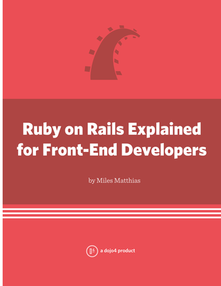

Over the holiday break I was reflecting on my introduction to Ruby on Rails at the dojo. As a full stack developer that mainly concentrates on the front-end, it was overwhelming to come into an existing rails project with a small javascript task. What files to edit? How are my scripts included in the page? How is a request handled in rails? Ahh!! 

So I wrote a book about it. My awesome dojo4 teammates helped review it for technical soundness and I think it's at a great point to release to the world. Hopefully it helps other front-end developers who jump into a rails project and realize they're lost. Let this book be your compass!



Check out the book:

* [In multiple e-book formats (PDF, MOBI, EPUB)](https://leanpub.com/rorfrontend)
* [In the Kindle store](http://www.amazon.com/Ruby-Rails-Explained-Front-End-Developers-ebook/dp/B00HYO0PT6/)
* [In paperback!](http://www.lulu.com/shop/miles-matthias/ruby-on-rails-explained-for-front-end-developers/paperback/product-21409160.html)

Description:

```text
Ruby on Rails is an extremely powerful full-stack web application framework, but with its power comes complexity. For front-end developers who simply need to edit HTML, CSS, and JS within a Ruby on Rails application, it can be a daunting task. This book explains what front-end developers needs to know about Ruby on Rails in order to work their mastery within a rails app.

By the end of the book, you'll be able to:

* know where to put your html, css, & js within the structure of a ruby on rails app

* how rails routes requests to controllers

* using views, layouts, and partials in controllers

* what the asset pipeline is and how to use it

* how controllers and views in rails work together to render a response in the browser

* how data is added to views and how to link to the data in your html
```

You'll love it:

* [In multiple e-book formats (PDF, MOBI, EPUB)](https://leanpub.com/rorfrontend)
* [In the Kindle store](http://www.amazon.com/Ruby-Rails-Explained-Front-End-Developers-ebook/dp/B00HYO0PT6/)
* [In paperback!](http://www.lulu.com/shop/miles-matthias/ruby-on-rails-explained-for-front-end-developers/paperback/product-21409160.html)