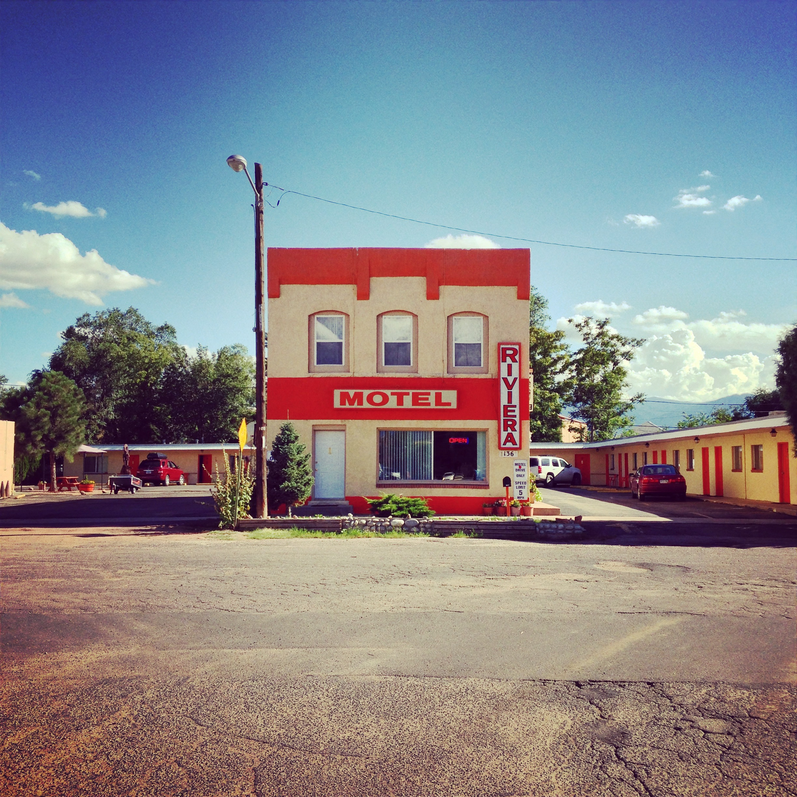
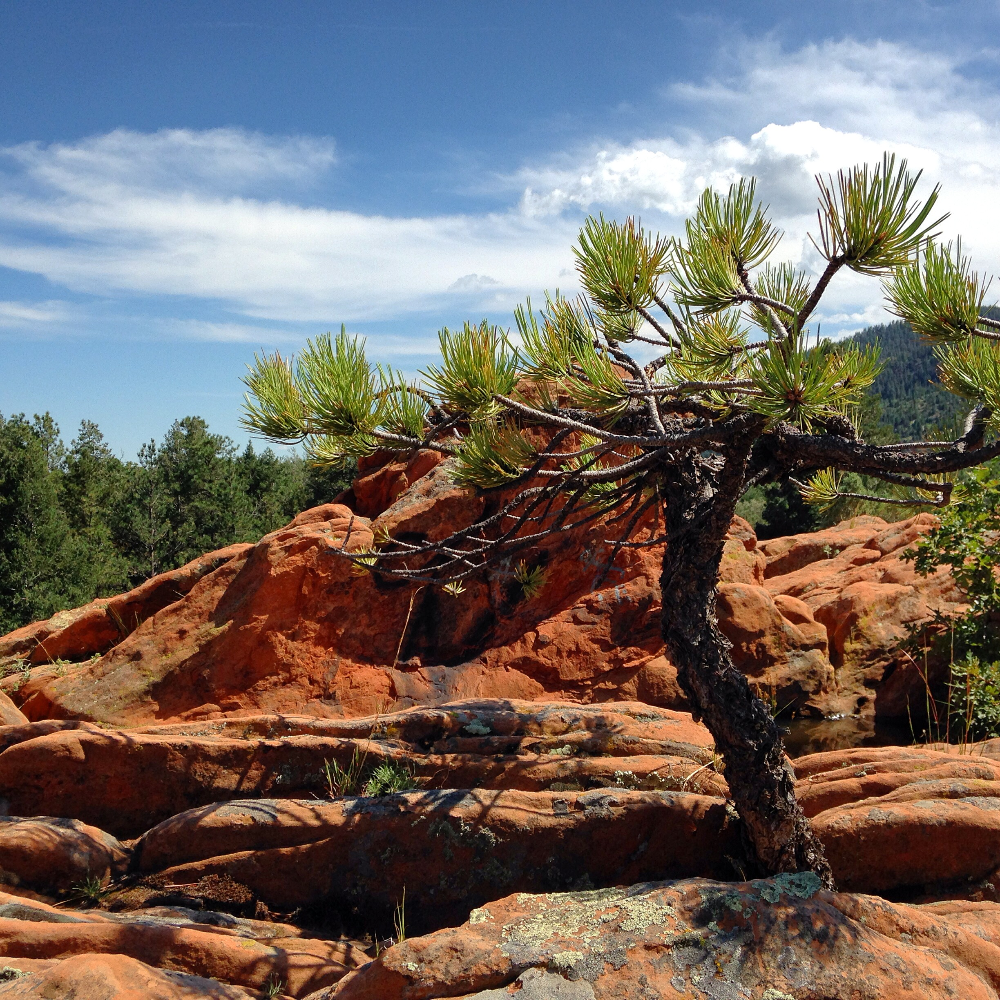
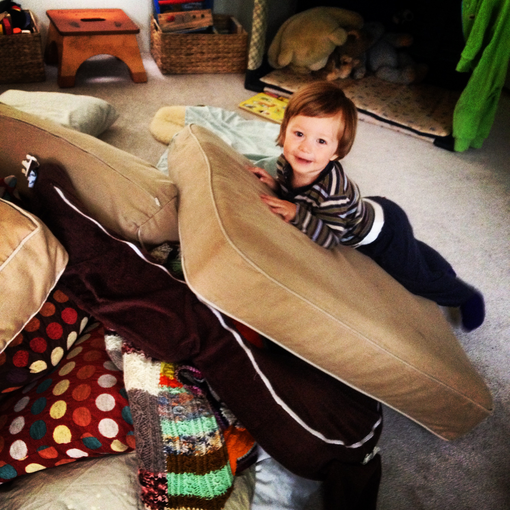
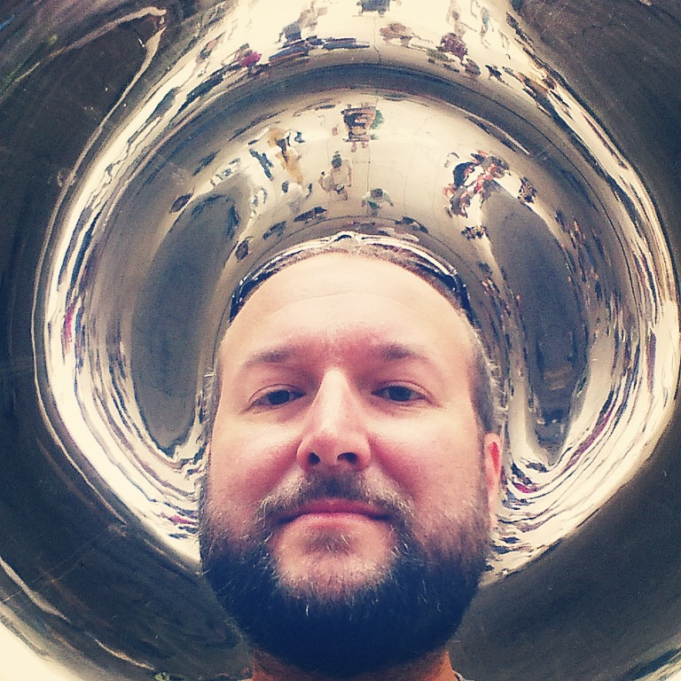
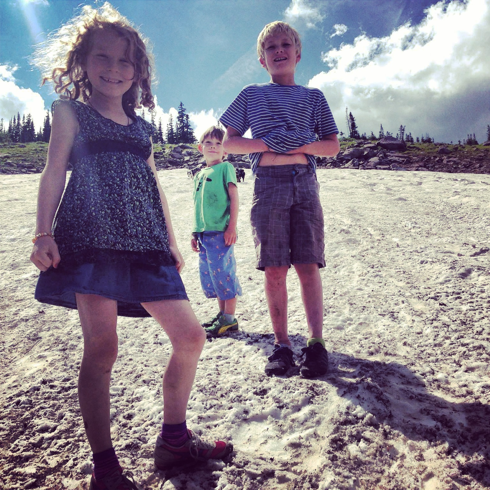
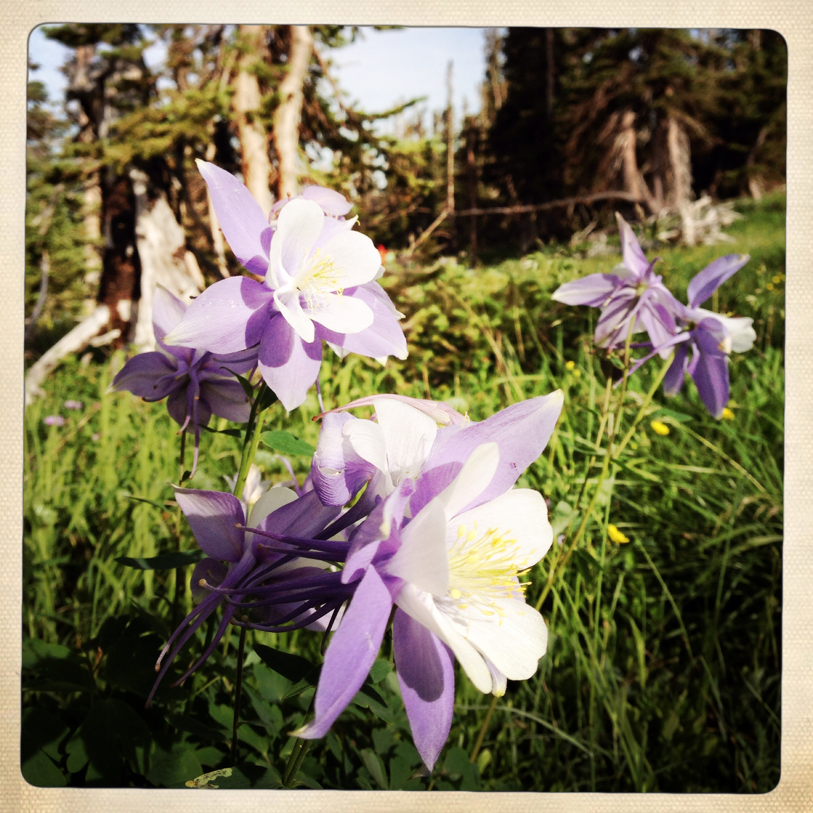
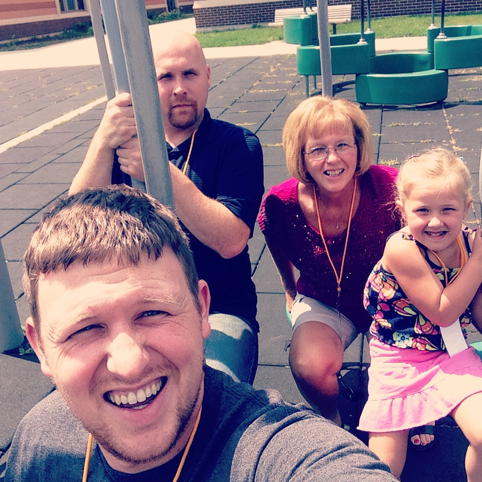
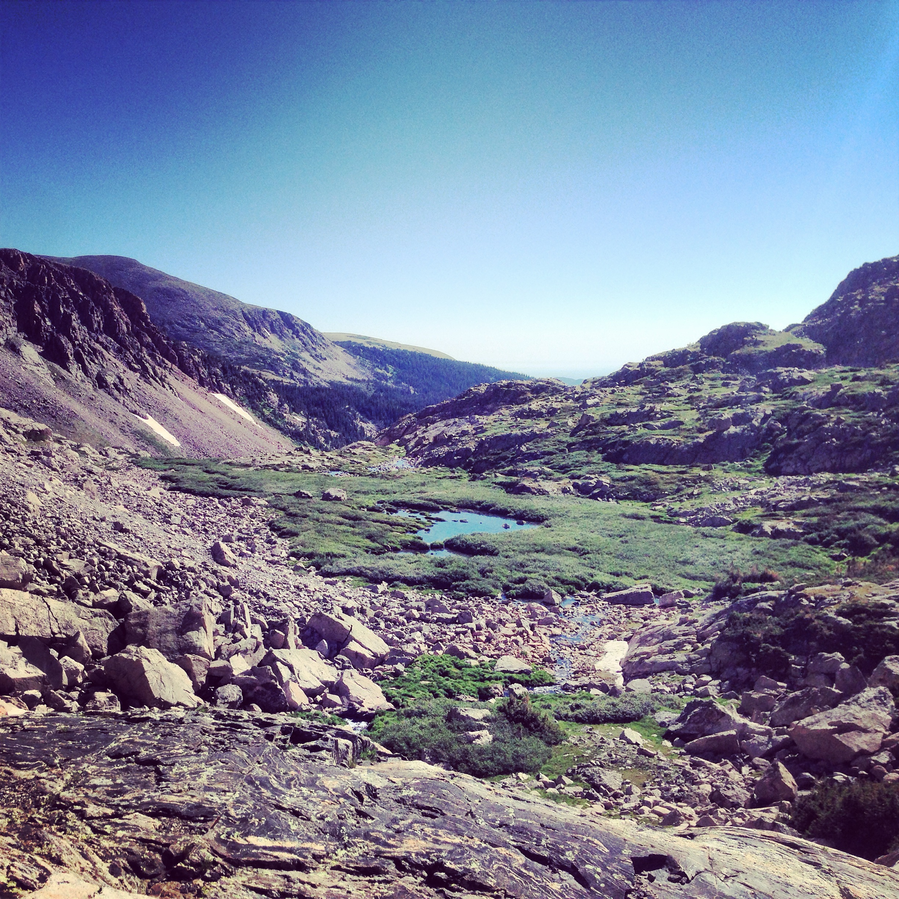
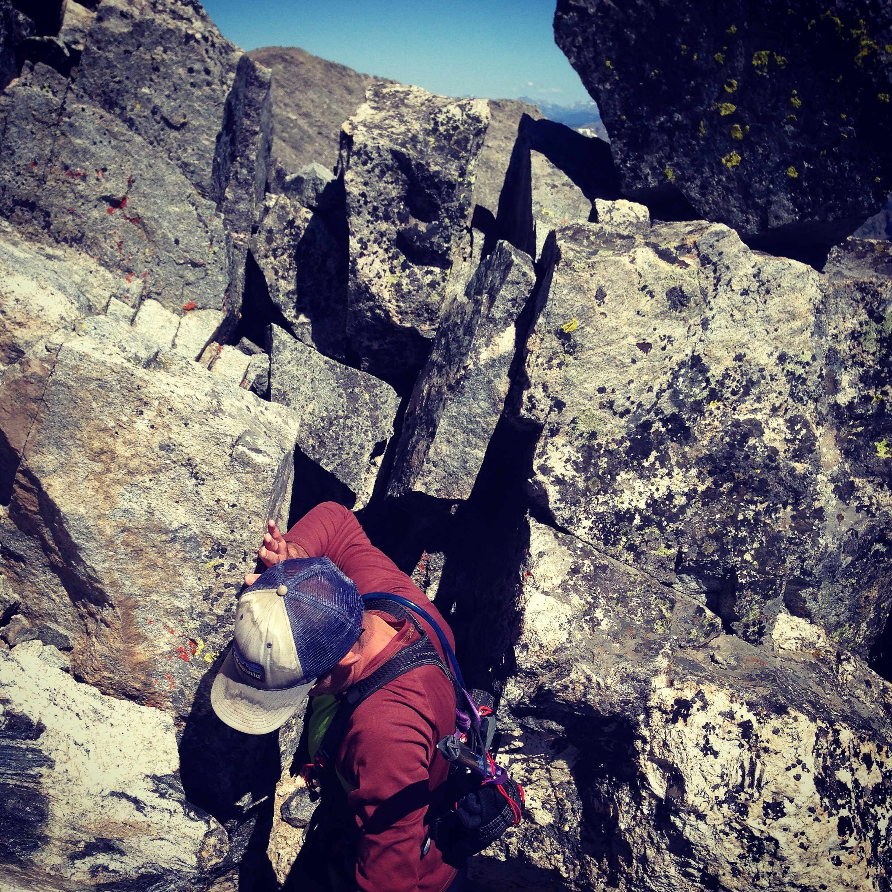

dojo4 had a pretty awesome weekend, and we wanted to share the fun with y'all.  We hiked Airplane Gully on Navajo Peak, one of Colorado's esteemed 14'ers.  We went to Chicago and took in the sights.  We took a solo road trip in Southern Colorado just to take pictures and soak in hot springs.  We summited Pillow Mountain in the living room.  We explored Caribou, a nearby destination for wildflower viewing and summer snow stomping. We went to a Midwest family reunion. 

And now we're back at work, reminiscing and digging in.  Happy Monday folks!

 

 

 

 

 

 

 

 

 