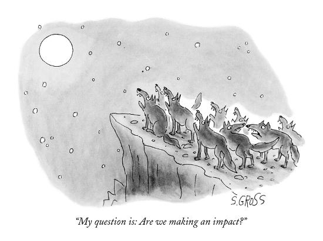

 
A few years ago, we decided we wanted dojo4 to be an "impact organization." We wanted to commit ourselves to doing work that inspires us, feels important and is truly helpful to the world around us. It felt like the best way to do that was to organize ourselves around work that could be put under the umbrella of "impact." We define impactful work on our [website](http://dojo4.com/about) this way:

> *We understand impact organizations to be those that use ingenuity to actively help people and our environment, by providing solutions to real problems. We've found that we do our best work when it engages real problems, when we are helping create a world where no one is limited by their circumstance.*

That was years ago. And our understanding of what it means to do meaningful and impactful work has evolved during that time.

This week we were honored [again](https://bcorporation.net/directory/dojo4) as being Best For The World in the Changemakers category. That means that, along with 203 companies in 66 different industries from around the world, we are being recognized for making the most positive improvement on our overall impact, based on the [independent, comprehensive assessment](https://bimpactassessment.net/) administered by the nonprofit [B Lab](https://bcorporation.net/about-b-lab).  It's lovely to have have our efforts acknowledged in this way and to be in the company of [so many extraordinary companies](http://www.bthechange.com) doing the hard work of improving this world of ours. And, for me, it raises the question again: what is this thing we call "impact?"

A colloquial definition of impact is to have a strong effect on someone or something. The contemporary business and investment usage of the term adds to that by implying a positive value to that impact. Impact = doing good. The implication is that a business can create a strong positive effect on people's lives. As the good people at the [Unreasonable Group](https://unreasonablegroup.com/about/) put it, it's about using business to provide solutions to the "[big f**ckin problems](https://unreasonable.is/)." Those problems are things like environmental degradation, poverty and wealth disparity, hunger and lack of clean water, avoidable illness, human rights, access to education and opportunity, and violent conflict. And those problems can also be things like depression, loneliness, and meaningless. 

But impact is complex, and the understanding of what good work is has deepened for many of us at dojo4, to include not just creating a work product that genuinely helps people and our environment. Sometimes, more immediately, it is simply work that supports a sense of joyful capacity, community engagement, wholeheartedly applied skill and fruitful collaboration. There's no question in my mind that the best use of business is to solve problems like homelessness, for instance. But if the company that is building a product / service to alleviate that problem is a dysfunctional, mismanaged, disheartened workplace, the positive impact of the product / service is not sustainable. Furthermore, harm is being created in the very process of trying to generate positive impact. Kindness toward yourself is what allows you to be truly kind to others. Similarly, companies have to take care of their own people, structure and environment before they can genuinely do good with their business. 

At dojo4 we continue to chose to work with [mission-driven clients](http://dojo4.com/work) that are committed to creating benefit in many of the impact categories like the ones outlined in the B Corp Assessment. But we've also found that one of the ways that we can create the most benefit is to turn our minds and energy toward the immediate impact that our work creates on ourselves and the people around us. Regardless of our current client roster and work projects, we focus on creating impact with the work environment, relationships and attitudes we cultivate. I believe that although (or maybe because?) we are a small company, we have a substantial positive impact on our community, our clients and our own experience, because we've completely invested ourselves in making a extraordinary space that we all like to work in, a space and deep relationships that are inclusive and welcoming, and challenge us to be ever more inclusive and welcoming. We still have a long way to go, but we are fervently committed to creating impact by building a business based trust and generosity. 

I am impressed and glad that we have made measurable gains in our impact on Environment, Customers, Governance, and Community. But I am most proud that we have made what I believe is truly positive impact on our own lives, the lives of our families, our clients and our community. I'm not sure how to measure joy but I'm sure that it is integral to any true impact, and I'm sure that it is scalable and ripples outwards in significant and influential ways. 

 