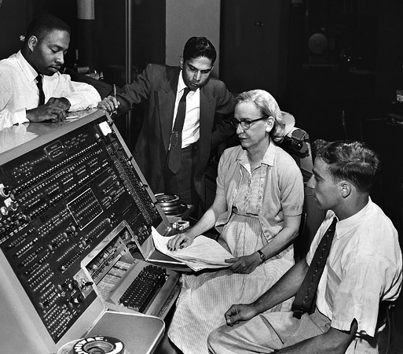

 
You've heard it before: there are not a lot of women in the tech industry, especially not as technologists. That’s not to say that there aren’t a lot of [very talented and influential](http://www.businessinsider.com/22-powerful-women-engineers-in-tech-2014-7?op=1) female entrepreneurs and coders out there. But even if you are blind, deaf and socially oblivious, you know that the tech scene is a male-populated and dominated field. Computer engineers are far more likely to have a Y chromosome than not. With [only about 18% of computer-science graduates from engineering schools being women and that number actually dropping](http://fortune.com/2015/03/26/report-the-number-of-women-entering-computing-took-a-nosedive/), rather than the other way around, it means that [bro-gramming](http://bostinno.streetwise.co/2011/08/31/the-10-commandments-of-brogramming/) is still the norm. 

**The tempting response to this situation is to try to find are the root causes and then solve them.** Where does the problem stem from? Is it because of a lack of [training](http://www.forbes.com/sites/dailymuse/2012/03/15/solving-the-pipeline-problem-how-to-get-more-women-in-tech/)? Skewed [media representation](http://link.springer.com/article/10.1007%2Fs11199-013-0296-x)? A [dearth of interest](http://www.cs.cmu.edu/afs/cs/project/gendergap/www/confidence.html)? A bias in [personal preference](https://www.psychologytoday.com/blog/the-village-effect/201004/women-computers-and-engineering-its-not-all-about-bias)? A [deficiency of confidence](http://cs.stanford.edu/people/eroberts/cs181/projects/2000-01/women-faculty/confidence.html)? A [deficit of intelligence](http://www.dailymail.co.uk/debate/article-1274952/Men-ARE-brainy-women-says-scientist-Professor-Richard-Lynn.html)? A [scarcity of good will and welcoming environments](http://lafalafu.com/krc/privilege.html)? There are lots and lots of answers to these questions, with thousands of dollars and [whole institutes](https://www.ncwit.org/) dedicated to figuring them out. But the fact of the matter remains: there is a gross gender imbalance in field of information technology. 

So, is this in fact a problem? To answer that, I’ll take my immediate situation as a case study. As a woman I am in the minority of people that work with dojo4. And none of the us women are in a strictly technical job here. Even though I went to college as a math wiz to study math and biology at the tender age of 16, I didn’t like the way sciences were taught and ended up majoring in Medical Anthropology, and then later getting a graduate degree in Communications. And now I find myself running a dev and design shop powered by male engineers (who I love and appreciate). Many a day I see no problem with the way things are- I am relating day-to-day with the people I work with, and gender is not at the forefront of my mind. I love my job, enjoy the company of my coworkers and business partner, feel empowered and confident in my work, and feel comfortable being ‘who I am’ in the workplace. But as someone educated in the age of post-structuralist feminism and gender studies, and having thought about this stuff a bit, I recognize that there is a whole panoply of [implicit biases](http://www.cnn.com/2012/10/01/opinion/urry-women-science/) and [imbalances](http://www.buzzfeed.com/katiecunningham/the-million-little-barbs-of-lighten-up) going on that do not necessarily support the model of an enlightened system. The main point, however, that sticks out for me is that although I rarely feel put upon, excluded or objectified, I do feel lonely sometimes and I wonder what it would be like to have more women around.

The problem is that we don’t know what it would be like if there were a more even balance of the genders. **How would the tech field be different if there were more women involved**, in general, and as technologists, specifically?  Would there be more innovation? Might there be more creativity? Would there be [a different set of users being served](http://www.nytimes.com/roomfordebate/2011/02/02/where-are-the-women-in-wikipedia/hearing-womens-voices)? Would there be more [productivity](http://blog.mindjet.com/2013/04/gender-equality-and-productivity/) or [happiness](http://www.reuters.com/article/2015/03/17/us-un-women-economy-idUSKBN0MD0JJ20150317) or even [increased profits](http://www.huffingtonpost.com/2014/10/07/gender-diversity-business-study_n_5945312.html) in tech workplaces? What would it be like if I or any of my co-workers could consult with another woman here at dojo4? What would it be like to do collaborative work with her to build technology?

These are all powerful questions, the answers to which could have powerful results. We can commit ourselves to hiring more women, to inviting more women to be collaborators, ask more women to mentor us. And we can also make a more conscious effort to understand gender as a spectrum rather than a binary factor and that that there are no simple solutions of balancing numbers of men and women. Some people now define feminism as the effort to [make everything better for everyone](http://thewebivore.com/make-everything-better-for-everyone-feminism-for-2012/). So **what can we do now to see what it might feel like if there were more women in tech, and to make everything better for everyone?** 

