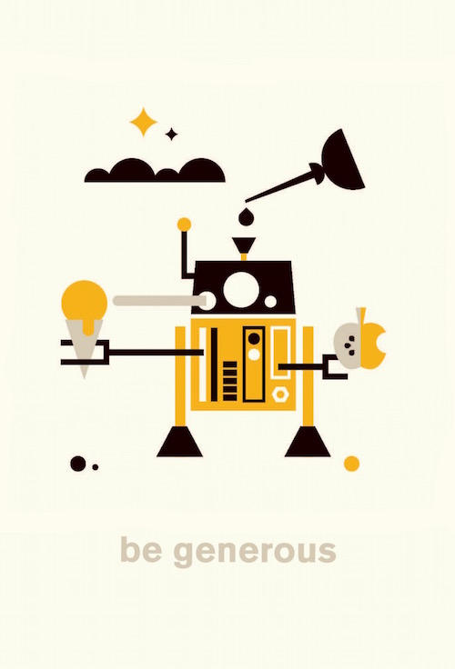

B Corp certification is the gold standard of [proof that your company is walking its talk](http://www.roundpegcomm.com/how-the-b-corp-certification-provides-crucial-context/). But aside from affirming what you already do, the process of becoming a B Corp also compels you to [clarify your values](http://little-startup-handbook.dojo4.com/be-generous) and write them into the DNA of the company in the form of [policies and practices](https://github.com/dojo4/policy/blob/master/hr.md).

DOJO4 is doing this in quite a few areas, but my personal favorite is our new matching gifts program. Here are a few reasons why your company should start one, too:

1. "Generosity is the virtue that produces peace," says Buddhism (and a lot of other spiritual traditions - Google it). Peace is good. The world could use more of it.

2. No gift is too small to make a difference (and it doubles in size as soon as you match it, anyway). In fact, nationwide [individuals donate over five times as much as all foundations combined](https://gusto.com/blog/zenpayroll-giving/), representing 72% of all charitable giving (which in 2014 totaled about 316 billion!).

3. It's easy as all get-out to have a matching gifts program. If you're big, you can use a service like [Gusto](https://support.gusto.com/hc/en-us/articles/210107558-How-Can-My-Employees-Donate-to-Charities-), which we love, and if you're small you can do what we did and just alert the team in [Flowdock](https://www.flowdock.com/features) that you'll match their gifts up to X amount; they can just add the donate url and amount to the thread and voila!

4. You will be a valuable asset to your community.  Interestingly, almost all of the organizations and causes that our team gave to were local, even though our work is international. It's always good to give back where you live, and it'll also raise your business' profile among friends and neighbors.

4. In a business context, offering a matching gift program (or giving your team members a say in what your company gives to) is a great way to get to know each other in a way that often doesn't happen during the daily grind. It was delightful and inspiring to see what moved our team members to give, and hear why they chose the causes they did. 

For us in 2015, that included:

* [Block 1750](http://www.block1750.com/) 

* [Boulder County Aids Project](http://bcap.org/) 

* [Boulder Food Rescue ](http://www.boulderfoodrescue.org)

* Boulder Shelter for the Homeless [Boulder County Cares Program ](http://www.bouldershelter.org/programs.bccares.html)

* [Boulder Valley Women's Health](http://www.boulderwomenshealth.org/)
[Community Food Share](http://communityfoodshare.org/) 

* [Harvest of Hope Pantry](http://www.hopepantry.org/) 

* [New Era Colorado Foundation](http://neweracolorado.org/) 

* [The Compassion Collective](http://thecompassioncollective.org/)   

* [Urgent Action Fund for Women's Human Rights](urgentactionfund.org) 

* And a Go Fund Me Campaign for [a local mom battling cancer](https://www.gofundme.com/zugey).

So remember, a company can match gifts no matter how small you are or how small the gifts. In business, as in life, [be generous and you will be prosperous](http://little-startup-handbook.dojo4.com/be-generous).

 

