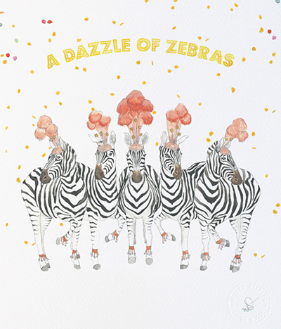
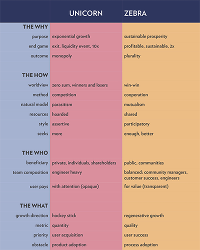
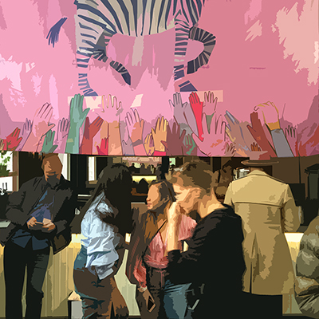

*Another world is not only possible, she's on the way and, on a quiet day, if you listen very carefully you can hear her breathe.* 
-Arundhati Roy

*Business is neither good nor bad, it's just a tool.* 
-Ari Weinzweig

 

If you aren't a [collective pronoun geek](https://www.collectivenounslist.com/zebras) and didn't know that a collection of zebras is [sometimes](http://www.collectivenounslist.com/zebras) called a dazzle, now you do. A dazzle of zebras dazzles, indeed! 

The Zebras that were called together at [DazzleCon]( https://www.zebrasunite.com/dazzlecon/) are a special breed. We are founders, investors and participants in companies that are both [black and white: they are profitable and improve society](https://medium.com/@sexandstartups/zebrasfix-c467e55f9d96) and don't sacrifice one for the other. We are playing a different game than the often predatory, exploitative, short-sighted, narrow and repetitive sport that has been exemplified by the conventional startup funding model's exclusive preference for unicorn [meat](https://www.wired.com/wp-content/uploads/blogs/magazine/wp-content/images/18-10/mf_thinkgeek_f.jpg). 

)

Back in 2016, this gathering was just a glimmer in the eye of the [authors of this sentence](https://www.zebrasunite.com/our-story): ["Startups, like the male anatomy, are designed for liquidity events."](https://medium.com/@sexandstartups/sex-startups-53f2f63ded49) That sentence opened an article that expressed what many of us had known, but may or may not have fully acknowledged, for years: the startup ecosystem is rigged. Who participates in, cultivates, funds and benefits from this ecosystem is dictated by the mostly [white, patriarchal hegemony](http://fortune.com/2017/09/29/group-of-white-men-in-patagonia-vests-confused-for-vc-fund-raise-500-million/) that engendered it. The startup world is primarily populated by people who are most likely to identify as being economically-advantaged, white and male. And the startup business model and network that makes it possible is characterized by a high level of competition, exploitation of its workers and users, emphasis on profit at all costs and generally predatory business practices. As Zebras, we are designing and building businesses that are aimed at solving real-world problems through collaboration, mutualism, and inclusive thinking that regenerates our communities, our economies, our environment, and our families. Our businesses aren't just creating social impact in what we're doing, but how we're doing it. 

 

DazzleCon made a great effort in reflecting this in who was there and what we talked about. Without a doubt, [DazzleCon was a business conference](https://www.feld.com/archives/2017/11/zebras-uniting-dazzlecon.html). But it was a conference for business as Zebras practice it. It was a conference for business as we aspire for the world to practice it. Clues to this were scattered throughout: the opening acknowledgement of being on the ancestral lands of the native peoples of the area, the childcare offered during the whole the program, [Wendell Berry](https://burginmathews.files.wordpress.com/2017/03/wendell-berry.jpg?w=863)'s "[It All Turns On Affection](https://www.neh.gov/about/awards/jefferson-lecture/wendell-e-berry-lecture)" and Bahá’í Assembly's "[Two Wings of a Bird](http://www.bahai.org/documents/nsa-usa/two-wings-bird)" tucked into the swag bag. This was the first such conference, [emerging out of the the overwhelming response to the first few articles posted by the founders of the gathering](https://www.zebrasunite.com/our-story), and as such, it had that feeling of intimacy, that we can make it what we want by being who we are. 

The enthusiasm and deep networks of the founders, the inspiring [Mara Zepeda](http://www.marazepeda.com/), [Aniyia Williams](http://www.aniyiawilliams.com/), [Astrid Scholz](http://www.sphaera.world/astrid/) and [Jennifer Brandel](http://www.jennyanything.com/), was heartfelt and apparent. Unfortunately that gusto expressed itself in a schedule that was too packed with speakers talking at attendees from a stage. In this way, the conference missed the opportunity to embody in its design the abundant energy that was gathered with facilitation tools that create emergent connections and actions like those offered organizations like the [Art of Hosting](http://www.artofhosting.org/) and [Social Labs](https://social-labs.org/toolkits/). The feeling of the conference as great, but the [shape](https://goodgoodwork.io/5-shapes-training-without-boss/) of this first one was somewhat misconceived. However, this gave me the opportunity to forge my own path with some of the enormously compelling people that I met there. The reality that how we do business is the nexus of our impact was beautifully manifested in the organizations built by so many of the people I got a chance to connect with there, like [Tinsel](http://tinsel.me/), [Side Door](http://sidedooraccess.com/), [Namastream](https://namastream.com/), [Good Good Work](https://goodgoodwork.io/) and [Smith and Connors](https://www.smithandconnors.com/), to name a few. And that's why I was there: to survey and wander through this landscape of people and companies that are making real and deep positive change by the way they are doing business. The Zebra ethos is in dojo4's DNA- I went to share who we are, to connect and to learn. And that's exactly what happened. 

In a post-conference email exchange of feedback, [Mara Zepeda](http://www.marazepeda.com/) expressed that her hope for the future of these gatherings is that we would *party* more together. I share her sentiment that Zebras can actually change the course of the history of business and the problems it solves with our playful energy. I have no doubt that we will find lots of ways to play together and am looking forward it it! 