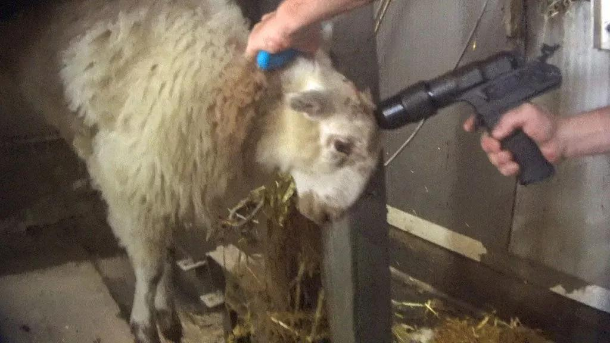

<iframe width="560" height="315" src="https://www.youtube.com/embed/5e-eIRvEoqs?si=bpMVpb_fz6ImbsC-&start=38" frameborder="0" allow="accelerometer; autoplay; clipboard-write; encrypted-media; gyroscope; picture-in-picture" allowfullscreen></iframe>

talking to people in the industry and the reality of it just gets darker. i'm talking with founders whose legit, funded mission is to control and alter human dna. they raised $100m to play god. total bene gesserit shit.

it's a fucking nightmare.

look at the news. look at block. every company out there is in a manufactured panic, worshipping elon and jack, firing half their staff because they think they have to replace them with ai to survive.

we are staring down a recession of epic proportions. at least 50% unemployment. a total wipeout of white collar work.

and the darkest joke of all is that it's a bubble. no one is actually buying this tech. the organic demand isn't there, so the giants are getting desperate. they have to trick the market. they have to convince everyone they'll go extinct if they don't buy in, just to manufacture the customers they couldn't find naturally.

meanwhile, the pentagon is using ai for nuclear planning.

as i write this, looking at the systems we build, it gets so hard to say why we keep doing it. just sheep to the slaughter, building the machinery of our own obsolescence.
