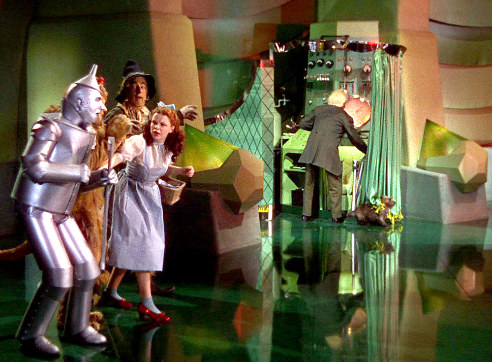

after the 5th or 6th su\_c\_de, in as many years... now that i stop and count
about twice as many actually...

i've begun to form some opinions, from both my personal _and_ professional
perspectives.

1. anyone that doesn't get depressed a little in this world is a monster.  it’s much, much more than ok to not be ok.

2. perhaps they've gone to a better place, and are at complete rest.

3. perhaps it was us they were fleeing from, and not life.

4. it's not accusational, or sensational, to say that we all have a responsibility, and interest, in preserving the mental freedom of our fellow humans, no matter how unlike us they might be.

5. putting people in little boxes, queues, lines, grades, levels. is mental violence. the lines on your paper, are someone else's prison.

6. the internet is, idealistically, and factually, one of the biggest levers being used to enforce this type violence on others.

7. anyone that thinks 'this sort of conversation does not belong \_here' can eat a bag of d\_cks. you are the problem.

we all are.

every, single day.

one thing we can do to reduce suffering, is to be there for our friends.

the others, we don't know how to help them...

do we?

at least we can try to do no harm.  then again, we lock those people up...

we seem to prefer pretending that this very internet isn't one of the biggest
'putter in boxers' out there.

the one that literally places the crazy eight balls behind those 9 trillion \[\[boxes\]\] that read

> **\[\[ tell me the truth \]\]**

or

> **\[\[ love me \]\]**

or

> **\[\[ see me \]\]**

((and now people are really going to get pissy…))

if you work for an AI company.  if you work for a social media company.  if
you use machines to sell stuff to people that makes them sick or unwell.  or
that they don't need and didn't ask for…  same damn thing...  if you
maximize time on site.  if you replace human connection with ‘user
interface’.  if you make it 'faster and easier' to do the stuff 'less
capable' people used to do with calculators.

i urge you to get up, and look in the mirror for 8 minutes without looking away.  what could it hurt?

unfair you say?  why me?

because you, and i, make this place.

you either _already_ know, or do not know, why this is the __perfect__ sound track for this click baity ass post.

<iframe width="560" height="315" src="https://www.youtube.com/embed/OVboY26AexU?si=DOs5Bi_G7pzsgaOG" title="YouTube video player" frameborder="0" allow="accelerometer; autoplay; clipboard-write; encrypted-media; gyroscope; picture-in-picture; web-share" referrerpolicy="strict-origin-when-cross-origin" allowfullscreen></iframe>

