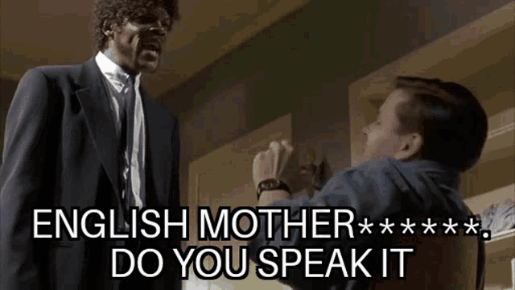

this is the part i hate.  writing about myself.

i'll start at the beginning:

* grew up in alaska, 4th generational irish people
* roamed the planet racing bikes and skis.  this before phones, gps, or digital cameras.
* started a family in boulder
* researched [life on earth from space](https://independent.academia.edu/arahoward) for about a decade
* wrote a [ton of software](htts://github.com/ahoward), some that [i am even proud of](https://www.linuxjournal.com/article/7922)
* founded, built, and ran [dojo4](/dojo4) for almost exactly a decade
* mentored dozens of startups, worked with and for over a hundred
* 2020 // COVID // massive life changes...
* subsequently, a ton of [mountains](https://photos.app.goo.gl/FwwxEygH55JnQR8n8)
* somehow managed to get lost in the [southwest for the 42'nd time in my life](https://photos.app.goo.gl/rnSLBr9MoWMHv1zx6)
* started [riding my bike to * alaska](https://photos.app.goo.gl/wMDwwuFamRWWgZiu6)
* met a girl in [LA](https://photos.app.goo.gl/MpSigk5BJwqeouiUA)
* [almost died in an ice cave](https://photos.app.goo.gl/F2Tsji1aHHzKRnVF8)
* been cranking on a [new company](https://syntheticecho.com) and [riding * bikes with a broken leg](https://photos.app.goo.gl/ikwjrYWBXEvFbwbx7) ever since

reminder: _this is a work in progress..._, so check back soon or just <a href="contact">contact</a> me if you are a-wondering _wtf_ is up?

> bored: 🐼 ?

iff you are so inclined (hi to my journalist/write friends that is NOT a typo so [look it up](https://letmegooglethat.com/?q=what+does+%27iff%27+%3F)) follow along here -> <a href="https://github.com/ahoward/drawohara.io">https://github.com/ahoward/drawohara.io</a>

or here -> <a href="https://www.instagram.com/drawohara">https://www.instagram.com/drawohara</a>

or even here (ssssshhhhhhh) -> <a href="https://syntheticecho.com">https://syntheticecho.com</a>

> wut even is that ^ ? and, "why are you so weird"

well, i get that question often from mean people that can't spell (this from me, a dislexic) but i will answer anyhow...   i've been working on a secret ai based project for close to a year, with some good friends from boulder.  we bring the social context - the voice of the people - to ai.

> E.M.F.D.Y.S.I !?!?!

here's an example.  more soon.

<a href="https://gist.github.com/ahoward/41b06d15d7afeed9fd82726057ad2646">https://gist.github.com/ahoward/41b06d15d7afeed9fd82726057ad2646</a>

> i am still dumb, and in imminent danger of giving democracy away on facebook, along with my entire existance and that of the human race...,what _is_ that?

it is a threat index, informed by over a million social media converstaions, regarding the fortune 500 in america, built by contextualizing those voices in a custom llm (that's ai speak for 'better than openai because it utilizes people's real voices instead of models trained on piles of seo ladden advertisements designed to make you a 🐑)

> what is wrong with you!?

_sigh..._
