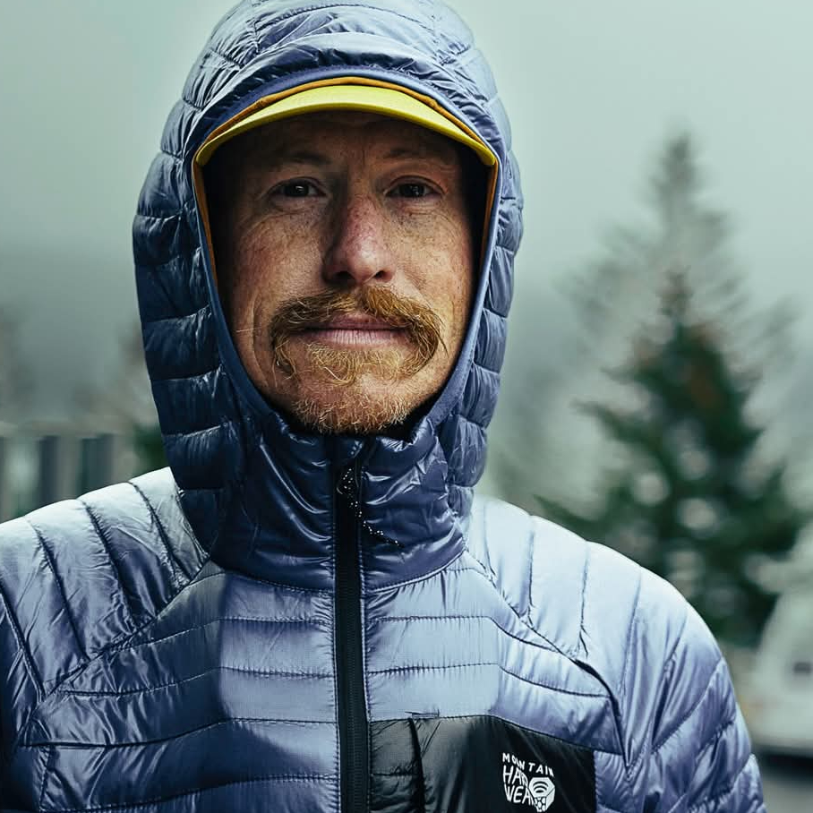

### hey, wanna know what i've been up to for the last **20+** years?

well... creating things out of virtual nothingness remains my favorite artform, even after **20** years as a professional software architect. right after [traversing natural landscapes and petting dogs](https://photos.app.goo.gl/FwwxEygH55JnQR8n8), of course.

> tl;dr: i'm ara t. howard, and i build stuff

you can find me bouncing between boulder, colorado // palmer, alaska // tabernash, colorado // and los angeles, california. hit me up: [drawohara@drawohara.io](mailto:drawohara@drawohara.io) or [303-747-3468](tel:303-747-3468)

here's where i hang out online: [github](https://github.com/ahoward) // [academia.edu](https://independent.academia.edu/arahoward) // [linkedin](https://www.linkedin.com/in/arahoward/) // [instagram](https://www.instagram.com/drawohara/) // [home](https://drawohara.io/)

__the journey so far...__

i got my start back in **1998** as a _student assistant_ at [CIRES](https://cires.colorado.edu/) and [FSL (Forecast Systems Lab)](https://www.boulder.noaa.gov/) at [NOAA](https://www.boulder.noaa.gov/). this is where i learned to do data visualization in _R/S/IDL/MATLAB_ (remember those?), optimize meteorological algorithms in _C/Fortran/Lisp_, and -- here's the fun part -- port the RUC weather model from big-endian Cray machines to little-endian Linux nodes.

oh, and we did all this right across the **Y2K** boundary. no pressure, right?

that's also where i started contributing to open-source projects, which would become a huge part of my life.

by **2000**, i leveled up to _professional research assistant_ at CIRES's [Integrated Systems Group (ISG)](https://www.boulder.noaa.gov/). this is where things got real:

we built **24x7 high-availability** platforms for meteorological data ingest and dissemination using _ruby, perl, ml, c, c++, bash, java_ (basically everything). we developed methodology for bi-temporal meta-data support regression analyses over large-scale real-time meteorological models.

> what does that even mean?

basically, we figured out how to test software when you don't know the 'right answer' -- you hold all variables constant, change a few, and look for patterns. sound familiar? yeah, it's back with AI now...

during this time, i released about **~10 open-source libraries** into the ruby, perl, and c ecosystems. just getting warmed up.

from **2003-2007**, i moved over to the [Defense Meteorological Satellite Program (DMSP)](https://www.ngdc.noaa.gov/) at NOAA, where i studied global population dynamics via _nighttime lights_ -- yes, you can track poverty, coral reef stressors, gas flaring, and city growth by analyzing how cities light up at night.

we developed novel user-space super-computing methodologies (before "the cloud" was even a thing), and i worked on edge detection algorithms along high-rate-of-change regions on city boundaries using techniques from computer vision and signal processing like the [watershed algorithm](https://en.wikipedia.org/wiki/Watershed_(image_processing))... but at _scale_.

we're talking [big fat super-compute](https://www.linuxjournal.com/article/7922) here -- essentially map-reduce style computing before those terms existed. we had to invent novel ways to move code off big-endian Cray machines onto hundreds of commodity Linux boxes.

during this stint, i released **over 100 open-source libraries**. NOAA let me share my work openly, and i'm deeply grateful for that. this eventually led to winning a **Ruby Hero** award.

> why do i care so much about open source?

because i believe true innovation comes from creative time to just _build things_. not from board rooms. not from mining data to give people what they want (which is probably potato chips). but from raw _instinct_ about what should be built, how, and _why_.

__coffee break...__

in **2007**, i founded codeforpeople.com, llc. to develop custom solutions for boulder's emerging start-up space in _ruby, c, and java_. this was when boulder tech was just starting to explode. i wrote early lines of code for companies that were later acquired by **Oracle** and **Twitter**.

then in **2010**, i started [dojo4](https://dojo4.com), which became the crown jewel of my career as a geek. over the next **10 years**, we:

- developed custom solutions for **over 200 tech start-ups**
- founded and chaired the [boulder awesome chapter](http://www.awesomefoundation.org/en/chapters/boulder)
- won that ruby hero award i mentioned
- mentored at [TechStars](https://www.techstars.com/) and Unreasonable Institute

it's been an eye-opening education learning first hand just how much pain tiny and seemingly unimportant technical decisions can cause for future you, how focusing and refocusing on _the three most important things_ over and over is the key to building great software that actually helps people, and witnessing how ruthless commitment to mission and vision can change the world one byte at a time.

in software as in mountaineering, although i appreciate an expedition style, i prefer, and have seen much greater success, with a **fast and light approach**. one that focuses on steel threads, ideals, atoms, ethics, and _systems_ instead of just letting the market define what engineering tasks should be on the board.

in **2020-2021**, i worked as _principal engineer_ at [mainstreet.com](https://mainstreet.com), where i developed a MongoDB-based archive, caching, and analytics layer for external payroll data and introduced key technologies and design patterns into a rapidly evolving code base.

these days (**2021-present**), i'm running a few things:

**[matanuskafrontiertrek.com](https://matanuskafrontiertrek.com)** -- _founder, guide_

a pet project/side business where i developed a Next.js, Strapi, and Render.com-based platform. because why not combine tech and adventure?

**[mountainhigh.codes](https://mountainhigh.codes)** -- _founder, principal engineer_

developing fast and light engineering solutions for non-profits and mountain companies using _11ty, Next.js, and other static-first technologies_. bringing simple and cost-effective AI solutions to individuals, non-profits, and small businesses.

**[syntheticecho.com](https://syntheticecho.com)** -- _founder, principal engineer_

services and software that bring the 'social voice' to artificial intelligence applications and research.

**[n5](https://www.nickel5.com/)** -- _researcher, engineer_ (2024-present)

currently, i'm working at this boulder-based, private equity backed think tank on some seriously wild problems: training the mind via the visual cortex using EEG analysis (yeah, we're literally hacking consciousness), and building a 'perfect oracle' as a novel DeFi market that models intersubjective reality through market signals.

> what even is that?

think of it as attempting to create a truth engine that emerges from collective human judgment, tokenized. we're exploring the boundaries where neuroscience, cryptoeconomics, and philosophy collide. because why not?

i am currently in a unique position, having reduced my own life footprint dramatically in order to create space for creativity. it's because so many big problems still exist, and i would love to talk about yours, and how hard we can go, in order to solve it.

**big problems, are big fun.**

__where i learned stuff...__

i started at the [University of Alaska Anchorage](https://www.uaa.alaska.edu/) (**1992-1994**) studying biochemistry and competing in D1 nordic skiing. turns out skiing fast and doing science are both pretty rad.

then i moved to the [University of Colorado at Boulder](https://www.colorado.edu/engineering/) (**1999-2003**) where i studied computer science and designed a senior year project for NOAA/CIRES. i earned a **10th place finish at collegiate nationals** and transitioned straight into the workplace at NOAA/CIRES as a research associate.

basically, school and work blurred together in the best possible way.

- this is all, always, a work in progress.
- i am doing it live.
- i cannot spell, so sue me. (a little dyslexic, in fact.)
