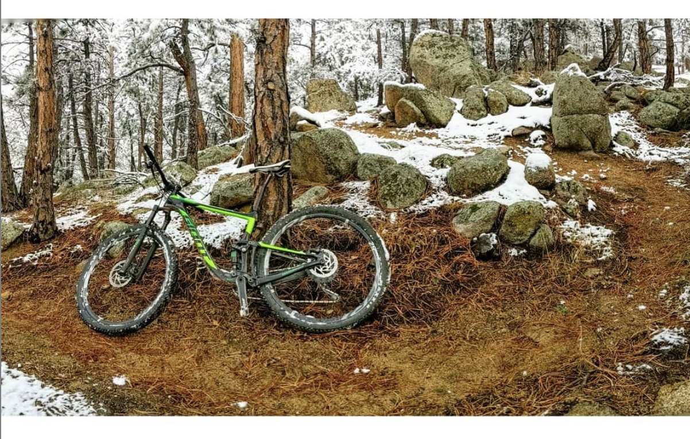

* Be outside.
* Ditch the car, ride a bike. [Electric bikes](https://www.radpowerbikes.com/) are fun, too. 
* Eat more [mushrooms](https://fungi.com/). 
* Gift [*Julian is a Mermaid*](https://jesslove.format.com/julian-is-a-mermaid) to someone you love. Or to anyone.

* Go [fossil free](https://gofossilfree.org/).
* Reduce your screen time. 
* Follow [goats in sweaters](https://www.instagram.com/sweateredgoats/). 
* Study and practice [a martial art](https://www.4ringstactical.com/).
* Try something you've never tried before. 
* Try something again that you've tried before and didn't like at the time.
 
* Submerge yourself in cold water to charge [your immune system, boost metabolic and brain activity, and reduce inflammation and pain](https://www.wimhofmethod.com/science). [Wim Hoff](https://www.youtube.com/watch?v=VaMjhwFE1Zw) says so, and he's right.  
* Eat [Jai Mix](http://jaimix.com/).
* Listen to the human-centered [Boulder Tech Podcast](http://bouldertechpodcast.com/).
* Read and support independent media, like [The Correspondent](https://thecorrespondent.com/) and other sources that are [rated as least biased](https://mediabiasfactcheck.com/center/).
* Get the help you may need to [hire more inclusively](https://hirediversity.us/). 
* [Host a screening](http://www.giftitforwardproject.com/screenings/) of [Gift](http://www.giftitforwardproject.com/the-film/)

* Join the [Consciousness Explorers Clubs](http://cecmeditate.com/).
* Learn more about permaculture and pattern language by reading books like [*Change Here Now: Permaculture Solutions for Personal and Community Transformation*](https://www.amazon.com/Change-Here-Now-Permaculture-Transformation/dp/1623170648) 
* See what you think about [Yuval Noah Harari](https://www.youtube.com/watch?v=JJ1yS9JIJKs)'s new book [Homo Deus](https://www.ynharari.com/book/homo-deus/).
* Allocate at least 25% of your time spent on Spotify, iTunes, etc. to exploring [Bandcamp](https://bandcamp.com/) or making a [mixtape](https://www.mixcloud.com/TheVibrarian/dancing-about-architecture-ignite-boulder-37-mixtape/) for someone (and, of course, follow [@TheVibrarian](https://twitter.com/thevibrarian)). Don't forget that you can always [find new music to love](https://www.youtube.com/watch?v=vXqkhK3lXhA).
* Listen to the latest dojo4 mixtape here: [ColoraDOJOyride](bit.ly/coloradojoyride)
* Don't forget [jazz](https://g.co/kgs/Vki1FV).
* Don't forget [poetry](https://g.co/kgs/zHQvZB).
* Don't forget [Tiny Desk Concerts](https://www.npr.org/series/tiny-desk-concerts/). Here are some of our favorites:
   - [Sylvan Esso](https://www.youtube.com/watch?v=mhyD2qchkEw)
   - [Tank and the Bangas](https://www.youtube.com/watch?v=QKzobTCIRDw&t=1213s)
   - [Mariachi Flor De Toloache](https://www.youtube.com/watch?v=-rl26QKPHtE)
   - [Nathaniel Rateliff & the Night Sweats](https://www.youtube.com/watch?v=8KUV2TFTpGo)
* Wear your [heart](http://), or your [spleen](https://iheartguts.com/collections/buttons-pins/products/spleen-lapel-pin), on your sleeve.
* [Patch](https://microcosmpublishing.com/catalog/patches) yourself (or [part of yourself](https://iheartguts.com/collections/buttons-pins/products/vadge-of-honor-patch)) up.
 
* Follow more artists on instagram, like these:
   - [Vanessa German](https://www.instagram.com/vanessalgerman/)
   - [Ruby Onyinyechi Amanze](https://www.instagram.com/ruby_onyinyechi_amanze/)
   - [Elia Alba](https://www.instagram.com/asahinyc/)
   - [Rhianne Clarke](https://www.instagram.com/rhianneclarke/)
   - [Suchitra Mattai](https://www.instagram.com/suchitramattaiart/)
   - [Debbie Clapper](https://www.instagram.com/gneural/)
   - [Ian Mclaughlin](https://www.instagram.com/ianmclaughlin/)
   - [Lina Iris Viktor](https://www.instagram.com/linairisviktor/)
 
* Look at more [images](https://mymodernmet.com/iapbp-birth-photography-contest-2018/) of [humans being born](https://www.birthbecomeshercontest.com/image-contest-2018/). 
* Share more [images](https://www.instagram.com/forgottenneighbors/) of humans without a home, by becoming a [contributor](https://forgottenneighbors.typeform.com/to/KlpI6F) to [Forgotten Neighbors](https://www.forgotten-neighbors.com/). 
* Make art. Or, at least, draw in some [coloring books](https://microcosmpublishing.com/catalog/books?subject=coloring_books&mm=or&pg=1#subjects=).
* Consider using [psychedelics](https://www.scientificamerican.com/article/scientists-are-starting-to-test-claims-about-microdosing/).  
* Use your [iPhone to travel](https://aconica.com/) more visually. 
  
* If you can't travel far, [travel near](http://www.globalgadding.com/travel-locally/). 
* Develop a friendlier, more [mindful relationship to your finances](https://www.highlanderwealth.com/mindful-finance-blog/). 
* Form new habits by picking something and doing it 200 days in this year.  That's barely more than half the days.
 
* [Don't sleep near your phone](https://www.vox.com/2018/7/16/17067214/cellphone-cancer-5g-evidence-studies). 
* Don't let doing your taxes get you down: use [BrassTaxes](https://brasstaxes.com/).
* Give your electronics a bedtime - try observing a digital sunset. 
* Track the phases of the moon.

* Don't wait to tell someone how you feel. 
* Create (or join) a regular, standing date to spend time outside with other people. We favor a weekly, family hike followed by early dinner/happy hour.
* Take a [walk](https://www.thehikinglife.com/2018/01/wanderlust-hiking-on-legendary-trails/).
 
* Slow down.

