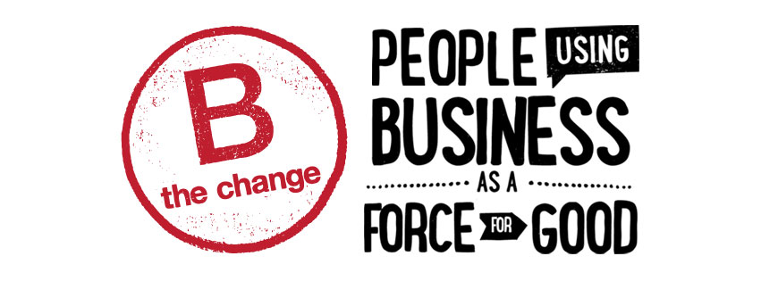

 

Yesterday dojo4's better half attended *B Bold: How Tech Companies are Focusing on Impact and Winning in the Marketplace*. It was enlivening to be amongst other technologists who truly believe that business can and should be a force for good in the world, and are walking their talk by [becoming certified B-Corps](https://www.bcorporation.net/what-are-b-corps). 

As part of dojo4's [big pivot](http://dojo4.com/blog/the-big-pivot) to being a [purpose-driven](http://dojo4.com/) agency, we are well on our way to becoming certified and will be at the [B-Labs Hackathon](https://www.eventbrite.com/e/b-impact-assessment-hackathon-tickets-15037279909) next week to complete our B-Impact Assessment. If you're in Boulder and are considering B-Corps certification, join us!

 

