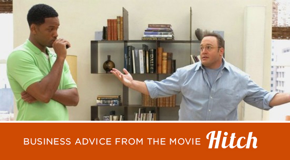

Hitch is a 2005 romantic comedy directed by Andy Tennant and starring Will Smith. The film, which was written by Kevin Bisch, co-stars Eva Mendes, Kevin James, and Amber Valletta. Date Doctor Alex Hitchens aids his clients in sweeping the women of their dreams off their feet, boasting that all you need is the right broom.

As a woman of business, I was curious if any of the advice he gave his clients about dating could be applied to business as well as dealing with clients and customers. I've come up with 5 tips that translate very well.

<h2>Knowing what you want</h2>

Hitch says "Even a beautiful women doesn’t know what she wants until she sees it." Can the same be true of your clients and customers? Often times our clients may have a general idea of what they want, such as "I need a website," or "I need a mobile app," but they don't really understand why or what it needs to do. As a business owner, this is your opportunity to shine. A potential client is coming to you because they need your creative expertise. Step up to the plate and be an expert. Get to the root of the basic needs of your prospect, and then wow them with what you can deliver. Make them fall in love with the process and the end result.

<h2>Listen and respond</h2>

Hitch reminds us that in the moment we should "listen and respond." This is actually true of all relationships and all forms of communication in life. But let's focus on business. Often we get caught up in the full range of quality services we can offer a client, that we automatically assume they want a certain kind of website or a certain type of bundle that we offer. That is actually rarely the case. In practicing the concept of really listening to the client you start to hear what their concerns are, and you also hear what their ambitions are in terms of what they're striving for. Pull that information out, and then find the skills and services you offer that match it.

<h2>The sign off</h2>

Hitch says, "A woman’s best friend must sign off on all big relationship decisions." Well, its not quite your prospect's best friend, but it's usually a board, an advisor, or various members of an internal team. Help equip your prospect with the information they need to sell the project to their company. Do this within reason of course, but if you have case studies, or examples of similar projects, or even write ups from other satisfied customers, that information should be readily accessible so it can be used to your advantage.

<h2>Non-verbal communication</h2>

Hitch says, "60% of all human communication is non-verbal, 30% is your tone; so that means that 90% of what you’re saying, ain’t coming out of your mouth." This is true. A potential client can pick up on your behavior and non-verbal cues. Are you confident in the solutions you're presenting? How do you feel about that number you told them (your fee, etc)? If you are not confident in what you're selling, it doesn't matter how great the presentation is, it could effect the outcome. Remember, a client is looking for you to be the expert, while also embodying the ability to assess their needs and deliver something unique for them. Own it.

<h2>The first time</h2>

Hitch says, "8 out of 10 women think that the first kiss will tell them everything they need to know about a relationship." Well, you probably won't get a first kiss in a business relationship, but that first phone call or in person meeting is a very critical part of the process. And just like dating, it plays a huge role on whether or not you make the cut and move on to round 2. Use the natural talents you have, and the elements of your personality that make you shine. As a business you have the advantage of sometimes bringing in a team member if needed. The best advice is really establish that human connection, allowing you to go above and beyond the sell.

It is after all just a movie, but often times pearls of wisdom come from some very unexpected places.