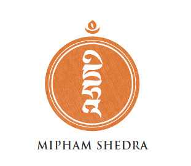
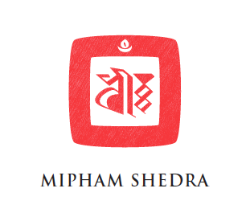
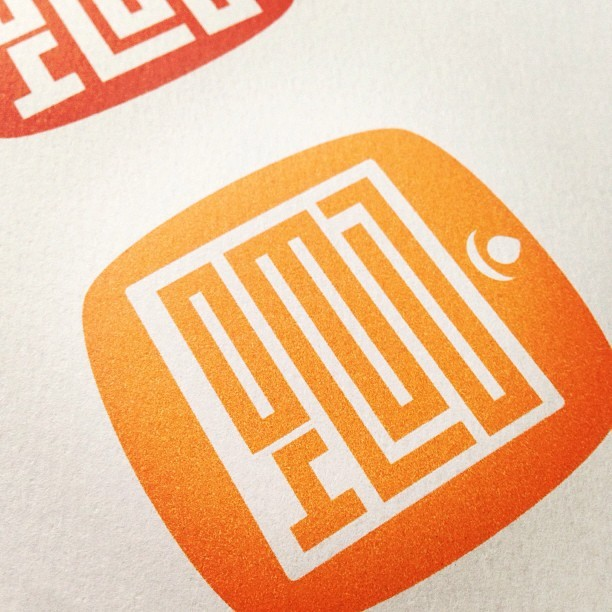

We were recently approached by a buddhist teacher named Löppon Rechungpa to design identity assets for his [meditation center](http://www.miphamshedra.org/). We decided to simplify the current [thangka](http://en.wikipedia.org/wiki/Thangka)-styled mark and go with something elegant, simple, and easy to stamp on collateral. We found [Tashi Mannox's](https://www.tashimannox.com/) inspiring calligraphic works a prime visual resource for the project.

We decided on doing a play on a 'chop', which is a calligraphic seal that represents an organization, person, or in some cases an artist. A 'chop' needs to have a strong, commanding aesthetic presence. As a brand identity resource we thought a seal was a great option! The client was pleased with our effort and we also made a dojo4 chop for the studio. We love when a project gives us an opportunity to learn new things about the arts and ancient cultures.

