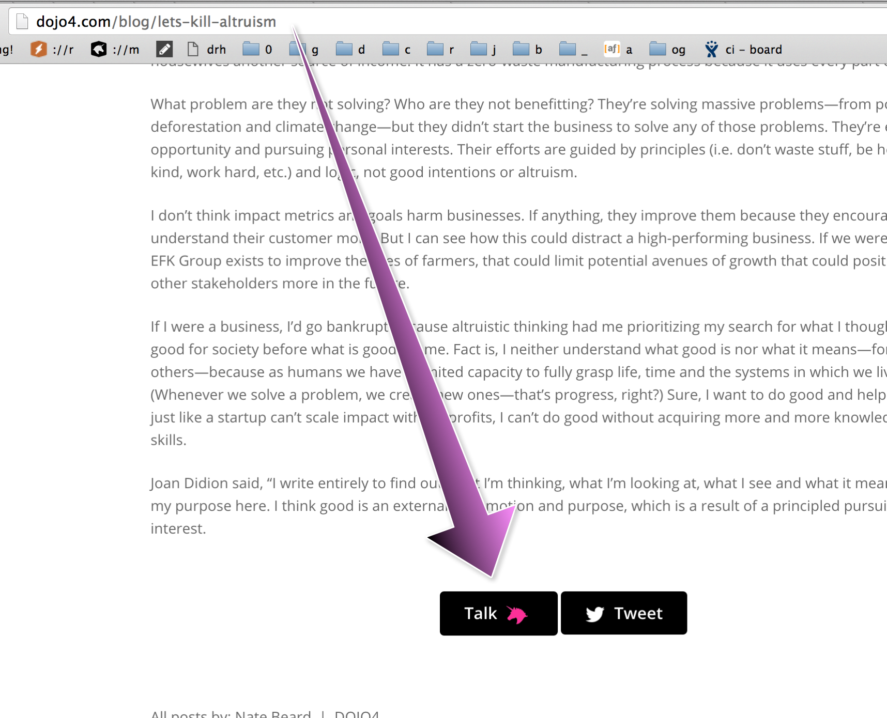

 
Something beautiful happened at dojo4 over these last 5+ years: we built a community. Countless people have come through our doors. We've shared meals, drinks, playlists, joys, tragedies, ideas, practical jokes, knowledge, feedback and connections. dojo4 has emerged as place that is home to many people, a place where we're doing business in a new way, and a place where we are exploring what it means to do meaningful work. 

It's been pretty amazing to have built a place where anyone can walk in the door and see where they might fit in, and recently we started talk about how we might open our community beyond our walls in Boulder, Colorado. In the spirit of doing *something* and not letting perfect be the enemy of good, we have thrown up [community.dojo4.com](http://community.dojo4.com/): dojo4 community, open-sourced. 

It's open. It's can be used however is most useful to you. We're hoping it will be used to bring people together around conversations about:

* purposeful work
* new ways of doing business
* sharing technical and design skillz
* sharing news, innovations and recommendations
* opportunities (jobs, investments, connections)
* things that we enjoy: travel, food, music, hidden gems

We're also hoping it will be used to discuss blog posts.

We've created a few categories that may (or may not) be evocative, and posted a few topics there. But inspiration and practicality trumps concept, so use it however it best suits.

> [None of us are as smart as all of us. ~Japanese proverb](http://little-startup-handbook.dojo4.com/call-on-community) 

