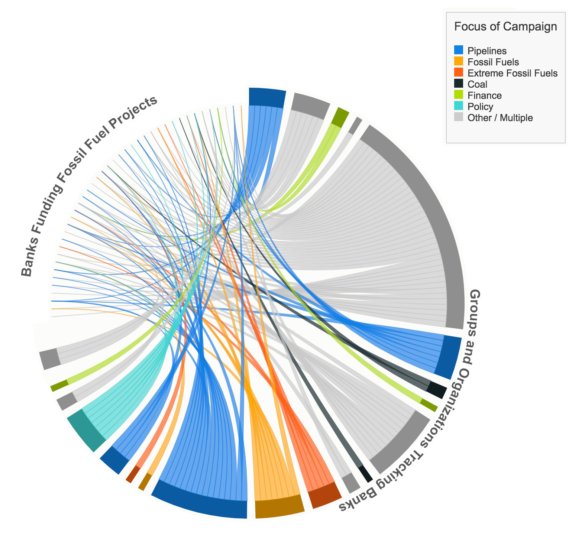

There are people who look at a spreadsheet and see the magic.  There are others who look at a spreadsheet and their eyes go all blurry and there's a strong urge to take a nap.  No judgement on either type, but sometimes you need to make it easier to digest.

Putting rows and columns of data into a format the helps people understand "what it's all about" is usually called *data visualization*.  There a lots of tools out there to create charts and graphics from spreadsheets - including ones built in to Excel or Google Sheets.  Sometimes you need something more robust though - and the best tool for the job is [D3](http://d3js.org).

Case in point: dojo4 recently finished a job for [350.org](https://350.org) - an organization focused on reducing fossil fuels and moving to 100% renewable energy sources.  We used the concept of a chord diagram to represent the efforts of several groups and organizations targeting international banks that fund fossil fuel projects around the world.  The color coding gives a quick overview on the groups and their particular fossil fuel focus.

 

Users can hover over an organization and see which banks they are targeting:
 

Or hover over a bank and see which groups are targeting that specific bank.
 

*(note that the names of banks and organizations have been removed for privacy)*

This chord diagram was dynamically generated from a shared Google Sheet using Google App Script and custom Javascript attached to the Sheet.  This self-contained relationship helps to make sure the source data and the code to generate the chart don't lose their relationship, and any updates to the shared sheet will automatically update the chart.

>*I enjoyed working with dojo4. The team really wanted to understand how a visualization of my data would be valuable and they seem to work from there. I now have an accessible and engaging graphic that tells a story of where there are gaps, redundancies, and opportunities for more coordination. I appreciated how they took the time to learn my organization's aesthetics and worked to match our style.*    –Senior Global Analyst, [350.org](https://350.org/)