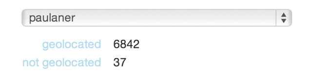

TL;DR
------

when you have *way* too much work to do on the server with respect to api limits

hand some work of to your client's browsers to perform - shipping the results back to your database

the problem
-----------
last week i was dealing with (g-provider) api limits and too many geolocation requests coming from a server(s).  i worked at that a bit, doing things in the background, with periodic retries - you know: the standard stuff...

the api in question is throttled by ip, and the docs recommend taking advantage of this by doing most api calls client side - in js.

now, in this particular case i absolutely *needed* the results of the api calls to reside server side, so i struck upon this compromising (in more that one way) solution

the solution
------------
assume that certain clients are willing to burn up their cpu to populate the data they are interested in working with.  in plain english, make some of your clients run jobs from a javascript work queue to prime the pump they are interested in drinking from.

in my case i have certain select interfaces (the ones interested in the output of said jobs) running a little iframe

```html

<!-- dump a job queue runner on certain pages/views/layouts -->

<iframe height="0" width="0" style="display:none;" src="/javascript_jobs/runner"></iframe>


```

```erb

<!-- the job runner -->

<%= javascript_include_tag :jquery %>
<%= javascript_include_tag :jobs %>

<script>
  jQuery(function(){
    jobs.complete = function(job){
      document.write('completed job ' + job.id);
      document.write('<br>');
    };

    setTimeout(function(){ jobs.start(); }, 1000);
  });
</script>


```

the js required to interface with the job queue is short and simple

all it does is get a job, run it, and ship it back to the server - respecting both throughput rate and max jobs to run.


```javascript

if(!window.jobs){
//
  window.jobs = {};
  window.jobs.count = 0;
  window.jobs.max = 256;
  window.jobs.throttle = 1000;
  window.jobs.complete = function(){};

//
  jobs.get_next_job = function(){
    var success = function(response){
      job = response['data']['job'];

      if(job){
        jobs.count++;

        jobs.run(job, function(job){
          if(jobs.count < jobs.max){
            setTimeout(jobs.get_next_job, jobs.throttle);
          }
        });
      }
    };

    jQuery.ajax({
      'url'     : '/api/jobs/next',
      'type'    : 'GET',
      'cache'   : false,
      'success' : success
    });
  };

//
  jobs.run = function(job, callback){
    var code = job['code'];
    var result = undefined;

    callback = callback || function(){};

    if(code){
      try{
        (function(){

          job['result'] = eval(code);

        })()
      } catch(e) {};
    }

    var url = '/api/jobs/:id'.replace(/:id/, job['id']);

    var data = {'job' : job};

    var success = function(response){
      job = response['data']['job'];

      try{
        jobs.complete(job);
      } catch(e){};

      try{
        callback(job);
      } catch(e){};
    };

    jQuery.ajax({
      'url'      : url,
      'type'     : 'PUT',
      'cache'    : false,
      'data'     : {'job'  : job},
      'dataType' : 'json',
      'success'  : success
    });
  };

//
  jobs.start = jobs.get_next_job;
}


```


the models, controllers, and api endpoints to support this js lib are not intesting, but here is the meat: the main model


```ruby

class JavascriptJob
#
  include Mongoid::Document

#
  field(:type, :type => String)
  field(:status, :type => String, :default => 'pending')
  field(:reserved_at, :type => Time)
  field(:completed_at, :type => Time)
  field(:code, :type => String)
  field(:result)

#
  scope :pending, where(:status => 'pending')
  scope :complete, where(:status => 'complete')

#
  def JavascriptJob.next!(options = {})
    options.to_options!

    now = Time.now

    stale = options[:stale] || (now - 60)

    query =
      any_of(
        {:status => 'pending'},
        {:status.ne => 'complete', :reserved_at.lte => stale}
      )

    updates = {'$set' => {:status => 'running', :reserved_at => Time.now}}

    doc = query.find_and_modify(updates, :new => true)
  end
end


```

this model let's us hand a job off to a client and, if they do not respond in a certain time, assume another client can run the job.

aka. jobs are considered to be both idempotent and stateless.

here is an example of job, one that performs a geolocation lookup in the client's browser and then ships it back to the server


```erb

// performs a geolocation lookup on the google maps api and ships it back to the server
//

  <%
    address = location.raw_address
    url     = GGeocode.geocode_url_for(:address => address).to_s
  %>

  var address = <%= raw address.to_json %>;
  var url     = <%= raw url.to_json %>;

  var result;

  jQuery.ajax({
    'type'  : 'GET',
    'url'   : url,
    'cache' : false,
    'async' : false,

    'success' : function(data){
      result = data;

      jQuery.ajax({
        'type'  : 'POST',
        'url'   : '/api/geo_locations',
        'cache' : false,
        'async' : false,
        'data'  : {'address' : address, 'data' : data}
      })
    }
  });

  result;


```


generating these jobs from the server is simple


```ruby

  # using teh awesome rails_view gem

  code = View.render('javascript_jobs/job/geo_location.js.erb', :locals => {:location => location})

  JavascriptJob.create :code => code


```

now the job is in the queue and some client will eventually perform the work
on our behalf.

the result
----------

i was able to avoid a $10,000 dollar license fee and perform many, many api requests to saturate my data for a small cost in complexity and paying the price of eventual consistency up front.


updates
-------

on a box limited to 2500 requests/day here is what is happening in *1* day




